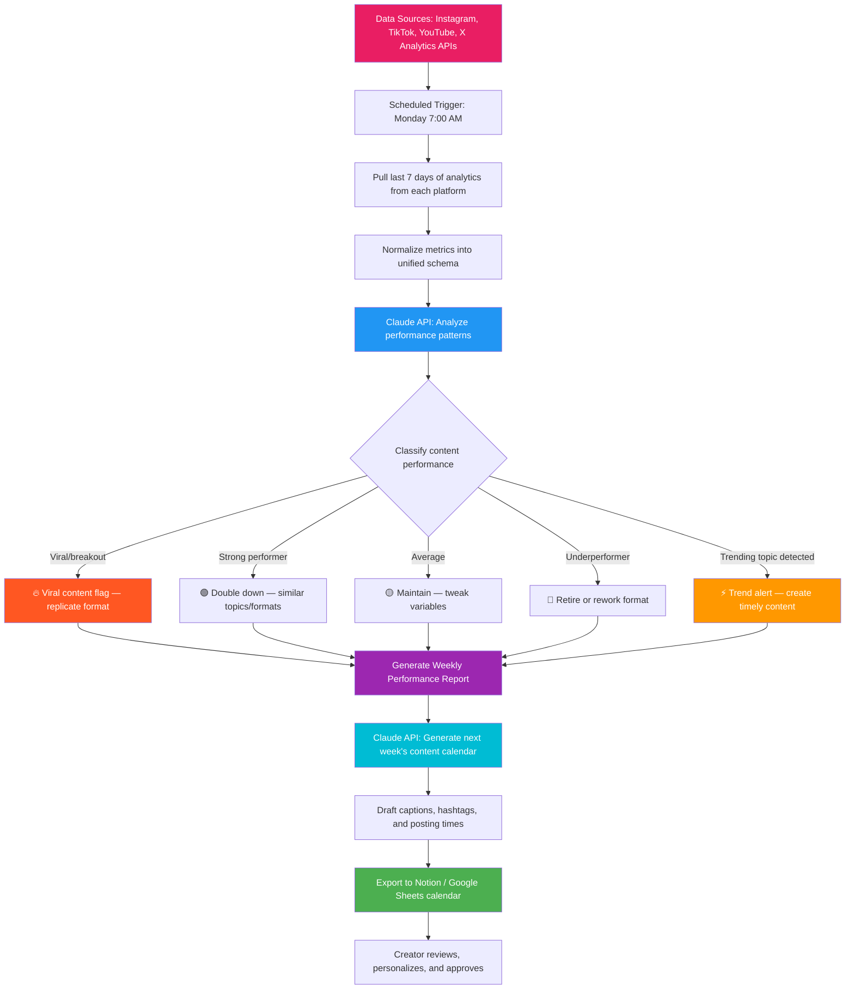

# Blueprint: Content Creator — Automated Weekly Content Performance Report & Calendar Generator

**Role:** Social Media Manager / Content Creator / Digital Marketing Specialist
**Pain Point:** 8–12 hours per week spent manually pulling analytics from multiple platforms, compiling performance metrics, identifying trends, and planning the next week's content calendar based on what's working
**Time Saved:** ~10 hours/week
**Difficulty to Implement:** Low–Medium
**Tools Required:** Platform APIs (Instagram Graph API, TikTok Business API, YouTube Data API, X/Twitter API), Google Sheets, Claude API or any LLM, Zapier/Make or a Python script, Notion/Google Docs for calendar output

---

## The Problem

Content creators and social media managers live in a constant cycle: create, post, analyze, plan, repeat. The most time-consuming part isn't the creation itself — it's the analysis and planning loop that bookends every piece of content.

A typical content creator managing 3–4 platforms spends Monday morning logging into Instagram Insights, TikTok Analytics, YouTube Studio, and X Analytics — each with its own dashboard, its own metrics terminology, and its own export format. They copy numbers into a spreadsheet, manually calculate week-over-week growth, try to spot which content formats drove the most engagement, and then use that analysis to plan next week's content calendar. This process repeats every single week.

For a creator managing a brand's social presence across Instagram, TikTok, YouTube, and X, this means:
- **~2 hours** pulling and normalizing analytics data from 4 platforms
- **~2 hours** building comparison tables and calculating trends
- **~2 hours** analyzing what worked (format, topic, posting time, hashtags) and what didn't
- **~3 hours** drafting next week's content calendar with captions, hashtags, and posting schedules optimized against the data

That's 9+ hours of work that follows a highly predictable, repeatable pattern — exactly the kind of workflow that AI can automate. The data is structured (engagement metrics), the analysis is pattern-based (what's trending up or down), and the output is templated (a content calendar with slots for each day/platform).

This blueprint automates the full pipeline: data collection, performance analysis, trend identification, and content calendar generation — delivering a ready-to-review weekly report and draft content plan every Monday at 8:00 AM.

---

## Workflow Overview



---

## How It Works

### Step 1: Data Collection (Automated)

Every Monday at 7:00 AM, the workflow pulls the previous 7 days of analytics from each connected platform. No manual exports — it connects directly to each platform's API.

**Data sources and what gets extracted:**

| Source | Data Pulled | Format |
|--------|------------|--------|
| Instagram Graph API | Reach, impressions, likes, comments, shares, saves, follower growth, story views | JSON via API |
| TikTok Business API | Views, likes, comments, shares, watch time, average view duration, follower growth | JSON via API |
| YouTube Data API | Views, watch time, likes, comments, subscriber change, CTR, audience retention | JSON via API |
| X / Twitter API | Impressions, engagements, retweets, replies, link clicks, follower change | JSON via API |
| Google Analytics (optional) | Referral traffic from social, conversions, bounce rate | JSON via API |

**Example raw data for one post:**

```json
{
  "platform": "Instagram",
  "post_id": "Cz8kL2mNpQr",
  "post_type": "Reel",
  "published_at": "2026-03-25T14:30:00Z",
  "caption_snippet": "3 AI tools that replaced my intern...",
  "topic_tags": ["AI", "productivity", "tools"],
  "metrics": {
    "reach": 48200,
    "impressions": 61500,
    "likes": 3842,
    "comments": 287,
    "shares": 1456,
    "saves": 2103,
    "engagement_rate": 15.93
  },
  "audience_data": {
    "peak_audience_time": "14:00-16:00",
    "top_demographics": "25-34, US, Female 58%"
  }
}
```

### Step 2: Data Normalization (Automated)

Raw metrics from different platforms use different terminology and scales. The workflow normalizes everything into a unified schema so comparisons are meaningful.

**Normalization mapping:**

| Universal Metric | Instagram | TikTok | YouTube | X |
|-----------------|-----------|--------|---------|---|
| Views/Reach | Reach | Views | Views | Impressions |
| Engagement Rate | (Likes+Comments+Shares+Saves) / Reach | (Likes+Comments+Shares) / Views | (Likes+Comments) / Views | Engagements / Impressions |
| Shareability Score | Shares / Reach | Shares / Views | Shares / Views | Retweets / Impressions |
| Save/Bookmark Rate | Saves / Reach | Favorites / Views | Add to Playlist / Views | Bookmarks / Impressions |
| Audience Growth | Follower delta | Follower delta | Subscriber delta | Follower delta |

**Unified post record after normalization:**

```json
{
  "post_id": "IG-Cz8kL2mNpQr",
  "platform": "Instagram",
  "format": "Short-form video",
  "topic": "AI Tools",
  "publish_date": "2026-03-25",
  "publish_time": "14:30",
  "publish_day": "Wednesday",
  "views": 48200,
  "engagement_rate": 15.93,
  "shareability_score": 3.02,
  "save_rate": 4.36,
  "comment_sentiment": "positive",
  "performance_tier": "viral"
}
```

### Step 3: AI-Powered Performance Analysis (Claude API)

The normalized data is sent to Claude with a structured analysis prompt that identifies patterns across content format, topic, posting time, and platform.

**Analysis prompt template:**

```
You are a social media analytics expert. Analyze the following weekly content
performance data and produce a structured report.

DATA:
{normalized_post_array}

ACCOUNT CONTEXT:
- Niche: {creator_niche}
- Primary platforms: {platforms}
- Content pillars: {content_pillars}
- Goals: {weekly_goals}
- Historical averages: {baseline_metrics}

ANALYZE:
1. OVERALL PERFORMANCE: Week-over-week comparison for each platform
   (followers, total reach, avg engagement rate)
2. TOP PERFORMERS: Top 3 posts by engagement rate — what made them work?
   (format, topic, hook, posting time, hashtags)
3. UNDERPERFORMERS: Bottom 3 posts — what likely caused low performance?
4. FORMAT ANALYSIS: Which content formats (Reels, carousels, static,
   long-form video, threads) performed best this week?
5. TOPIC ANALYSIS: Which content pillars drove the most engagement?
6. TIMING ANALYSIS: Which days and times yielded the best results?
7. TREND DETECTION: Any emerging topics or formats gaining traction in the
   niche that the creator should capitalize on?
8. RECOMMENDATIONS: 5 specific, actionable recommendations for next week

Return your analysis as a structured JSON object.
```

**Example AI analysis output:**

```json
{
  "week": "2026-03-23 to 2026-03-29",
  "overall_performance": {
    "total_reach": 312400,
    "reach_change": "+18.3% vs last week",
    "total_engagement": 28750,
    "avg_engagement_rate": "9.2% (up from 7.1%)",
    "follower_growth": "+2,847 across all platforms",
    "best_platform_this_week": "Instagram (+22% reach)"
  },
  "top_performers": [
    {
      "post": "3 AI tools that replaced my intern (IG Reel)",
      "engagement_rate": "15.93%",
      "why_it_worked": "Strong hook in first 1.5s, relatable pain point, listicle format with visual demos, posted during peak Wed afternoon slot. Shareability score 3.02% indicates high word-of-mouth value."
    },
    {
      "post": "POV: Your boss discovers ChatGPT (TikTok)",
      "engagement_rate": "12.7%",
      "why_it_worked": "Humor + relatability. Skit format drives rewatches. 94% avg watch-through rate suggests strong retention hook."
    },
    {
      "post": "The $0 marketing stack (YouTube Short)",
      "engagement_rate": "11.2%",
      "why_it_worked": "High save rate (5.1%) indicates utility value. Tutorial format with step-by-step visuals performs consistently."
    }
  ],
  "underperformers": [
    {
      "post": "Motivational Monday quote graphic (IG Static)",
      "engagement_rate": "1.2%",
      "likely_cause": "Static image posts continue declining in reach. Generic motivational content lacks niche specificity. Consider retiring this format."
    }
  ],
  "format_ranking": [
    {"format": "Short-form video (Reels/TikTok/Shorts)", "avg_engagement": "11.8%"},
    {"format": "Carousel posts", "avg_engagement": "7.4%"},
    {"format": "Text threads (X)", "avg_engagement": "4.2%"},
    {"format": "Static image", "avg_engagement": "1.8%"}
  ],
  "timing_insights": {
    "best_days": ["Wednesday", "Thursday"],
    "best_times": ["12:00-14:00", "18:00-20:00"],
    "worst_day": "Monday — lowest reach across all platforms"
  },
  "trend_alerts": [
    "AI agent workflows gaining traction — search volume up 340% this week",
    "Split-screen reaction format trending on TikTok in your niche",
    "LinkedIn carousels driving unusual engagement for B2B creators this month"
  ],
  "recommendations": [
    "Replicate the 'X tools that replaced Y' Reel format — test with different job roles",
    "Double down on Wednesday + Thursday posting; reduce Monday output",
    "Test split-screen reaction format on TikTok using trending AI news clips",
    "Convert top-performing Reels into YouTube Shorts with platform-native captions",
    "Retire static motivational quotes; replace with carousel micro-tutorials"
  ]
}
```

### Step 4: Content Calendar Generation (Claude API)

Using the performance analysis, Claude generates a draft content calendar for the upcoming week — complete with content ideas, captions, hashtags, and optimal posting times.

**Calendar generation prompt:**

```
Based on the following performance analysis, generate a 7-day content calendar
for the upcoming week.

PERFORMANCE ANALYSIS: {analysis_output}
CREATOR PROFILE: {creator_profile}
CONTENT PILLARS: {pillars}
UPCOMING EVENTS/HOOKS: {timely_hooks}

For each content slot, provide:
- Platform
- Content format
- Topic/angle
- Hook (first line or first 3 seconds)
- Draft caption (with CTAs)
- Hashtag set (5-10 relevant, mix of broad and niche)
- Optimal posting time
- Why this piece: data-backed rationale from this week's analysis

Schedule 2-3 posts per day across platforms. Prioritize formats and topics
that performed well. Include 1-2 experimental pieces testing new formats or
trending topics.
```

**Example calendar output (one day):**

| Time | Platform | Format | Topic | Hook | Rationale |
|------|----------|--------|-------|------|-----------|
| 12:30 PM | Instagram | Reel | AI Tools | "5 AI tools my boss doesn't know I use..." | Replicates top performer format; Wed peak slot |
| 2:00 PM | TikTok | Split-screen reaction | AI News | React to viral AI demo clip | Tests trending format flagged in analysis |
| 6:00 PM | YouTube | Short | Tutorial | "The free tool that writes your emails" | High save-rate tutorial format; evening slot |
| 7:00 PM | X | Thread | Productivity | "I automated 10hrs of my work week. Here's how:" | Thread format + utility angle; X evening engagement peak |

### Step 5: Delivery and Review

The workflow outputs two deliverables:

1. **Weekly Performance Report** — A formatted document (Google Doc or Notion page) summarizing metrics, top/bottom performers, trends, and recommendations with embedded charts
2. **Draft Content Calendar** — A Notion database or Google Sheet with each content slot pre-filled, ready for the creator to review, tweak, and schedule into their publishing tool (Later, Buffer, Hootsuite, or native scheduling)

---

## Example Output: Weekly Performance Dashboard

```
╔══════════════════════════════════════════════════════════════════╗
║           WEEKLY CONTENT PERFORMANCE REPORT                     ║
║           Week of March 23 – March 29, 2026                     ║
╠══════════════════════════════════════════════════════════════════╣
║                                                                  ║
║  📊 REACH        312,400  (+18.3% WoW)                          ║
║  💬 ENGAGEMENTS   28,750  (+29.6% WoW)                          ║
║  📈 ENG RATE       9.2%   (↑ from 7.1%)                         ║
║  👥 NEW FOLLOWERS  2,847  (+34% vs avg week)                     ║
║  🔗 LINK CLICKS    1,203  (+12% WoW)                            ║
║                                                                  ║
╠══════════════════════════════════════════════════════════════════╣
║  PLATFORM BREAKDOWN                                              ║
║  ─────────────────────────────────────────                       ║
║  Instagram    142K reach │ 11.4% eng │ +1,204 followers          ║
║  TikTok       98K views  │  9.8% eng │ +892 followers            ║
║  YouTube      52K views  │  7.1% eng │ +438 subscribers          ║
║  X / Twitter  20K impr   │  4.2% eng │ +313 followers            ║
║                                                                  ║
╠══════════════════════════════════════════════════════════════════╣
║  🏆 TOP PERFORMER                                                ║
║  "3 AI tools that replaced my intern" (IG Reel)                  ║
║  → 48.2K reach │ 15.93% engagement │ 1,456 shares               ║
║  → Why: Strong hook + listicle + Wed 2PM slot                    ║
║                                                                  ║
║  ⚠️  UNDERPERFORMER                                              ║
║  "Motivational Monday quote" (IG Static)                         ║
║  → 2.1K reach │ 1.2% engagement │ 3 shares                      ║
║  → Recommendation: Retire format                                 ║
║                                                                  ║
╠══════════════════════════════════════════════════════════════════╣
║  🎯 TOP 5 RECOMMENDATIONS FOR NEXT WEEK                         ║
║  1. Replicate "X tools that replaced Y" format with new angles   ║
║  2. Shift posting volume to Wed/Thu; reduce Monday output        ║
║  3. Test split-screen reaction format on TikTok                  ║
║  4. Cross-post top Reels → YouTube Shorts with native captions   ║
║  5. Replace static quotes with carousel micro-tutorials          ║
╚══════════════════════════════════════════════════════════════════╝
```

---

## Implementation Guide

### Option A: No-Code (Zapier/Make + Google Sheets + Claude API)

**Estimated setup time: 2–3 hours**

1. **Create a Google Sheet** with tabs for each platform's raw data
2. **Set up Zapier/Make integrations** to pull weekly analytics:
   - Instagram → Use the Instagram Graph API Zapier integration
   - TikTok → Use the TikTok for Business integration or a webhook
   - YouTube → Use the YouTube Analytics Zapier integration
   - X → Use the X/Twitter API integration
3. **Create a normalization step** in Make (data transformer module) that maps each platform's metrics to the unified schema
4. **Add a Claude API step** that sends the normalized data with the analysis prompt
5. **Parse Claude's JSON output** and write it to a formatted Google Doc (performance report) and a Notion database or Google Sheet (content calendar)
6. **Schedule the workflow** to run every Monday at 7:00 AM

### Option B: Python Script (More Flexible)

**Estimated setup time: 3–4 hours**

```python
import anthropic
import json
from datetime import datetime, timedelta
from google.oauth2 import service_account
from googleapiclient.discovery import build

# --- Configuration ---
PLATFORMS = {
    "instagram": {"api_key": "YOUR_IG_TOKEN", "account_id": "YOUR_IG_ID"},
    "tiktok": {"api_key": "YOUR_TT_TOKEN", "account_id": "YOUR_TT_ID"},
    "youtube": {"api_key": "YOUR_YT_KEY", "channel_id": "YOUR_CHANNEL"},
    "twitter": {"bearer_token": "YOUR_X_TOKEN", "account_id": "YOUR_X_ID"}
}

CREATOR_PROFILE = {
    "niche": "AI & Productivity",
    "content_pillars": ["AI Tools", "Workflow Automation", "Productivity Hacks", "Tech Reviews"],
    "goals": {"weekly_reach": 250000, "engagement_rate": 8.0, "follower_growth": 2000}
}

client = anthropic.Anthropic()

# --- Step 1: Data Collection ---
def pull_instagram_analytics(days=7):
    """Pull last 7 days of Instagram post and account analytics."""
    # Uses Instagram Graph API /me/media and /me/insights endpoints
    # Returns list of post objects with metrics
    pass  # Implementation uses requests library with IG Graph API

def pull_tiktok_analytics(days=7):
    """Pull last 7 days of TikTok video analytics."""
    # Uses TikTok Business API /video/list and /video/query endpoints
    pass

def pull_youtube_analytics(days=7):
    """Pull last 7 days of YouTube video and channel analytics."""
    # Uses YouTube Data API v3 and YouTube Analytics API
    pass

def pull_twitter_analytics(days=7):
    """Pull last 7 days of X/Twitter post analytics."""
    # Uses X API v2 /tweets and /users/:id/tweets endpoints
    pass

def collect_all_data():
    """Collect analytics from all platforms."""
    return {
        "instagram": pull_instagram_analytics(),
        "tiktok": pull_tiktok_analytics(),
        "youtube": pull_youtube_analytics(),
        "twitter": pull_twitter_analytics(),
        "collection_date": datetime.now().isoformat(),
        "period": f"{(datetime.now() - timedelta(days=7)).strftime('%Y-%m-%d')} to {datetime.now().strftime('%Y-%m-%d')}"
    }

# --- Step 2: Normalize ---
def normalize_metrics(raw_data):
    """Normalize cross-platform metrics into unified schema."""
    unified_posts = []

    for platform, posts in raw_data.items():
        if platform in ("collection_date", "period"):
            continue
        for post in posts:
            unified = {
                "post_id": f"{platform[:2].upper()}-{post['id']}",
                "platform": platform,
                "format": classify_format(post),
                "topic": extract_topic(post),
                "publish_date": post["published_at"][:10],
                "publish_time": post["published_at"][11:16],
                "views": normalize_reach(platform, post),
                "engagement_rate": calculate_engagement_rate(platform, post),
                "shareability_score": calculate_share_rate(platform, post),
                "save_rate": calculate_save_rate(platform, post),
            }
            unified_posts.append(unified)

    return unified_posts

# --- Step 3: AI Analysis ---
def analyze_performance(unified_posts, baseline_metrics):
    """Send normalized data to Claude for performance analysis."""
    prompt = f"""You are a social media analytics expert. Analyze the following
    weekly content performance data and produce a structured report.

    DATA: {json.dumps(unified_posts, indent=2)}

    ACCOUNT CONTEXT:
    - Niche: {CREATOR_PROFILE['niche']}
    - Content pillars: {CREATOR_PROFILE['content_pillars']}
    - Goals: {json.dumps(CREATOR_PROFILE['goals'])}
    - Historical averages: {json.dumps(baseline_metrics)}

    Return a comprehensive analysis as structured JSON with keys:
    overall_performance, top_performers, underperformers, format_ranking,
    timing_insights, trend_alerts, recommendations"""

    response = client.messages.create(
        model="claude-sonnet-4-6",
        max_tokens=4096,
        messages=[{"role": "user", "content": prompt}]
    )
    return json.loads(response.content[0].text)

# --- Step 4: Calendar Generation ---
def generate_content_calendar(analysis):
    """Generate next week's content calendar based on analysis."""
    prompt = f"""Based on this performance analysis, generate a 7-day content
    calendar for the upcoming week.

    ANALYSIS: {json.dumps(analysis, indent=2)}
    CREATOR PROFILE: {json.dumps(CREATOR_PROFILE)}

    For each slot provide: platform, format, topic, hook, draft_caption,
    hashtags, posting_time, rationale.

    Schedule 2-3 posts/day. Prioritize winning formats. Include 1-2 experiments.
    Return as JSON array of daily objects."""

    response = client.messages.create(
        model="claude-sonnet-4-6",
        max_tokens=8192,
        messages=[{"role": "user", "content": prompt}]
    )
    return json.loads(response.content[0].text)

# --- Step 5: Output ---
def export_report_to_gdoc(analysis, calendar):
    """Export formatted report to Google Docs and calendar to Google Sheets."""
    pass  # Uses Google Docs API to create formatted report
         # Uses Google Sheets API to populate calendar template

# --- Main Execution ---
if __name__ == "__main__":
    print("📊 Collecting analytics data...")
    raw_data = collect_all_data()

    print("🔄 Normalizing metrics...")
    unified = normalize_metrics(raw_data)

    print("🤖 Analyzing performance with Claude...")
    analysis = analyze_performance(unified, baseline_metrics={})

    print("📅 Generating content calendar...")
    calendar = generate_content_calendar(analysis)

    print("📤 Exporting report and calendar...")
    export_report_to_gdoc(analysis, calendar)

    print("✅ Weekly report and content calendar delivered!")
```

### Option C: Cron Job + Notion Integration

For creators who live in Notion, the script can push the content calendar directly into a Notion database using the Notion API, with each content slot as a database entry that includes status tracking (Draft → Scheduled → Published → Analyzed).

---

## Why This Should Be Implemented

| Metric | Before Automation | After Automation |
|--------|------------------|-----------------|
| Time spent on analytics review | 4–5 hrs/week | 15 min review |
| Time spent on calendar planning | 4–5 hrs/week | 30 min personalization |
| Data-driven decisions | Gut-feel based | Every decision backed by metrics |
| Cross-platform comparison | Manual spreadsheet | Automatic unified dashboard |
| Trend detection | Reactive (days late) | Proactive (surfaced automatically) |
| Content consistency | Sporadic posting | Systematic daily cadence |
| **Total time recovered** | **~10 hrs/week** | **→ Reinvested in creation** |

The real ROI isn't just time savings — it's better content. When a creator spends 10 fewer hours on spreadsheets and 10 more hours on scripting, filming, and engaging with their audience, the quality gap compounds week over week. Pair that with AI-driven trend detection (catching viral formats 2–3 days faster than manual monitoring), and you have a creator who is both more efficient and more effective.

---

## Cost Estimate

| Component | Monthly Cost |
|-----------|-------------|
| Claude API (Sonnet, ~4 calls/week) | ~$5–15 |
| Zapier/Make (if using no-code) | $0–20 (free tier may suffice) |
| Platform APIs | Free (within rate limits) |
| Google Workspace / Notion | Likely already subscribed |
| **Total** | **$5–35/month** |

For a creator or brand spending $0 and 10 hours/week on manual analytics, this workflow pays for itself in the first week — freeing up two full working days of creative capacity every month.
