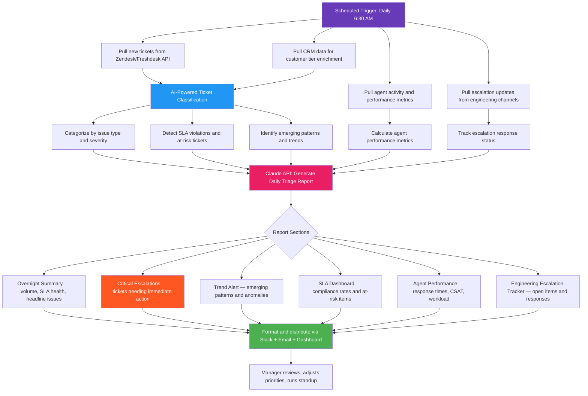

# Blueprint: Customer Support Manager — Automated Daily Ticket Triage & Escalation Report

**Role:** Customer Support Manager / Support Team Lead / CX Operations Manager
**Pain Point:** 8–12 hours per week spent manually reviewing incoming tickets, categorizing by severity, identifying escalation patterns, tracking SLA compliance, and compiling daily team performance summaries
**Time Saved:** ~10 hours/week
**Difficulty to Implement:** Low–Medium
**Tools Required:** Help desk API (Zendesk, Freshdesk, or Intercom), CRM API (Salesforce or HubSpot), Slack API, Claude API, Google Sheets or dashboard tool for output

---

## The Problem

Customer support managers are the front line of customer experience at scale. They sit between the support team, product/engineering, and company leadership — responsible for making sure every ticket gets the right attention at the right time while keeping the team productive and customers satisfied.

The daily triage and reporting cycle is the most time-consuming part of the role, and it follows the same exhausting pattern every single day:

1. Open the help desk dashboard and manually scan every new ticket from the past 24 hours — reading subject lines and initial messages to assess severity and urgency
2. Categorize each ticket by issue type (billing, technical, account access, feature request, bug report) and assign priority levels based on customer tier, contract value, and issue severity
3. Identify tickets approaching or breaching SLA thresholds and flag them for immediate attention
4. Look for patterns — are multiple customers reporting the same bug? Is there a spike in billing questions after a pricing change? Are certain product areas generating disproportionate ticket volume?
5. Check which tickets have been escalated to engineering or product and track whether those escalations received responses
6. Pull individual agent performance metrics: response times, resolution rates, customer satisfaction scores, tickets handled
7. Compile all of this into a daily report for leadership and a team standup briefing

For a support manager overseeing a team of 8–15 agents handling 150–300 tickets per day, this breaks down to:

- **~1.5 hours** scanning and categorizing new tickets each morning
- **~1 hour** checking SLA compliance and flagging at-risk tickets
- **~1 hour** analyzing ticket trends and identifying emerging issues
- **~0.5 hours** tracking engineering escalation status
- **~1 hour** pulling agent performance metrics and coaching notes
- **~1 hour** writing the daily report and preparing team standup briefing

That's roughly 6 hours per day — more than half the workday — spent on data gathering and report assembly rather than actual leadership: coaching agents, improving processes, and solving systemic customer issues.

The data sources are well-structured, the categorization logic follows repeatable rules, and the output format is consistent. This is a high-impact automation opportunity.

This blueprint automates the full pipeline: ticket ingestion, AI-powered categorization, SLA monitoring, trend detection, escalation tracking, agent performance analysis, and report generation — delivering a polished daily triage report by 8:00 AM, ready for the manager to review and act on.

---

## Workflow Overview



---

## How It Works

### Step 1: Data Collection (Automated)

Every morning at 6:30 AM, the workflow pulls the previous 24 hours of support activity from four data sources in parallel.

**Data sources and what gets extracted:**

| Source | Data Pulled | Purpose |
|--------|------------|---------|
| Zendesk / Freshdesk API | New tickets, updated tickets, resolved tickets, CSAT responses, tags, custom fields | Raw ticket data for classification and metrics |
| CRM API (Salesforce / HubSpot) | Customer account tier, contract value, renewal date, account health score | Enrichment data for priority weighting |
| Slack API | Messages from #support-escalations, #eng-bugs, #product-feedback mentioning ticket IDs or customer names | Escalation status and cross-team communication tracking |
| Help desk reporting API | Agent-level metrics: avg first response time, avg resolution time, tickets handled, CSAT per agent | Team performance data for coaching and workload balancing |

**Example raw data — Zendesk ticket batch (24 hours):**

```json
{
  "period": "2026-04-05 06:30 to 2026-04-06 06:30",
  "total_new_tickets": 187,
  "total_resolved": 162,
  "total_pending": 284,
  "tickets_sample": [
    {
      "id": 48291,
      "subject": "Cannot access dashboard — login redirects to blank page",
      "requester": "jamie.foster@acmecorp.com",
      "account": "Acme Corp",
      "priority": "high",
      "status": "open",
      "created_at": "2026-04-05T08:14:00Z",
      "tags": ["login", "dashboard", "enterprise"],
      "first_response_at": null,
      "sla_breach_at": "2026-04-05T12:14:00Z",
      "description": "Since this morning, clicking 'Login' redirects to a blank white page. Tried Chrome and Firefox. Cleared cache. Same issue for 3 other team members. We have a board presentation using the dashboard tomorrow at 9 AM.",
      "attachments": ["screenshot_blank_page.png"]
    },
    {
      "id": 48295,
      "subject": "Billing discrepancy — charged twice for March",
      "requester": "accounting@globalretail.com",
      "account": "Global Retail Inc",
      "priority": "normal",
      "status": "open",
      "created_at": "2026-04-05T09:32:00Z",
      "tags": ["billing", "duplicate-charge"],
      "first_response_at": "2026-04-05T10:15:00Z",
      "sla_breach_at": "2026-04-06T09:32:00Z",
      "description": "We were charged $4,800 on March 1 and again on March 28 for our Enterprise plan. Please refund the duplicate charge and confirm it won't happen again."
    },
    {
      "id": 48301,
      "subject": "API rate limit errors in production",
      "requester": "devops@fastship.io",
      "account": "FastShip",
      "priority": "urgent",
      "status": "open",
      "created_at": "2026-04-05T11:47:00Z",
      "tags": ["api", "rate-limit", "production", "enterprise"],
      "first_response_at": "2026-04-05T11:52:00Z",
      "sla_breach_at": "2026-04-05T13:47:00Z",
      "description": "Our integration is hitting 429 errors on the /orders endpoint. Started 30 min ago. We're processing 50k orders/day and this is blocking our fulfillment pipeline. Need immediate rate limit increase or workaround."
    },
    {
      "id": 48312,
      "subject": "How do I export data to CSV?",
      "requester": "lisa.park@startupxyz.com",
      "account": "StartupXYZ",
      "priority": "low",
      "status": "solved",
      "created_at": "2026-04-05T14:20:00Z",
      "tags": ["how-to", "export", "csv"],
      "first_response_at": "2026-04-05T14:28:00Z",
      "resolved_at": "2026-04-05T14:28:00Z",
      "satisfaction_rating": "good",
      "description": "Where is the CSV export button? I can't find it in the new UI."
    },
    {
      "id": 48318,
      "subject": "Data sync failing between Salesforce and your platform",
      "requester": "ops@medigroup.com",
      "account": "MediGroup Health",
      "priority": "high",
      "status": "pending",
      "created_at": "2026-04-05T16:05:00Z",
      "tags": ["integration", "salesforce", "sync", "enterprise"],
      "first_response_at": "2026-04-05T16:22:00Z",
      "sla_breach_at": "2026-04-06T00:05:00Z",
      "description": "Our Salesforce sync has been failing silently since April 3. We noticed today that 2 days of contact records are missing. This is a compliance issue for us in healthcare — we need every record accounted for."
    }
  ]
}
```

**Example raw data — CRM enrichment:**

```json
{
  "customer_enrichment": [
    {
      "account": "Acme Corp",
      "tier": "Enterprise",
      "arr": 96000,
      "renewal_date": "2026-07-15",
      "health_score": 72,
      "csm": "Rachel Kim",
      "open_tickets_count": 3,
      "escalation_history": 1
    },
    {
      "account": "FastShip",
      "tier": "Enterprise",
      "arr": 144000,
      "renewal_date": "2026-05-01",
      "health_score": 65,
      "csm": "David Park",
      "open_tickets_count": 5,
      "escalation_history": 4,
      "notes": "Renewal at risk — evaluating competitor"
    },
    {
      "account": "MediGroup Health",
      "tier": "Enterprise",
      "arr": 216000,
      "renewal_date": "2026-09-01",
      "health_score": 80,
      "csm": "Amanda Torres",
      "open_tickets_count": 2,
      "escalation_history": 0,
      "notes": "Healthcare vertical — HIPAA compliance required"
    },
    {
      "account": "Global Retail Inc",
      "tier": "Business",
      "arr": 28800,
      "renewal_date": "2026-11-20",
      "health_score": 88,
      "csm": null,
      "open_tickets_count": 1,
      "escalation_history": 0
    },
    {
      "account": "StartupXYZ",
      "tier": "Starter",
      "arr": 3600,
      "renewal_date": "2026-08-01",
      "health_score": 95,
      "csm": null,
      "open_tickets_count": 0,
      "escalation_history": 0
    }
  ]
}
```

**Example raw data — Agent performance metrics:**

```json
{
  "period": "2026-04-05",
  "team_summary": {
    "total_agents_active": 10,
    "tickets_handled": 187,
    "tickets_resolved": 162,
    "avg_first_response_min": 18.4,
    "avg_resolution_hours": 4.2,
    "csat_average": 4.3,
    "sla_compliance_rate": "91.2%"
  },
  "agent_breakdown": [
    {
      "agent": "Carlos Martinez",
      "tickets_handled": 24,
      "tickets_resolved": 22,
      "avg_first_response_min": 8.2,
      "avg_resolution_hours": 2.1,
      "csat": 4.7,
      "sla_breaches": 0,
      "notes": "Top performer — consistently fast and high CSAT"
    },
    {
      "agent": "Nina Johansson",
      "tickets_handled": 21,
      "tickets_resolved": 19,
      "avg_first_response_min": 12.5,
      "avg_resolution_hours": 3.8,
      "csat": 4.4,
      "sla_breaches": 1,
      "notes": "Solid performance, slight dip in resolution speed this week"
    },
    {
      "agent": "Tyler Brooks",
      "tickets_handled": 14,
      "tickets_resolved": 10,
      "avg_first_response_min": 34.7,
      "avg_resolution_hours": 7.9,
      "csat": 3.6,
      "sla_breaches": 4,
      "notes": "Response time and CSAT trending down over past 3 days"
    },
    {
      "agent": "Aisha Patel",
      "tickets_handled": 22,
      "tickets_resolved": 20,
      "avg_first_response_min": 11.1,
      "avg_resolution_hours": 3.2,
      "csat": 4.5,
      "sla_breaches": 0,
      "notes": "Strong on technical tickets — handles API and integration issues well"
    }
  ]
}
```

**Example raw data — Slack escalation signals:**

```json
{
  "escalation_signals": [
    {
      "type": "escalation",
      "channel": "#support-escalations",
      "timestamp": "2026-04-05T12:00:00Z",
      "author": "nina.johansson",
      "summary": "Ticket #48301 (FastShip API rate limits) — escalated to engineering. Production fulfillment pipeline blocked. Customer is $144K ARR with renewal May 1.",
      "severity": "critical",
      "linked_ticket": 48301
    },
    {
      "type": "engineering_response",
      "channel": "#eng-bugs",
      "timestamp": "2026-04-05T13:15:00Z",
      "author": "mike.chen",
      "summary": "Investigating FastShip rate limit issue. Looks like a regression from yesterday's deploy. Temporarily bumped their limit to 5000/min. Root fix in PR #2341.",
      "linked_ticket": 48301
    },
    {
      "type": "escalation",
      "channel": "#support-escalations",
      "timestamp": "2026-04-05T16:30:00Z",
      "author": "aisha.patel",
      "summary": "Ticket #48318 (MediGroup Salesforce sync failure) — 2 days of missing records. Healthcare compliance implications. Need eng investigation ASAP.",
      "severity": "high",
      "linked_ticket": 48318
    },
    {
      "type": "pattern_alert",
      "channel": "#support-escalations",
      "timestamp": "2026-04-05T10:45:00Z",
      "author": "carlos.martinez",
      "summary": "Heads up: 6 tickets in the last 2 hours about login redirect issues. All Enterprise accounts. Looks like it might be related to yesterday's SSO update.",
      "severity": "high",
      "pattern": "login_redirect_cluster"
    },
    {
      "type": "positive",
      "channel": "#support-wins",
      "timestamp": "2026-04-05T15:00:00Z",
      "author": "carlos.martinez",
      "summary": "Just closed a 3-week escalation with NovaTech — they upgraded from Business to Enterprise. CX turned into expansion!",
      "sentiment": "celebration"
    }
  ]
}
```

### Step 2: AI-Powered Classification and Analysis (Automated)

The workflow uses Claude to perform intelligent ticket classification that goes beyond simple keyword matching.

**Classification dimensions:**

| Dimension | Categories | Logic |
|-----------|-----------|-------|
| Issue Type | Bug, Billing, Account Access, Feature Request, How-To, Integration, Performance, Security | AI classifies based on ticket content, not just tags |
| Severity | Critical, High, Medium, Low | Weighted by: issue impact + customer tier + ARR + renewal proximity |
| Urgency | Immediate, Today, This Week, Backlog | Based on SLA deadline, customer business impact, and compliance flags |
| Pattern Flag | Isolated, Cluster (2–5 similar), Outbreak (6+ similar) | AI detects when multiple tickets describe the same root cause |
| Churn Risk | High, Medium, Low, None | Based on account health score + ticket severity + renewal date proximity |

**Severity weighting formula:**

```
Priority Score = (Issue_Impact × 0.35) + (Customer_Tier × 0.25) + (ARR_Weight × 0.20) + (Renewal_Proximity × 0.10) + (Compliance_Flag × 0.10)

Where:
- Issue_Impact: Critical=10, High=7, Medium=4, Low=1
- Customer_Tier: Enterprise=10, Business=6, Starter=3, Free=1
- ARR_Weight: >$100K=10, $50-100K=7, $10-50K=4, <$10K=1
- Renewal_Proximity: <30 days=10, 30-90 days=7, 90-180 days=4, >180 days=1
- Compliance_Flag: HIPAA/SOC2/GDPR=10, None=0
```

**Example classification output:**

```json
{
  "classified_tickets": [
    {
      "ticket_id": 48301,
      "subject": "API rate limit errors in production",
      "ai_category": "Performance / API",
      "ai_severity": "Critical",
      "priority_score": 9.15,
      "reasoning": "Production-blocking issue for $144K Enterprise account with renewal in 25 days. Customer actively evaluating competitors. Fulfillment pipeline impact means revenue loss for their business every hour this persists.",
      "recommended_action": "Immediate engineering escalation. Assign senior agent. CSM David Park should be looped in given renewal risk.",
      "churn_risk": "High",
      "pattern_flag": "Isolated"
    },
    {
      "ticket_id": 48291,
      "subject": "Cannot access dashboard — login redirects to blank page",
      "ai_category": "Bug / Authentication",
      "ai_severity": "High",
      "priority_score": 7.85,
      "reasoning": "Part of a cluster of 6 login redirect tickets in 2 hours — all Enterprise accounts. Likely systemic issue related to recent SSO update. Customer has board presentation tomorrow requiring dashboard access.",
      "recommended_action": "Escalate to engineering as potential SSO regression. Offer affected customers temporary direct login bypass while fix is deployed.",
      "churn_risk": "Medium",
      "pattern_flag": "Cluster — 6 similar tickets identified"
    },
    {
      "ticket_id": 48318,
      "subject": "Data sync failing between Salesforce and your platform",
      "ai_category": "Integration / Data Sync",
      "ai_severity": "High",
      "priority_score": 8.40,
      "reasoning": "Healthcare customer with HIPAA compliance requirements. 2 days of missing records is a potential compliance violation. $216K ARR account with strong health score — don't let this erode trust.",
      "recommended_action": "Engineering escalation for data recovery. Compliance team should be notified. Provide customer with timeline and incident reference number.",
      "churn_risk": "Medium",
      "pattern_flag": "Isolated"
    }
  ],
  "trend_analysis": {
    "emerging_patterns": [
      {
        "pattern": "Login redirect failures post-SSO update",
        "ticket_count": 6,
        "affected_accounts": ["Acme Corp", "TechVentures", "DataFlow Inc", "CloudNine", "Meridian Solutions", "BrightPath"],
        "all_enterprise": true,
        "likely_cause": "SSO authentication update deployed 2026-04-04. Redirect URI handling may be broken for SAML-configured accounts.",
        "recommended_action": "Engineering should investigate SSO deploy from April 4. Consider rollback if fix is not available within 4 hours."
      },
      {
        "pattern": "CSV export confusion after UI redesign",
        "ticket_count": 8,
        "affected_tiers": "Mostly Starter and Business",
        "likely_cause": "Export button moved in the March 28 UI update. Help center article still shows old location.",
        "recommended_action": "Update help center article with new export location. Add in-app tooltip pointing to new button. Low severity but high volume — good candidate for self-service deflection."
      }
    ],
    "volume_anomalies": {
      "total_vs_avg": "+12% above 30-day average",
      "spike_category": "Authentication (login issues) — 3x normal volume",
      "declining_category": "Billing inquiries — down 18% since auto-invoice feature launched"
    }
  }
}
```

### Step 3: Report Generation (Claude API)

The classified data is sent to Claude with a structured prompt that generates a manager-ready daily triage report.

**Report generation prompt:**

```
You are a senior customer support manager preparing a daily triage and
performance report. Your audience includes: the support team (for standup),
the VP of Customer Experience, and product/engineering leads (for escalations).

Write a professional daily report that the VP can skim in 2 minutes,
the support team can use as their standup agenda, and engineering can
reference for escalation context.

DATA:
- Ticket classification results: {classified_tickets}
- Trend analysis: {trend_analysis}
- Agent performance metrics: {agent_metrics}
- Escalation tracking: {escalation_signals}
- SLA compliance data: {sla_data}
- Previous day's report (for continuity): {yesterday_report}

REPORT STRUCTURE:
1. OVERNIGHT SUMMARY (3-4 sentences — volume, SLA health, headline issues)
2. CRITICAL ESCALATIONS (tickets requiring immediate action today)
3. TREND ALERT (emerging patterns, volume anomalies, and recommended responses)
4. SLA DASHBOARD (compliance rates, at-risk tickets, breach details)
5. AGENT PERFORMANCE (team metrics + individual highlights and coaching flags)
6. ENGINEERING ESCALATION TRACKER (open items, response status, ETAs)
7. TODAY'S PRIORITIES (top 5 action items for the support team)

TONE: Actionable, data-driven, supportive of the team. Lead with what
needs attention. Celebrate wins. Flag coaching opportunities constructively.

Return as structured JSON with each section as a key.
```

**Example AI-generated report output:**

```json
{
  "overnight_summary": "187 tickets received yesterday (12% above 30-day avg), 162 resolved. SLA compliance at 91.2% — below our 95% target, primarily due to an SSO-related login issue cluster affecting 6 Enterprise accounts. Two critical escalations active: FastShip API rate limits (production-blocking, renewal at risk) and MediGroup Salesforce sync failure (healthcare compliance implications). On a positive note, billing ticket volume continues to decline post auto-invoice launch.",

  "critical_escalations": [
    {
      "ticket_id": 48301,
      "customer": "FastShip",
      "issue": "API rate limit errors blocking production fulfillment pipeline",
      "arr": "$144,000",
      "renewal": "May 1, 2026 (25 days)",
      "churn_risk": "HIGH — actively evaluating competitor",
      "status": "Engineering investigating. Temp rate limit bump applied. Root fix in PR #2341.",
      "action_needed": "Support manager to check with engineering on PR #2341 ETA. Loop in CSM David Park for renewal risk mitigation. Follow up with customer by 10 AM with timeline.",
      "assigned_agent": "Aisha Patel",
      "priority_score": 9.15
    },
    {
      "ticket_id": 48318,
      "customer": "MediGroup Health",
      "issue": "Salesforce sync failure — 2 days of missing contact records",
      "arr": "$216,000",
      "renewal": "September 1, 2026",
      "churn_risk": "MEDIUM — compliance concern could escalate quickly",
      "status": "Escalated to engineering yesterday at 4:30 PM. No response yet.",
      "action_needed": "Follow up with engineering immediately. Notify compliance team. Provide customer with incident reference and initial timeline by 9 AM. Data recovery is the priority.",
      "assigned_agent": "Aisha Patel",
      "priority_score": 8.40
    }
  ],

  "trend_alert": {
    "active_patterns": [
      {
        "pattern": "SSO Login Redirect Failures",
        "severity": "High",
        "ticket_count": 6,
        "affected_segment": "Enterprise accounts with SAML SSO",
        "likely_root_cause": "SSO authentication update deployed April 4",
        "impact": "Enterprise customers unable to access dashboards. One customer (Acme Corp) has board presentation tomorrow.",
        "recommended_response": "Escalate to engineering for SSO deploy investigation. Offer affected customers temporary direct login bypass. Consider rollback if fix not available within 4 hours.",
        "deflection_potential": "None — requires engineering fix"
      },
      {
        "pattern": "CSV Export Button Confusion",
        "severity": "Low",
        "ticket_count": 8,
        "affected_segment": "Starter and Business tier users",
        "likely_root_cause": "UI redesign moved the export button; help center article outdated",
        "impact": "Low severity per ticket, but high volume is consuming agent time",
        "recommended_response": "Update help center article today. Request in-app tooltip from product team. Create macro response for this issue.",
        "deflection_potential": "High — self-service fix could eliminate 90% of these tickets"
      }
    ],
    "positive_trends": [
      "Billing tickets down 18% since auto-invoice launch — automation is working",
      "API documentation tickets down 25% since new docs portal went live last month"
    ]
  },

  "sla_dashboard": {
    "overall_compliance": "91.2%",
    "target": "95%",
    "status": "BELOW TARGET",
    "breach_breakdown": {
      "total_breaches": 16,
      "by_priority": {
        "urgent": 1,
        "high": 4,
        "normal": 7,
        "low": 4
      },
      "primary_cause": "Login redirect cluster created a surge that overwhelmed morning shift. 9 of 16 breaches occurred between 8:00–10:00 AM during the spike."
    },
    "at_risk_right_now": [
      {
        "ticket_id": 48318,
        "customer": "MediGroup Health",
        "sla_deadline": "2026-04-06T00:05:00Z",
        "status": "BREACHED — pending engineering response",
        "time_over_sla": "6.4 hours"
      },
      {
        "ticket_id": 48332,
        "customer": "NorthStar Analytics",
        "sla_deadline": "2026-04-06T11:00:00Z",
        "status": "At risk — 4.5 hours remaining",
        "action": "Reassign from Tyler to Carlos for faster resolution"
      }
    ]
  },

  "agent_performance": {
    "team_averages": {
      "avg_first_response": "18.4 min (target: <15 min)",
      "avg_resolution_time": "4.2 hours (target: <4 hours)",
      "avg_csat": "4.3/5.0 (target: 4.5)",
      "status": "Slightly below targets — driven by morning surge"
    },
    "highlights": [
      {
        "agent": "Carlos Martinez",
        "highlight": "Top performer: 24 tickets handled, 8.2 min avg response, 4.7 CSAT, zero SLA breaches. Also proactively identified the login redirect pattern and alerted the team.",
        "action": "Recognize in standup. Consider for team lead mentor role."
      },
      {
        "agent": "Aisha Patel",
        "highlight": "Handling both critical enterprise escalations (FastShip + MediGroup) with strong technical communication. 22 tickets with 4.5 CSAT despite complex workload.",
        "action": "Monitor workload — two critical escalations is heavy. Consider redistributing routine tickets."
      }
    ],
    "coaching_flags": [
      {
        "agent": "Tyler Brooks",
        "concern": "Response time trending up for 3 consecutive days (now 34.7 min avg). CSAT dropped to 3.6. 4 SLA breaches yesterday.",
        "possible_causes": "Workload, training gap, or burnout. Yesterday was his 8th consecutive workday.",
        "recommended_action": "1-on-1 check-in today. Review his recent tickets for training opportunities. Verify schedule — may need a day off."
      }
    ]
  },

  "engineering_escalation_tracker": [
    {
      "ticket_id": 48301,
      "customer": "FastShip",
      "issue": "API rate limit regression",
      "escalated_at": "2026-04-05T12:00:00Z",
      "engineering_response": "Yes — investigating, temp fix applied, root fix in PR #2341",
      "eta": "Pending — need update from engineering",
      "status": "IN PROGRESS",
      "days_open": 1
    },
    {
      "ticket_id": 48318,
      "customer": "MediGroup Health",
      "issue": "Salesforce sync failure + missing records",
      "escalated_at": "2026-04-05T16:30:00Z",
      "engineering_response": "No response yet",
      "eta": "Unknown",
      "status": "AWAITING RESPONSE",
      "days_open": 1
    },
    {
      "ticket_id": 48291,
      "customer": "Acme Corp (+ 5 others)",
      "issue": "SSO login redirect failure — cluster of 6",
      "escalated_at": "2026-04-05T10:45:00Z",
      "engineering_response": "Not yet escalated to eng — needs formal escalation",
      "eta": "N/A",
      "status": "NEEDS ESCALATION",
      "days_open": 0
    }
  ],

  "today_priorities": [
    "CRITICAL: Follow up with engineering on MediGroup Salesforce sync — data recovery timeline needed by 9 AM. Notify compliance team.",
    "CRITICAL: Formally escalate SSO login redirect cluster to engineering. 6 Enterprise accounts affected. Offer temp bypass to impacted customers.",
    "HIGH: Get ETA on FastShip rate limit fix (PR #2341). Update customer and loop in CSM David Park for renewal risk conversation.",
    "MEDIUM: 1-on-1 with Tyler Brooks — check in on performance dip and schedule. Redistribute 2-3 tickets if needed.",
    "LOW: Update help center article for CSV export location. Create agent macro for this issue to reduce handle time."
  ]
}
```

### Step 4: Formatting and Delivery (Automated)

The structured JSON is rendered into multiple outputs for different audiences.

**Output options:**

- **Slack #support-daily** — Overnight summary + critical escalations + today's priorities. Posted at 7:30 AM so the team sees it before standup.
- **Email to VP of CX** — Full report with SLA dashboard and agent performance. Formatted HTML with color-coded severity indicators.
- **Dashboard (Google Sheets / Looker)** — Metrics appended to a running tracker for week-over-week trend analysis.
- **Standup Agenda (Notion / Google Doc)** — Structured talking points pulled from the report: critical tickets to discuss, pattern alerts, coaching notes, and priorities.

---

## Example Output: Formatted Daily Triage Report

```
╔══════════════════════════════════════════════════════════════════════╗
║              DAILY SUPPORT TRIAGE REPORT                             ║
║              Monday, April 6, 2026                                   ║
║              Support Manager: Jordan Rivera                          ║
╠══════════════════════════════════════════════════════════════════════╣
║                                                                      ║
║  OVERNIGHT SUMMARY                                                   ║
║  187 tickets received (+12% vs avg) · 162 resolved · SLA: 91.2%     ║
║  Below 95% target — driven by SSO login cluster surge at 8–10 AM.   ║
║  2 critical enterprise escalations active. Billing tickets           ║
║  continue to decline post auto-invoice launch (down 18%).            ║
║                                                                      ║
╠══════════════════════════════════════════════════════════════════════╣
║  CRITICAL ESCALATIONS                                                ║
║  ────────────────────────────────────────────                        ║
║  [CRITICAL] #48301 — FastShip: API rate limits blocking production   ║
║    $144K ARR · Renewal: May 1 (25 days) · Churn Risk: HIGH          ║
║    Status: Eng investigating, temp fix applied, PR #2341 pending     ║
║    Action: Get ETA from eng. Loop in CSM. Update customer by 10 AM  ║
║                                                                      ║
║  [CRITICAL] #48318 — MediGroup: Salesforce sync failure, 2 days     ║
║    $216K ARR · Healthcare/HIPAA · Churn Risk: MEDIUM                 ║
║    Status: Escalated yesterday 4:30 PM — NO ENG RESPONSE YET        ║
║    Action: Follow up eng NOW. Notify compliance. Timeline by 9 AM   ║
║                                                                      ║
║  [HIGH] #48291 — SSO Login Redirect Cluster (6 Enterprise accounts) ║
║    Pattern: All SAML-configured accounts post April 4 SSO deploy     ║
║    Status: NOT YET ESCALATED TO ENGINEERING                          ║
║    Action: Formal eng escalation. Offer temp direct login bypass.    ║
║                                                                      ║
╠══════════════════════════════════════════════════════════════════════╣
║  TREND ALERT                                                         ║
║  ────────────────────────────────────────────                        ║
║  ▲ SSO Login Failures: 6 tickets in 2 hrs — Enterprise only         ║
║    Root cause: Likely SSO deploy on April 4. Needs eng rollback      ║
║    or fix within 4 hours.                                            ║
║                                                                      ║
║  ▲ CSV Export Confusion: 8 tickets — Starter/Business tier           ║
║    Root cause: UI redesign moved export button, help docs outdated   ║
║    Fix: Update help center + add in-app tooltip (self-service)       ║
║                                                                      ║
║  ▼ Billing Tickets: Down 18% — auto-invoice working as intended     ║
║  ▼ API Doc Tickets: Down 25% — new docs portal deflecting well      ║
║                                                                      ║
╠══════════════════════════════════════════════════════════════════════╣
║  SLA DASHBOARD                                                       ║
║  ────────────────────────────────────────────                        ║
║  Overall Compliance     91.2%      TARGET: 95%  [BELOW]             ║
║  Breaches Yesterday       16       (9 during 8-10 AM surge)          ║
║  Currently At Risk          2       tickets within 4 hrs of breach   ║
║                                                                      ║
║  BREACHED:                                                           ║
║  #48318 MediGroup — 6.4 hrs over SLA (pending eng response)         ║
║                                                                      ║
║  AT RISK:                                                            ║
║  #48332 NorthStar — 4.5 hrs remaining (reassign to Carlos)          ║
║                                                                      ║
╠══════════════════════════════════════════════════════════════════════╣
║  AGENT PERFORMANCE                                                   ║
║  ────────────────────────────────────────────                        ║
║  Avg First Response    18.4 min    (target <15 min) [ABOVE]          ║
║  Avg Resolution         4.2 hrs    (target <4 hrs)  [ABOVE]          ║
║  Avg CSAT               4.3/5.0    (target 4.5)     [BELOW]          ║
║                                                                      ║
║  STANDOUT AGENTS:                                                    ║
║  ★ Carlos Martinez — 24 tickets, 8.2 min response, 4.7 CSAT        ║
║    Proactively flagged login pattern. Recommend recognition.         ║
║  ★ Aisha Patel — Handling both critical enterprise escalations      ║
║    Strong technical communication. Monitor workload.                 ║
║                                                                      ║
║  COACHING FLAG:                                                      ║
║  ⚠ Tyler Brooks — Response time 34.7 min (3-day upward trend)      ║
║    CSAT at 3.6, 4 SLA breaches. 8th consecutive workday.            ║
║    Action: 1-on-1 check-in today. Review schedule.                   ║
║                                                                      ║
╠══════════════════════════════════════════════════════════════════════╣
║  ENGINEERING ESCALATION TRACKER                                      ║
║  ────────────────────────────────────────────                        ║
║  #48301 FastShip rate limits ......... IN PROGRESS (1 day)           ║
║  #48318 MediGroup sync failure ....... AWAITING RESPONSE (1 day)     ║
║  #48291 SSO login cluster ............ NEEDS ESCALATION              ║
║                                                                      ║
╠══════════════════════════════════════════════════════════════════════╣
║  TODAY'S PRIORITIES                                                  ║
║  ────────────────────────────────────────────                        ║
║  1. Follow up eng on MediGroup sync — timeline by 9 AM              ║
║  2. Escalate SSO login cluster to engineering formally               ║
║  3. Get FastShip rate limit fix ETA — update customer + CSM          ║
║  4. 1-on-1 with Tyler Brooks — performance + schedule check          ║
║  5. Update help center for CSV export — create agent macro           ║
╚══════════════════════════════════════════════════════════════════════╝
```

---

## Implementation Guide

### Option A: No-Code (Zapier/Make + Zendesk + Claude API)

**Estimated setup time: 3–4 hours**

1. **Set up a Zendesk scheduled trigger** in Zapier/Make to pull all tickets created or updated in the past 24 hours every morning at 6:30 AM
2. **Add a CRM lookup step** to enrich each ticket with customer tier, ARR, and renewal date from Salesforce or HubSpot
3. **Add a Slack search step** to pull messages from escalation channels containing ticket IDs or signal keywords
4. **Add a Zendesk reporting step** to pull agent-level performance metrics for the previous day
5. **Merge all data** using a Zapier/Make data transformer step
6. **Send to Claude API** with the structured classification and report generation prompt
7. **Parse the JSON output** and format for delivery:
   - Post summary to Slack #support-daily
   - Send full report via email to VP of CX
   - Append metrics to Google Sheets tracker
8. **Set up a daily trend comparison** by storing each day's report summary for week-over-week context

### Option B: Python Script (More Flexible)

**Estimated setup time: 4–6 hours**

```python
import anthropic
import json
import requests
from datetime import datetime, timedelta
from zenpy import Zenpy

# --- Configuration ---
ZENDESK_CONFIG = {
    "subdomain": "yourcompany",
    "email": "support-manager@company.com",
    "token": "YOUR_ZENDESK_TOKEN"
}

CRM_CONFIG = {
    "platform": "salesforce",
    "instance_url": "https://yourcompany.salesforce.com",
    "access_token": "YOUR_SF_TOKEN"
}

SLACK_CONFIG = {
    "token": "YOUR_SLACK_BOT_TOKEN",
    "channels": ["#support-escalations", "#eng-bugs", "#support-wins"],
    "signal_keywords": ["escalat", "blocker", "blocked", "urgent",
                        "critical", "outage", "compliance", "churn"]
}

client = anthropic.Anthropic()

# --- Step 1: Data Collection ---
def pull_zendesk_tickets(hours=24):
    """Pull all tickets created or updated in the past 24 hours."""
    zenpy_client = Zenpy(**ZENDESK_CONFIG)
    since = datetime.now() - timedelta(hours=hours)

    new_tickets = list(zenpy_client.search(
        created_after=since.isoformat(), type="ticket"
    ))
    updated_tickets = list(zenpy_client.search(
        updated_after=since.isoformat(), type="ticket"
    ))

    tickets = []
    for ticket in set(new_tickets + updated_tickets):
        tickets.append({
            "id": ticket.id,
            "subject": ticket.subject,
            "description": ticket.description[:500],
            "requester": ticket.requester.email,
            "priority": ticket.priority,
            "status": ticket.status,
            "tags": ticket.tags,
            "created_at": str(ticket.created_at),
            "updated_at": str(ticket.updated_at),
            "assignee": str(ticket.assignee) if ticket.assignee else None,
            "satisfaction_rating": getattr(ticket, 'satisfaction_rating', None),
            "sla_policy": getattr(ticket, 'sla_policy', None)
        })

    return {
        "period": f"{since.isoformat()} to {datetime.now().isoformat()}",
        "total_new": len(new_tickets),
        "total_updated": len(updated_tickets),
        "tickets": tickets
    }

def enrich_with_crm_data(tickets):
    """Look up customer tier, ARR, and renewal date for each ticket."""
    enriched = []
    for ticket in tickets:
        account_email = ticket["requester"]
        domain = account_email.split("@")[1] if "@" in account_email else ""

        # Query CRM for account data (simplified)
        crm_data = query_crm_account(domain)
        ticket["account_tier"] = crm_data.get("tier", "Unknown")
        ticket["arr"] = crm_data.get("arr", 0)
        ticket["renewal_date"] = crm_data.get("renewal_date")
        ticket["health_score"] = crm_data.get("health_score")
        ticket["csm"] = crm_data.get("csm")
        enriched.append(ticket)

    return enriched

def pull_agent_metrics():
    """Pull per-agent performance metrics from Zendesk reporting."""
    zenpy_client = Zenpy(**ZENDESK_CONFIG)
    # Uses Zendesk Explore API or pre-built report
    # Returns agent-level metrics for the past 24 hours
    pass

def pull_slack_escalations(hours=24):
    """Extract escalation signals from Slack channels."""
    from slack_sdk import WebClient
    slack = WebClient(token=SLACK_CONFIG["token"])
    oldest = str((datetime.now() - timedelta(hours=hours)).timestamp())
    signals = []

    for channel in SLACK_CONFIG["channels"]:
        history = slack.conversations_history(
            channel=channel, oldest=oldest, limit=200
        )
        for msg in history["messages"]:
            text = msg.get("text", "").lower()
            if any(kw in text for kw in SLACK_CONFIG["signal_keywords"]):
                signals.append({
                    "channel": channel,
                    "author": msg.get("user"),
                    "text": msg.get("text"),
                    "timestamp": msg.get("ts"),
                    "type": classify_escalation_signal(text)
                })

    return signals

def classify_escalation_signal(text):
    """Classify a Slack message by signal type."""
    if any(w in text for w in ["escalat", "urgent", "critical"]):
        return "escalation"
    elif any(w in text for w in ["blocker", "blocked", "outage"]):
        return "blocker"
    elif any(w in text for w in ["resolved", "fixed", "shipped"]):
        return "resolution"
    return "info"

# --- Step 2: AI Classification ---
def classify_tickets(enriched_tickets, slack_signals):
    """Use Claude to classify tickets and detect patterns."""
    prompt = f"""You are an expert customer support operations analyst.

    Analyze these support tickets and provide:
    1. Classification by issue type, severity, and urgency
    2. Priority scoring using this formula:
       Score = (Impact×0.35) + (Tier×0.25) + (ARR×0.20) + (Renewal×0.10) + (Compliance×0.10)
    3. Pattern detection — identify clusters of similar issues
    4. Churn risk assessment for each account
    5. Trend analysis vs typical daily volume

    TICKETS: {json.dumps(enriched_tickets, indent=2)}
    SLACK SIGNALS: {json.dumps(slack_signals, indent=2)}

    Return as structured JSON."""

    response = client.messages.create(
        model="claude-sonnet-4-6",
        max_tokens=4096,
        messages=[{"role": "user", "content": prompt}]
    )
    return json.loads(response.content[0].text)

# --- Step 3: Generate Report ---
def generate_triage_report(classification, agent_metrics, escalations):
    """Generate the full daily triage report using Claude."""
    prompt = f"""You are a senior customer support manager writing a daily
    triage report. Generate a structured report with these sections:

    1. overnight_summary (3-4 sentences)
    2. critical_escalations (tickets needing immediate action)
    3. trend_alert (emerging patterns and anomalies)
    4. sla_dashboard (compliance rates and at-risk tickets)
    5. agent_performance (team + individual metrics)
    6. engineering_escalation_tracker (open items and response status)
    7. today_priorities (top 5 action items)

    CLASSIFICATION DATA: {json.dumps(classification, indent=2)}
    AGENT METRICS: {json.dumps(agent_metrics, indent=2)}
    ESCALATION SIGNALS: {json.dumps(escalations, indent=2)}

    Tone: Actionable, data-driven, supportive. Flag risks with actions.
    Return as structured JSON."""

    response = client.messages.create(
        model="claude-sonnet-4-6",
        max_tokens=4096,
        messages=[{"role": "user", "content": prompt}]
    )
    return json.loads(response.content[0].text)

# --- Step 4: Distribute ---
def post_to_slack(report, channel="#support-daily"):
    """Post morning summary to team Slack channel."""
    from slack_sdk import WebClient
    slack = WebClient(token=SLACK_CONFIG["token"])

    summary = (
        f"*Daily Support Triage — {datetime.now().strftime('%B %d, %Y')}*\n\n"
        f"{report['overnight_summary']}\n\n"
        f"*Critical Escalations:* {len(report['critical_escalations'])}\n"
        f"*SLA Compliance:* {report['sla_dashboard']['overall_compliance']}\n\n"
        f"*Today's Priorities:*\n"
    )
    for i, priority in enumerate(report['today_priorities'], 1):
        summary += f"{i}. {priority}\n"

    slack.chat_postMessage(channel=channel, text=summary)

def send_email_report(report, recipients):
    """Send formatted HTML report to VP of CX."""
    pass  # Uses SendGrid, SES, or Gmail API

def append_to_tracker(report):
    """Append daily metrics to Google Sheets tracker."""
    pass  # Uses Google Sheets API

# --- Main Execution ---
if __name__ == "__main__":
    print("Pulling Zendesk tickets...")
    raw_tickets = pull_zendesk_tickets()

    print("Enriching with CRM data...")
    enriched = enrich_with_crm_data(raw_tickets["tickets"])

    print("Pulling agent metrics...")
    agent_metrics = pull_agent_metrics()

    print("Scanning Slack for escalation signals...")
    escalations = pull_slack_escalations()

    print("Classifying tickets with Claude...")
    classification = classify_tickets(enriched, escalations)

    print("Generating triage report...")
    report = generate_triage_report(classification, agent_metrics, escalations)

    print("Distributing report...")
    post_to_slack(report)
    send_email_report(report, ["vp-cx@company.com"])
    append_to_tracker(report)

    print("Daily triage report delivered!")
```

### Option C: Zendesk + Zapier + Google Sheets Dashboard

For teams wanting a visual dashboard alongside the daily report, connect the workflow output to a Google Sheets template with conditional formatting, sparkline charts, and auto-updating agent scorecards. This gives the VP of CX a live dashboard they can check anytime, while the support manager gets the actionable morning report.

---

## Why This Should Be Implemented

| Metric | Before Automation | After Automation |
|--------|------------------|-----------------|
| Time to produce daily triage report | 5–6 hours/day | 20 min review and adjustment |
| Ticket classification accuracy | Varies by manager's attention | Consistent AI-powered scoring with CRM enrichment |
| Pattern detection speed | Hours or days (noticed reactively) | Real-time — clusters flagged within first occurrence |
| SLA breach visibility | Checked manually, often too late | Proactive alerts with time-remaining countdown |
| Agent coaching insights | Monthly reviews based on memory | Daily data-driven flags with specific ticket examples |
| Engineering escalation tracking | Scattered across Slack threads | Centralized tracker with response time visibility |
| Churn risk correlation | Rarely connected to support tickets | Every ticket scored against ARR, tier, and renewal date |
| **Total time recovered** | **~10 hrs/week** | **Reinvested in coaching, process improvement, and customer relationships** |

The real value extends beyond time savings. When a support manager starts the day with a pre-built report that highlights the 3 things that need their attention most, they shift from reactive fire-fighting to proactive leadership. The pattern detection catches emerging issues before they become outages. The churn risk scoring ensures the team never accidentally under-prioritizes a ticket from a customer who's about to renew. And the agent performance tracking moves coaching from subjective gut feelings to specific, data-backed conversations.

This workflow transforms the support manager from a "ticket traffic controller" into a strategic CX leader who spends their time on what actually moves the needle: coaching their team, improving processes, and building relationships with at-risk customers.

---

## Cost Estimate

| Component | Monthly Cost |
|-----------|-------------|
| Claude API (Sonnet, ~30 calls/month for classification + reporting) | ~$10–30 |
| Zapier/Make (if using no-code) | $0–20 (free tier may suffice) |
| Zendesk API | Free (included with subscription) |
| Salesforce/HubSpot API | Free (included with subscription) |
| Slack API | Free (within rate limits) |
| Google Sheets API | Free |
| **Total** | **$10–50/month** |

For a support manager earning $85K–$120K/year, 10 hours per week of recovered time represents roughly $2,000–$2,900/month in productivity value — making the $10–50/month automation cost a 50–100x return on investment. Factor in the churn prevention from better ticket prioritization (saving even one $100K+ account per year), and the ROI becomes transformative.
