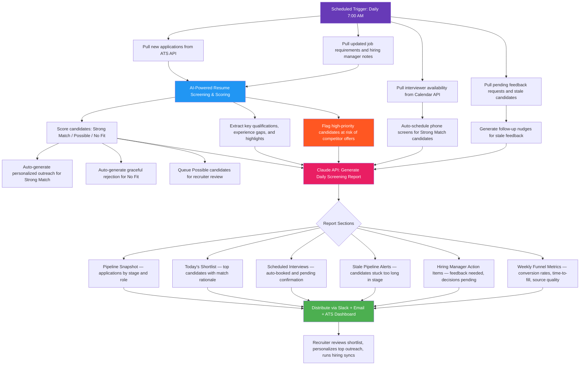

# Blueprint: HR Recruiter — Automated Candidate Screening & Interview Pipeline

**Role:** HR Recruiter / Talent Acquisition Specialist / Hiring Coordinator
**Pain Point:** 12–18 hours per week spent manually reviewing resumes, screening candidates against job requirements, coordinating interview schedules, sending follow-up emails, and compiling hiring pipeline reports
**Time Saved:** ~12 hours/week
**Difficulty to Implement:** Low–Medium
**Tools Required:** ATS API (Greenhouse, Lever, or Workable), Calendar API (Google Calendar or Outlook), Email API (Gmail or Outlook), Claude API, Google Sheets or dashboard tool for output

---

## The Problem

HR recruiters are the gatekeepers of talent for every organization. They sit between hiring managers, candidates, and leadership — responsible for filling open positions quickly with quality hires while delivering a smooth candidate experience. For most recruiters managing 15–30 open requisitions simultaneously, the daily grind looks remarkably similar:

1. Open the ATS dashboard and review every new application that came in overnight — scanning resumes, cover letters, and LinkedIn profiles against job descriptions to determine basic fit
2. For each promising candidate, cross-reference their experience against the specific must-have and nice-to-have qualifications the hiring manager defined during the intake meeting
3. Send personalized rejection emails to candidates who don't meet minimum requirements, while drafting outreach to those who do — tailoring the message to reference something specific from their background
4. Coordinate phone screen schedules by checking interviewer availability, candidate time zones, and existing calendar commitments — often involving 3–5 back-and-forth emails per candidate
5. After phone screens, compile notes and scoring rubrics, then schedule panel interviews by cross-referencing availability across 3–5 interviewers
6. Track every candidate's stage in the pipeline, update the ATS, and flag candidates who have been sitting in a stage too long or are at risk of accepting another offer
7. Compile a weekly pipeline report for hiring managers and leadership showing funnel metrics, time-to-fill trends, and bottleneck analysis

For a recruiter handling 200+ applications per week across multiple roles, the time breakdown is brutal:

- **~3 hours** reviewing and screening new applications each day
- **~2 hours** writing personalized outreach and rejection emails
- **~2 hours** coordinating interview schedules across multiple calendars
- **~1 hour** updating the ATS with candidate status, notes, and tags
- **~1.5 hours** following up with hiring managers for feedback on candidates
- **~1 hour** compiling weekly pipeline reports and metrics

That's roughly 10–12 hours per day on operational tasks — leaving almost no time for the work that actually moves the needle: building relationships with top candidates, improving job descriptions, developing sourcing strategies, and advising hiring managers on market conditions.

The screening criteria are well-defined per role, the scheduling logic follows repeatable patterns, and the reporting format is consistent. This is a textbook automation opportunity.

This blueprint automates the full pipeline: resume ingestion, AI-powered screening and scoring, personalized candidate communication, intelligent interview scheduling, pipeline tracking, and report generation — delivering a prioritized candidate shortlist by 8:00 AM daily, with interviews auto-scheduled and hiring managers kept in the loop.

---

## Workflow Overview



---

## How It Works

### Step 1: Data Collection (Automated)

Every morning at 7:00 AM, the workflow pulls the previous 24 hours of recruiting activity from four sources in parallel.

**From the ATS (Greenhouse/Lever/Workable):**

```python
import requests
from datetime import datetime, timedelta

def pull_new_applications(ats_api_key, since_hours=24):
    """Pull all new applications from the ATS in the last 24 hours."""
    since = (datetime.utcnow() - timedelta(hours=since_hours)).isoformat()

    # Example: Greenhouse API
    response = requests.get(
        "https://harvest.greenhouse.io/v1/applications",
        params={
            "created_after": since,
            "status": "active",
            "per_page": 200
        },
        auth=(ats_api_key, "")
    )

    applications = response.json()

    enriched = []
    for app in applications:
        candidate = requests.get(
            f"https://harvest.greenhouse.io/v1/candidates/{app['candidate_id']}",
            auth=(ats_api_key, "")
        ).json()

        job = requests.get(
            f"https://harvest.greenhouse.io/v1/jobs/{app['jobs'][0]['id']}",
            auth=(ats_api_key, "")
        ).json()

        enriched.append({
            "application_id": app["id"],
            "candidate_name": f"{candidate['first_name']} {candidate['last_name']}",
            "candidate_email": candidate["email_addresses"][0]["value"],
            "resume_url": next((a["url"] for a in app.get("attachments", []) if a["type"] == "resume"), None),
            "job_title": job["name"],
            "job_id": job["id"],
            "department": job.get("departments", [{}])[0].get("name", "Unknown"),
            "applied_at": app["applied_at"],
            "source": app.get("source", {}).get("public_name", "Direct"),
            "job_requirements": job.get("notes", ""),
            "hiring_manager": job.get("hiring_team", {}).get("hiring_managers", [{}])[0].get("name", "Unassigned")
        })

    return enriched
```

**From Calendar API (interviewer availability):**

```python
from googleapiclient.discovery import build

def get_interviewer_availability(interviewers, days_ahead=5):
    """Check interviewer availability for scheduling."""
    service = build("calendar", "v3", credentials=creds)

    now = datetime.utcnow()
    time_max = now + timedelta(days=days_ahead)

    availability = {}
    for interviewer in interviewers:
        events = service.events().list(
            calendarId=interviewer["email"],
            timeMin=now.isoformat() + "Z",
            timeMax=time_max.isoformat() + "Z",
            singleEvents=True,
            orderBy="startTime"
        ).execute().get("items", [])

        busy_slots = [
            {"start": e["start"]["dateTime"], "end": e["end"]["dateTime"]}
            for e in events if e.get("transparency") != "transparent"
        ]

        availability[interviewer["email"]] = {
            "name": interviewer["name"],
            "timezone": interviewer.get("timezone", "America/New_York"),
            "busy_slots": busy_slots
        }

    return availability
```

**From ATS — stale pipeline detection:**

```python
def detect_stale_candidates(ats_api_key, thresholds=None):
    """Flag candidates sitting too long in any pipeline stage."""
    if thresholds is None:
        thresholds = {
            "Application Review": 48,     # hours
            "Phone Screen": 72,
            "On-Site Interview": 120,
            "Offer": 48,
            "Reference Check": 96
        }

    response = requests.get(
        "https://harvest.greenhouse.io/v1/applications",
        params={"status": "active", "per_page": 500},
        auth=(ats_api_key, "")
    ).json()

    stale = []
    for app in response:
        current_stage = app.get("current_stage", {}).get("name", "Unknown")
        last_activity = datetime.fromisoformat(app["last_activity_at"].replace("Z", "+00:00"))
        hours_in_stage = (datetime.now(last_activity.tzinfo) - last_activity).total_seconds() / 3600

        threshold = thresholds.get(current_stage, 72)
        if hours_in_stage > threshold:
            stale.append({
                "candidate": f"{app['candidate']['first_name']} {app['candidate']['last_name']}",
                "job": app["jobs"][0]["name"],
                "stage": current_stage,
                "hours_in_stage": round(hours_in_stage),
                "threshold_hours": threshold,
                "overdue_by": f"{round(hours_in_stage - threshold)}h",
                "risk": "HIGH" if hours_in_stage > threshold * 2 else "MEDIUM"
            })

    return sorted(stale, key=lambda x: x["hours_in_stage"], reverse=True)
```

---

### Step 2: AI-Powered Candidate Screening (Claude API)

This is the core of the automation. Each new application is evaluated against the specific job requirements using a structured prompt that produces consistent, auditable scoring.

```python
import anthropic

client = anthropic.Anthropic()

def screen_candidate(candidate, job_requirements):
    """Screen a single candidate against job requirements using Claude."""

    prompt = f"""You are an expert technical recruiter. Screen this candidate against the job requirements below.

## Job Requirements
{job_requirements}

## Candidate Profile
Name: {candidate['candidate_name']}
Applied for: {candidate['job_title']}
Source: {candidate['source']}

Resume:
{candidate['resume_text']}

## Screening Instructions

Evaluate the candidate on these dimensions:
1. **Must-Have Requirements** — Does the candidate meet every non-negotiable qualification? List each requirement and whether it's met (YES/NO/PARTIAL).
2. **Nice-to-Have Requirements** — Which preferred qualifications does the candidate bring?
3. **Experience Relevance** — How closely does their experience align with the role's core responsibilities?
4. **Career Trajectory** — Does their career progression suggest they're ready for this level/scope?
5. **Red Flags** — Job hopping patterns, unexplained gaps, mismatched seniority, or misaligned expectations.
6. **Standout Factors** — Anything exceptional: domain expertise, notable companies, open source contributions, relevant certifications.

## Output Format (JSON)

Return a JSON object:
{{
    "overall_score": "STRONG_MATCH" | "POSSIBLE" | "NO_FIT",
    "confidence": 0.0-1.0,
    "must_have_met": 0-100,
    "nice_to_have_met": 0-100,
    "summary": "2-3 sentence assessment",
    "match_rationale": "Why this candidate does or doesn't fit",
    "key_strengths": ["strength1", "strength2"],
    "concerns": ["concern1", "concern2"],
    "suggested_questions": ["question1", "question2", "question3"],
    "competitive_risk": "HIGH" | "MEDIUM" | "LOW",
    "competitive_risk_reason": "Why they might get snatched up"
}}

Be calibrated: STRONG_MATCH means you'd confidently put them in front of the hiring manager. POSSIBLE means worth a second look. NO_FIT means clearly missing critical requirements."""

    response = client.messages.create(
        model="claude-sonnet-4-6",
        max_tokens=1500,
        messages=[{"role": "user", "content": prompt}]
    )

    return json.loads(response.content[0].text)
```

**Batch screening with priority sorting:**

```python
def screen_all_candidates(applications, job_requirements_map):
    """Screen all new applications and return prioritized results."""
    results = []

    for app in applications:
        job_reqs = job_requirements_map.get(app["job_id"], "")
        if not job_reqs:
            continue

        screening = screen_candidate(app, job_reqs)
        results.append({
            **app,
            **screening,
            "screened_at": datetime.utcnow().isoformat()
        })

    # Sort: STRONG_MATCH first, then by competitive risk, then confidence
    priority_order = {"STRONG_MATCH": 0, "POSSIBLE": 1, "NO_FIT": 2}
    risk_order = {"HIGH": 0, "MEDIUM": 1, "LOW": 2}

    results.sort(key=lambda x: (
        priority_order.get(x["overall_score"], 3),
        risk_order.get(x["competitive_risk"], 3),
        -x["confidence"]
    ))

    return results
```

---

### Step 3: Automated Communication (Personalized Emails)

The workflow generates three types of communications based on screening results.

**For STRONG_MATCH candidates — personalized outreach:**

```python
def generate_outreach_email(candidate, screening):
    """Generate a personalized outreach email for strong candidates."""

    prompt = f"""Write a warm, personalized recruiting email to {candidate['candidate_name']} who applied for {candidate['job_title']}.

Their key strengths: {', '.join(screening['key_strengths'])}
Match rationale: {screening['match_rationale']}

The email should:
- Reference something specific from their background (not generic flattery)
- Express genuine enthusiasm about their fit for the role
- Briefly mention 1-2 exciting aspects of the role/team
- Include a clear CTA to schedule a 30-minute phone screen
- Feel human, not templated — conversational but professional
- Be under 150 words

Sign off as the recruiter name provided in the system config."""

    response = client.messages.create(
        model="claude-sonnet-4-6",
        max_tokens=500,
        messages=[{"role": "user", "content": prompt}]
    )

    return response.content[0].text
```

**For NO_FIT candidates — graceful, specific rejection:**

```python
def generate_rejection_email(candidate, screening):
    """Generate a respectful rejection that doesn't burn bridges."""

    prompt = f"""Write a brief, kind rejection email to {candidate['candidate_name']} who applied for {candidate['job_title']}.

Main reasons for no-fit: {', '.join(screening['concerns'])}

The email should:
- Thank them genuinely for their interest and time
- NOT specify exact rejection reasons (legal risk)
- Encourage them to apply for future roles if appropriate
- Feel warm and human, not corporate boilerplate
- Be under 80 words
- End on a positive note"""

    response = client.messages.create(
        model="claude-sonnet-4-6",
        max_tokens=300,
        messages=[{"role": "user", "content": prompt}]
    )

    return response.content[0].text
```

---

### Step 4: Intelligent Interview Scheduling

For candidates marked STRONG_MATCH, the workflow automatically finds optimal interview slots by cross-referencing interviewer and candidate availability.

```python
def auto_schedule_phone_screen(candidate, recruiter_availability, candidate_timezone):
    """Find and book the first available phone screen slot."""

    preferred_windows = [
        {"start_hour": 10, "end_hour": 12},  # Morning block
        {"start_hour": 14, "end_hour": 16},   # Afternoon block
    ]

    available_slots = find_open_slots(
        busy_slots=recruiter_availability["busy_slots"],
        preferred_windows=preferred_windows,
        duration_minutes=30,
        timezone=candidate_timezone,
        days_ahead=5,
        min_notice_hours=24  # Don't book anything less than 24h out
    )

    if available_slots:
        # Book the first available slot
        best_slot = available_slots[0]

        # Create calendar event
        event = create_calendar_event(
            summary=f"Phone Screen: {candidate['candidate_name']} — {candidate['job_title']}",
            start=best_slot["start"],
            end=best_slot["end"],
            attendees=[candidate["candidate_email"], recruiter_availability["email"]],
            description=f"Phone screen for {candidate['job_title']}\n\n"
                       f"Candidate highlights:\n{screening['summary']}\n\n"
                       f"Suggested questions:\n" +
                       "\n".join(f"- {q}" for q in screening["suggested_questions"]),
            conferencing=True  # Auto-add Google Meet / Zoom link
        )

        return {
            "status": "scheduled",
            "slot": best_slot,
            "event_id": event["id"],
            "meeting_link": event.get("hangoutLink", "")
        }

    return {
        "status": "no_slots_available",
        "action": "manual_scheduling_required"
    }
```

---

### Step 5: Report Generation (Claude API)

All collected data feeds into a comprehensive daily report.

```python
def generate_daily_screening_report(screening_results, stale_candidates,
                                      scheduled_interviews, pipeline_metrics):
    """Generate the full daily screening report using Claude."""

    prompt = f"""Generate a daily recruiting pipeline report based on the data below.

## New Applications Screened Today
{json.dumps(screening_results, indent=2)}

## Stale Pipeline Alerts
{json.dumps(stale_candidates, indent=2)}

## Interviews Scheduled Today
{json.dumps(scheduled_interviews, indent=2)}

## Pipeline Metrics
{json.dumps(pipeline_metrics, indent=2)}

## Report Format

### 📊 Pipeline Snapshot
Summary table: open roles, total candidates per stage, applications received today.

### 🌟 Today's Shortlist
For each STRONG_MATCH candidate:
- Name, role, source
- 1-line match rationale
- Competitive risk level
- Action taken (email sent, interview scheduled, etc.)

### 📅 Scheduled Interviews
List of all interviews booked (auto-scheduled and manual), including time, candidate, role, and interviewer.

### ⚠️ Stale Pipeline Alerts
Candidates stuck beyond threshold, sorted by urgency. Include the action needed (hiring manager feedback, scheduling, decision).

### 📋 Hiring Manager Action Items
Specific asks per hiring manager: feedback needed, interviews to confirm, decisions pending.

### 📈 Weekly Funnel Metrics (if Monday)
Application-to-screen rate, screen-to-interview rate, interview-to-offer rate, average time-to-fill by role, top performing sources.

Keep the tone actionable and concise. Every section should end with a clear next step."""

    response = client.messages.create(
        model="claude-sonnet-4-6",
        max_tokens=4000,
        messages=[{"role": "user", "content": prompt}]
    )

    return response.content[0].text
```

---

### Step 6: Distribution

The finished report is distributed through multiple channels at 8:00 AM.

```python
def distribute_report(report, shortlist, stale_alerts):
    """Send the daily report via Slack and Email."""

    # 1. Full report to #talent-acquisition Slack channel
    post_to_slack(
        channel="#talent-acquisition",
        text=report,
        thread_name=f"Daily Screening Report — {datetime.now().strftime('%B %d, %Y')}"
    )

    # 2. Shortlist summary DM to each hiring manager
    for candidate in shortlist:
        if candidate["overall_score"] == "STRONG_MATCH":
            send_slack_dm(
                user=candidate["hiring_manager"],
                text=f"🌟 *Strong candidate for {candidate['job_title']}*\n\n"
                     f"*{candidate['candidate_name']}* — {candidate['summary']}\n"
                     f"Competitive risk: {candidate['competitive_risk']}\n"
                     f"Action: {candidate.get('action_taken', 'Awaiting your review')}"
            )

    # 3. Stale pipeline alerts to responsible hiring managers
    for alert in stale_alerts:
        if alert["risk"] == "HIGH":
            send_slack_dm(
                user=alert["hiring_manager"],
                text=f"⚠️ *Pipeline Alert: {alert['candidate']}* has been in "
                     f"*{alert['stage']}* for {alert['hours_in_stage']}h "
                     f"(threshold: {alert['threshold_hours']}h). "
                     f"Please take action to avoid losing this candidate."
            )

    # 4. Weekly email digest to VP of People (Mondays only)
    if datetime.now().weekday() == 0:
        send_email(
            to="vp-people@company.com",
            subject=f"Weekly Recruiting Pipeline Report — {datetime.now().strftime('%B %d')}",
            body=report
        )
```

---

## Example Output

Here's what the recruiter sees at 8:00 AM:

```
═══════════════════════════════════════════════════════════════
   DAILY CANDIDATE SCREENING REPORT — Tuesday, April 7, 2026
═══════════════════════════════════════════════════════════════

📊 PIPELINE SNAPSHOT
────────────────────────────────────────────────────
Role                    Open  New Today  In Pipeline  Avg Days
────────────────────────────────────────────────────
Sr. Backend Engineer     2       12         34         18
Product Designer         1        5         11         22
Data Analyst             1        8         15         14
DevOps Engineer          1        3          9         25
Marketing Manager        1        6         12         16
────────────────────────────────────────────────────
TOTAL                    6       34         81         19

Applications screened: 34 | Strong Match: 6 | Possible: 11 | No Fit: 17

🌟 TODAY'S SHORTLIST
────────────────────────────────────────────────────

1. Sarah Kim — Sr. Backend Engineer
   Score: STRONG_MATCH (0.94) | Source: LinkedIn Referral
   ✅ 6 years distributed systems at Stripe + AWS certifications
   ⚡ Competitive Risk: HIGH — currently interviewing at 2 other companies
   📧 Personalized outreach sent | 📅 Phone screen: Wed 10:30 AM

2. Marcus Rivera — Product Designer
   Score: STRONG_MATCH (0.91) | Source: Portfolio Submission
   ✅ Led design system at Series B fintech, strong UX research background
   ⚡ Competitive Risk: MEDIUM
   📧 Personalized outreach sent | 📅 Phone screen: Thu 2:00 PM

3. Priya Patel — Data Analyst
   Score: STRONG_MATCH (0.89) | Source: Indeed
   ✅ 4 years at consulting firm, advanced SQL + Python, dbt experience
   ⚡ Competitive Risk: LOW
   📧 Personalized outreach sent | 📅 Phone screen: Wed 3:00 PM

4. James O'Connor — Sr. Backend Engineer
   Score: STRONG_MATCH (0.87) | Source: Company Career Page
   ✅ Golang microservices at scale, open-source contributor
   ⚡ Competitive Risk: MEDIUM
   📧 Personalized outreach sent | 📅 Scheduling in progress

5. Aisha Thompson — Marketing Manager
   Score: STRONG_MATCH (0.86) | Source: Referral - Internal
   ✅ B2B SaaS marketing at HubSpot, strong demand gen metrics
   ⚡ Competitive Risk: LOW
   📧 Personalized outreach sent | 📅 Phone screen: Fri 11:00 AM

6. David Chen — DevOps Engineer
   Score: STRONG_MATCH (0.82) | Source: Stack Overflow Jobs
   ✅ Kubernetes + Terraform expert, SRE background at mid-stage startup
   ⚡ Competitive Risk: HIGH — received competing offer
   📧 Personalized outreach sent | 📅 Phone screen: Wed 11:00 AM
   🚨 PRIORITY: Fast-track recommended due to competing offer

📅 SCHEDULED INTERVIEWS
────────────────────────────────────────────────────
Wed Apr 8  10:30 AM  Sarah Kim          Phone Screen     You
Wed Apr 8  11:00 AM  David Chen         Phone Screen     You
Wed Apr 8   3:00 PM  Priya Patel        Phone Screen     You
Thu Apr 9   2:00 PM  Marcus Rivera      Phone Screen     You
Thu Apr 9   3:30 PM  Lisa Wang          Panel Interview  Eng Team
Fri Apr 10 11:00 AM  Aisha Thompson     Phone Screen     You

⚠️ STALE PIPELINE ALERTS
────────────────────────────────────────────────────
🔴 HIGH: Tom Bradley — Sr. Backend Engineer
   Stage: On-Site Interview | 168h in stage (threshold: 120h)
   → Waiting on feedback from @mike-eng. Nudge sent.

🔴 HIGH: Rachel Green — Product Designer
   Stage: Offer | 96h in stage (threshold: 48h)
   → Offer sent Thursday, no response. Follow-up recommended.

🟡 MEDIUM: Carlos Mendez — Data Analyst
   Stage: Phone Screen | 84h in stage (threshold: 72h)
   → Phone screen completed, awaiting hiring manager debrief.

📋 HIRING MANAGER ACTION ITEMS
────────────────────────────────────────────────────
@mike-eng (Engineering Manager):
  • Provide interview feedback for Tom Bradley (overdue 48h)
  • Review 2 new strong-match backend candidates
  • Confirm Thu panel interview for Lisa Wang

@jessica-design (Design Lead):
  • Follow up on Rachel Green's offer (no response since Thursday)
  • Review Marcus Rivera's portfolio (strong match, phone screen Thu)

@anna-data (Data Team Lead):
  • Debrief on Carlos Mendez phone screen
  • Review Priya Patel (strong match, screens Wed)

═══════════════════════════════════════════════════════════════
  Rejections sent: 17 | Outreach emails sent: 6
  Next report: Wednesday, April 8, 2026 at 8:00 AM
═══════════════════════════════════════════════════════════════
```

---

## Why This Should Be Implemented

**For the recruiter:** Instead of spending 3+ hours every morning buried in resumes and ATS tabs, they arrive to a prioritized shortlist with screening rationale, outreach already sent, and interviews already on the calendar. Their morning shifts from data processing to relationship building — calling top candidates, prepping hiring managers, and closing offers.

**For candidates:** Response times drop from 3–5 days to under 24 hours. Every candidate gets a personalized touch — whether it's a warm outreach or a respectful rejection. No more ghosting, no more "we'll get back to you" black holes.

**For hiring managers:** They receive proactive Slack notifications when strong candidates appear, with specific context on why the candidate fits. Stale pipeline alerts prevent great candidates from slipping away. Weekly metrics give them visibility into funnel health without having to chase the recruiter for updates.

**For the business:** Time-to-fill decreases as scheduling bottlenecks are eliminated. Quality of hire improves because AI screening catches qualification gaps humans miss when fatigued after reviewing 50 resumes. Source quality tracking reveals which channels produce the best candidates, optimizing recruiting spend.

**The math:** A recruiter managing 25 open roles at $75/hour fully loaded cost spends ~12 hours/week on tasks this workflow automates. That's $900/week or ~$47,000/year in recovered productivity per recruiter — time redirected to strategic sourcing, employer branding, and candidate relationship management that directly impacts hire quality and retention.

---

## Implementation Notes

**Phase 1 (Week 1):** Connect ATS API, implement resume screening pipeline, generate daily shortlist report. Manual review of all AI screening decisions for the first 2 weeks to calibrate scoring thresholds.

**Phase 2 (Week 2–3):** Add automated email generation (outreach + rejections) with recruiter approval queue. Recruiter reviews and sends each email with one click rather than writing from scratch.

**Phase 3 (Week 3–4):** Enable auto-scheduling for phone screens. Integrate calendar APIs and candidate timezone detection. Add stale pipeline monitoring.

**Phase 4 (Week 4+):** Full automation with confidence thresholds. STRONG_MATCH candidates above 0.90 confidence get auto-outreach and auto-scheduling. POSSIBLE candidates queue for recruiter review. Weekly funnel metrics and source quality analysis auto-generate.

**Bias safeguards:** The screening prompt explicitly evaluates against stated job requirements only — no demographic inference, no "culture fit" scoring, no school/company prestige weighting. All screening decisions include written rationale for auditability. Monthly bias audits compare AI screening demographics against applicant pool demographics.

---

*Blueprint by heymarii | April 7, 2026 | Part of the [AI Blueprints](https://github.com/heymarii/ai-blueprints) collection*
