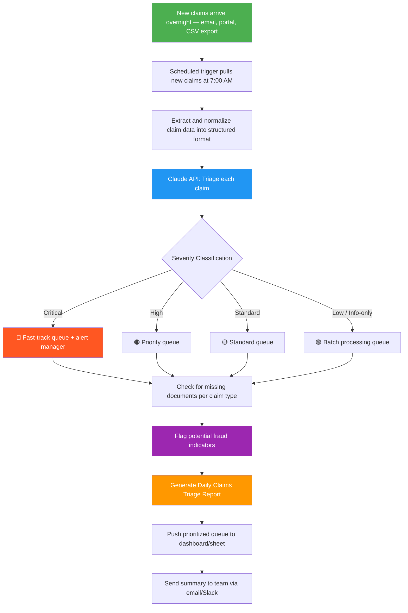

# Blueprint: Insurance Claims Adjuster — Daily Claims Triage & Summary Report

**Role:** Insurance Claims Adjuster / Claims Manager
**Pain Point:** 3–4 hours daily spent reading new claims submissions, categorizing severity, identifying missing documentation, and compiling a priority queue for the team
**Time Saved:** ~12–15 hours/week
**Difficulty to Implement:** Low–Medium
**Tools Required:** Email inbox or claims portal CSV export, Claude API (or any LLM API), Zapier/Make or a Python script, Google Sheets or internal dashboard

---

## The Problem

Insurance claims adjusters start every morning drowning in a queue of new claims that arrived overnight. Each claim needs to be read, categorized by severity and type (auto, property, liability, etc.), checked for missing documentation, flagged for fraud indicators, and prioritized for follow-up. A senior adjuster might handle 30–50 new claims daily, and just the initial triage — before any actual investigation — eats up half the workday.

Most small to mid-sized insurance agencies and third-party administrators still do this manually. Claims arrive via email, portal submissions, or faxed documents. The adjuster opens each one, skims the details, mentally categorizes it, makes notes, and builds their daily priority list in a spreadsheet. It's slow, inconsistent, and means high-priority claims (injuries, large losses, potential fraud) can sit unnoticed for hours while the adjuster works through the pile sequentially.

This blueprint automates the entire triage process so adjusters start their day with a prioritized, categorized, and flagged queue — ready to act on the claims that matter most.

---

## Workflow Overview



---

## Step-by-Step Breakdown

### Step 1: Claims Ingestion (Automated — runs at 7:00 AM)

A scheduled job pulls all new claims from the previous 24 hours. Depending on your setup, this could be:

- **Email-based:** Zapier monitors a claims inbox, extracts email body + attachments
- **Portal CSV:** Script downloads the daily export from the claims management system
- **API-based:** Pull directly from your claims platform API (Guidewire, Duck Creek, etc.)

The output is a normalized JSON or CSV with these fields per claim:

| Field | Example |
|-------|---------|
| Claim ID | CLM-2026-04891 |
| Date of Loss | 2026-03-25 |
| Claimant Name | Maria Gonzalez |
| Policy Number | POL-882741 |
| Claim Type | Auto — Collision |
| Description | "Rear-ended at a stoplight on Elm St. Airbags deployed. Claimant reports neck pain and vehicle is not drivable." |
| Estimated Amount | $18,500 |
| Attachments | Police report (yes), Photos (3), Medical records (no) |

### Step 2: AI-Powered Triage (Claude API)

Each claim (or a batch of claims) is sent to Claude with the following prompt:

```
You are a senior insurance claims analyst with 15 years of experience.
Triage the following batch of new claims and produce a structured assessment for each.

<claims_batch>
{CLAIMS_DATA}
</claims_batch>

For EACH claim, provide:

1. SEVERITY CLASSIFICATION:
   - 🔴 CRITICAL: Bodily injury, fatalities, large losses >$50K,
     catastrophic events, litigation mentioned
   - 🟠 HIGH: Significant property damage, moderate injuries,
     commercial claims, multi-vehicle accidents
   - 🟡 STANDARD: Minor property damage, single-vehicle incidents,
     routine claims within normal ranges
   - 🟢 LOW: Information-only, supplement requests, status inquiries,
     minor adjustments under $2K

2. MISSING DOCUMENTATION CHECK:
   Based on claim type, flag what's missing:
   - Auto claims need: police report, photos, repair estimate,
     medical records (if injury)
   - Property claims need: photos, contractor estimate,
     proof of ownership, prior inspection
   - Liability claims need: incident report, witness statements,
     medical bills, legal correspondence

3. FRAUD INDICATORS (flag any of these):
   - Claim filed within 30 days of policy inception
   - Vague or inconsistent description of events
   - No police report for significant loss
   - Estimated amount is round number or suspiciously high
   - Multiple recent claims on same policy
   - Loss occurred in high-fraud ZIP code
   - Description matches known fraud patterns
     (staged accidents, phantom passengers)

4. RECOMMENDED NEXT ACTION:
   - Specific steps the adjuster should take first
   - Who to contact, what to request, any deadlines

5. ADJUSTER ASSIGNMENT SUGGESTION:
   - Based on claim type and severity, suggest which
     adjuster specialty should handle it
     (auto, property, liability, SIU for fraud)

Format output as a structured report. Be concise but thorough.
Prioritize actionable intelligence over general observations.
```

### Step 3: Report Generation (Automated)

Claude's response is parsed and formatted into a Daily Claims Triage Report with sections:

- Executive summary with key numbers
- Priority queue (critical + high claims listed first)
- Missing documentation tracker
- Fraud flags for SIU review
- Team workload distribution

### Step 4: Delivery & Dashboard Update

- The report is emailed/Slacked to the claims team at 7:30 AM
- The prioritized queue is pushed to a shared Google Sheet or internal dashboard
- Critical claims trigger an immediate alert to the claims manager

---

## Example Output

### 📋 Daily Claims Triage Report — Thursday, March 27, 2026

**Executive Summary**
- **37 new claims** received in the last 24 hours
- **3 critical** (1 bodily injury, 1 large commercial loss, 1 potential litigation), **8 high**, **19 standard**, **7 low**
- **12 claims** have missing documentation that needs to be requested today
- **2 claims** flagged for potential fraud — routed to SIU for review

---

**🔴 Critical Claims — Immediate Attention Required**

| # | Claim ID | Type | Description Summary | Est. Amount | Missing Docs | Action |
|---|----------|------|---------------------|-------------|--------------|--------|
| 1 | CLM-2026-04891 | Auto — BI | Rear-end collision, airbag deployment, claimant reports neck pain. Vehicle totaled. | $18,500 + medical | Medical records, repair estimate | Contact claimant for medical auth form. Order vehicle inspection. 48hr deadline for BI acknowledgment. |
| 2 | CLM-2026-04903 | Commercial Property | Warehouse roof collapse after storm. Inventory damage to electronics distributor. | $142,000 | Inventory list, prior inspection report | Assign to commercial property specialist. Schedule on-site inspection within 72hrs. Notify reinsurance. |
| 3 | CLM-2026-04887 | Auto — Liability | Multi-vehicle pileup on I-95. Claimant's attorney already involved. 3 injured parties. | $85,000+ | Attorney letter of rep, all medical records | Assign to senior adjuster. Set litigation reserve. Contact defense counsel. |

---

**🟠 High Priority Claims**

| # | Claim ID | Type | Key Issue | Est. Amount | Next Step |
|---|----------|------|-----------|-------------|-----------|
| 4 | CLM-2026-04895 | Auto — Collision | T-bone at intersection, moderate vehicle damage, passenger complained of back pain | $12,200 | Request medical evaluation. Get intersection camera footage. |
| 5 | CLM-2026-04899 | Property — Fire | Kitchen fire in rental property. Tenant displaced. | $34,000 | Fire marshal report pending. Arrange ALE for tenant. |
| 6 | CLM-2026-04901 | Auto — Collision | Commercial vehicle (box truck) hit parked cars (3). Fleet policy. | $28,500 | Contact fleet manager. Get driver's MVR. Multiple claimant coordination. |
| ... | ... | ... | ... | ... | ... |

---

**📎 Missing Documentation Tracker**

| Claim ID | Missing Items | Auto-Request Sent? | Deadline |
|----------|--------------|---------------------|----------|
| CLM-2026-04891 | Medical records, repair estimate | ✅ Email sent | Apr 1 |
| CLM-2026-04903 | Inventory list, prior inspection | ❌ Need commercial contact info | Apr 3 |
| CLM-2026-04887 | Attorney LOR, medical records | ✅ Request faxed to attorney | Mar 31 |
| CLM-2026-04895 | Medical evaluation | ✅ Email sent to claimant | Apr 3 |
| CLM-2026-04910 | Photos of damage | ✅ Text sent with upload link | Mar 30 |
| ... | ... | ... | ... |

---

**🚨 Fraud Flags — SIU Review**

| Claim ID | Type | Indicators | Risk Score |
|----------|------|-----------|------------|
| CLM-2026-04912 | Auto — Collision | Policy inception 18 days ago. Description vague ("hit something in parking lot"). No police report. Round estimate ($10,000). | **HIGH** |
| CLM-2026-04907 | Auto — BI | 3rd claim in 12 months on same policy. All "rear-end" collisions. Different passengers each time. | **HIGH** |

*Both claims routed to SIU queue. Standard processing paused pending review.*

---

**📊 Team Workload Distribution**

| Adjuster | Current Open | New Assigned | Specialization |
|----------|-------------|-------------|----------------|
| J. Martinez | 42 | +6 (3 auto, 2 standard, 1 low) | Auto |
| R. Patel | 38 | +5 (2 property, 3 standard) | Property |
| S. Williams | 45 | +4 (2 high auto, 2 standard) | Auto — Senior |
| T. Brooks | 31 | +3 (1 commercial, 2 low) | Commercial |
| SIU Team | 12 | +2 (fraud flags) | Investigation |
| *Unassigned* | — | 17 (standard + low) | Auto-route by type |

---

## Implementation Guide

### Option A: No-Code (Zapier + Gmail + Claude API + Google Sheets)

1. **Set up claims inbox monitoring:**
   - Zapier trigger: New email in claims inbox (filtered by subject line or sender)
   - Parse email body and extract key fields using Zapier's built-in parser or a Formatter step
2. **Schedule daily batch at 7:00 AM:**
   - Zapier Schedule trigger collects all parsed claims from the past 24 hours
   - Sends the batch to Claude API via Webhooks
3. **Route the output:**
   - Parse Claude's response and append rows to a Google Sheet (the priority queue)
   - Send the summary report via Gmail to the team
   - If any claim is 🔴 Critical, send an immediate Slack alert to the claims manager
4. **Cost:** ~$30/mo Zapier (multi-step zaps) + ~$15/mo Claude API (moderate volume)

### Option B: Python Script (for agencies with IT support)

```python
# daily_claims_triage.py
# Run via cron at 7:00 AM daily

import anthropic
import csv
import json
import smtplib
from email.mime.multipart import MIMEMultipart
from email.mime.text import MIMEText
from datetime import date, timedelta
from pathlib import Path

# --- Config ---
CLAUDE_API_KEY = "your-api-key"
CLAIMS_CSV = "/data/exports/new_claims_daily.csv"
TEAM_EMAIL = ["claims-team@agency.com"]
MANAGER_EMAIL = "claims-manager@agency.com"

# --- Load new claims ---
def load_claims(filepath):
    with open(filepath, "r") as f:
        reader = csv.DictReader(f)
        return list(reader)

# --- Triage via Claude ---
def triage_claims(claims_data):
    client = anthropic.Anthropic(api_key=CLAUDE_API_KEY)
    message = client.messages.create(
        model="claude-sonnet-4-6",
        max_tokens=4000,
        messages=[{
            "role": "user",
            "content": f"""You are a senior insurance claims analyst.
Triage the following claims and produce a Daily Claims Triage Report.

<claims_batch>
{json.dumps(claims_data, indent=2)}
</claims_batch>

Classify each claim by severity (Critical/High/Standard/Low).
Flag missing documentation based on claim type.
Identify potential fraud indicators.
Suggest next actions and adjuster assignment.
Format as a structured, scannable report."""
        }]
    )
    return message.content[0].text

# --- Send report ---
def send_report(report_text, is_critical=False):
    msg = MIMEMultipart("alternative")
    today = date.today().strftime("%A, %B %d, %Y")
    msg["Subject"] = f"{'🔴 CRITICAL — ' if is_critical else ''}Daily Claims Triage — {today}"
    msg["From"] = "reports@agency.com"
    msg["To"] = ", ".join(TEAM_EMAIL)
    msg.attach(MIMEText(report_text, "plain"))

    with smtplib.SMTP("smtp.gmail.com", 587) as server:
        server.starttls()
        server.login("reports@agency.com", "app-password")
        server.send_message(msg)

# --- Main ---
if __name__ == "__main__":
    claims = load_claims(CLAIMS_CSV)
    print(f"Loaded {len(claims)} new claims for triage.")

    report = triage_claims(claims)
    has_critical = "CRITICAL" in report.upper()
    send_report(report, is_critical=has_critical)

    # Save report to archive
    archive_path = Path(f"/data/reports/{date.today().isoformat()}-triage.md")
    archive_path.write_text(report)

    print(f"Triage report sent. {'CRITICAL claims detected!' if has_critical else 'No critical claims.'}")
```

---

## Why This Should Be Implemented

| Before (Manual) | After (Automated) |
|---|---|
| 3–4 hours every morning reading and sorting claims | Claims pre-triaged and prioritized before the team arrives |
| Critical claims sometimes sit for hours in the queue | Critical claims trigger immediate alerts at 7:00 AM |
| Missing documents discovered mid-investigation | Missing docs flagged upfront — requests sent automatically |
| Fraud indicators caught by experienced adjusters (maybe) | Consistent fraud screening on every claim, every time |
| Adjuster assignment based on who's available, not who's best | Intelligent routing by specialization and current workload |
| Team lead spends 1 hour building the daily priority list | Priority queue auto-generated and pushed to dashboard |

**ROI Estimate:** A claims adjuster earning $60K/year who saves 12 hours/week recovers roughly $18,700/year in labor. For a team of 5 adjusters sharing the triage burden, that's ~$45K/year in recovered productivity. Add in faster cycle times (critical claims handled same-day instead of next-day) and improved fraud detection (even catching 1–2 fraudulent claims per month at $10K average saves $120K–$240K/year), and the ROI is substantial.

---

## Variations & Extensions

- **Automated document requests:** When missing docs are identified, auto-send templated emails to claimants with upload links
- **Severity escalation rules:** If a claim isn't touched within X hours of being flagged critical, escalate to the claims director
- **Predictive reserving:** Use historical data + claim characteristics to suggest initial reserve amounts
- **Claimant sentiment analysis:** Analyze the tone of the claim description to flag emotionally charged or potentially litigious claimants early
- **Weekly team performance dashboard:** Track claims closed, average cycle time, accuracy of initial severity ratings vs. final outcomes

---

*Blueprint by heymarii | March 27, 2026 | Part of the AI Blueprints collection*
