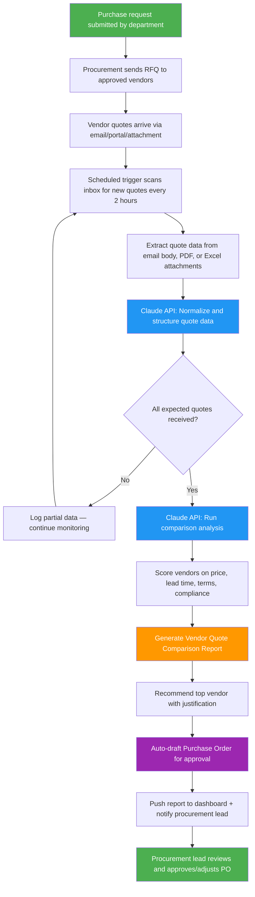

# Blueprint: Procurement Specialist — Automated Vendor Quote Comparison & PO Recommendation Report

**Role:** Procurement Specialist / Purchasing Manager
**Pain Point:** 4–6 hours daily spent collecting vendor quotes from emails, normalizing pricing into comparable formats, evaluating against compliance criteria, and generating purchase order recommendations
**Time Saved:** ~15–20 hours/week
**Difficulty to Implement:** Low–Medium
**Tools Required:** Email inbox (Outlook/Gmail), Claude API or any LLM API, Zapier/Make or Python script, Google Sheets or ERP system, optional Slack/Teams for notifications

---

## The Problem

Procurement specialists live in a world of vendor quotes arriving from every direction — emails, PDFs, supplier portals, phone follow-ups transcribed into notes. When a department submits a purchase request for, say, 500 ergonomic chairs or a year's supply of industrial cleaning chemicals, the procurement team reaches out to 3–8 approved vendors for quotes.

What happens next is a manual nightmare. Each vendor sends quotes in their own format. Some use PDFs with line-item breakdowns, others send Excel files, some just write pricing into the email body. The procurement specialist has to open each one, extract the relevant numbers, normalize them into a comparable format (factoring in unit pricing, shipping, lead times, volume discounts, payment terms), check each vendor against compliance requirements (insurance, certifications, preferred vendor status), and compile everything into a comparison matrix.

For a mid-sized company processing 15–30 purchase requests per week, this means a procurement specialist spends the majority of their day just organizing information rather than making strategic sourcing decisions. Worse, the manual process introduces errors — a missed volume discount here, an overlooked shipping surcharge there — that can cost thousands over the life of a contract.

This blueprint automates the entire quote-to-comparison pipeline so procurement specialists receive a ready-to-act comparison report with PO recommendations the moment enough quotes have been collected for a request.

---

## Workflow Overview



---

## Why This Should Be Implemented

### The Business Case

| Metric | Before Automation | After Automation |
|--------|-------------------|------------------|
| Time to compile comparison | 2–3 hours per request | 5–10 minutes |
| Quoting errors per month | 8–12 (missed terms, wrong units) | Near zero |
| Requests processed per specialist per day | 3–5 | 10–15 |
| Cost savings from better comparisons | Baseline | 5–12% avg. reduction in procurement spend |
| Vendor response tracking | Manual, inconsistent | Automatic with reminders |

### Who Benefits

- **Procurement Specialists** stop doing data entry and start doing strategic sourcing
- **Department Managers** get faster turnaround on purchase requests
- **Finance Teams** get standardized PO documentation with clear justification trails
- **Vendors** receive faster decisions, improving the buyer-supplier relationship

---

## Detailed Implementation

### Step 1: Capture Incoming Quotes

**Trigger:** Scheduled scan every 2 hours (or webhook from email provider)

Quotes arrive in multiple formats. The system needs to handle all of them:

```python
import imaplib
import email
from pathlib import Path
import json
from datetime import datetime, timedelta

class QuoteCollector:
    """Scans email inbox for vendor quotes matching open purchase requests."""

    def __init__(self, email_config, open_requests):
        self.email_config = email_config
        self.open_requests = open_requests  # List of active RFQ reference numbers

    def scan_inbox(self, hours_back=2):
        """Pull emails from the last N hours that look like vendor quotes."""
        mail = imaplib.IMAP4_SSL(self.email_config['server'])
        mail.login(self.email_config['user'], self.email_config['password'])
        mail.select('inbox')

        since_date = (datetime.now() - timedelta(hours=hours_back)).strftime("%d-%b-%Y")
        _, message_ids = mail.search(None, f'(SINCE "{since_date}")')

        quotes = []
        for msg_id in message_ids[0].split():
            _, msg_data = mail.fetch(msg_id, '(RFC822)')
            msg = email.message_from_bytes(msg_data[0][1])

            # Check if email matches any open RFQ
            subject = msg['subject'] or ''
            body = self._get_body(msg)
            attachments = self._get_attachments(msg)

            rfq_match = self._match_to_rfq(subject, body)
            if rfq_match:
                quotes.append({
                    'rfq_id': rfq_match,
                    'vendor_email': msg['from'],
                    'subject': subject,
                    'body': body,
                    'attachments': attachments,
                    'received_at': msg['date'],
                    'raw_msg_id': msg_id.decode()
                })

        mail.logout()
        return quotes

    def _match_to_rfq(self, subject, body):
        """Match email to an open RFQ by reference number or keywords."""
        combined = f"{subject} {body}".lower()
        for rfq in self.open_requests:
            if rfq['reference'].lower() in combined:
                return rfq['reference']
            # Fuzzy match on item description keywords
            keywords = rfq.get('keywords', [])
            if sum(1 for kw in keywords if kw.lower() in combined) >= 2:
                return rfq['reference']
        return None

    def _get_body(self, msg):
        """Extract plain text body from email."""
        if msg.is_multipart():
            for part in msg.walk():
                if part.get_content_type() == 'text/plain':
                    return part.get_payload(decode=True).decode('utf-8', errors='replace')
        return msg.get_payload(decode=True).decode('utf-8', errors='replace')

    def _get_attachments(self, msg):
        """Extract and save attachments (PDFs, Excel files)."""
        attachments = []
        if msg.is_multipart():
            for part in msg.walk():
                filename = part.get_filename()
                if filename and filename.lower().endswith(('.pdf', '.xlsx', '.xls', '.csv')):
                    filepath = Path(f"/tmp/quotes/{filename}")
                    filepath.parent.mkdir(parents=True, exist_ok=True)
                    filepath.write_bytes(part.get_payload(decode=True))
                    attachments.append({
                        'filename': filename,
                        'path': str(filepath),
                        'type': filepath.suffix.lower()
                    })
        return attachments
```

### Step 2: Extract and Normalize Quote Data with AI

This is where the LLM does the heavy lifting — turning messy, inconsistent vendor quotes into structured, comparable data.

```python
import anthropic
import json

EXTRACTION_PROMPT = """You are a procurement data extraction specialist. Given a vendor quote
(which may come from an email body, PDF text, or spreadsheet data), extract ALL pricing and
terms into a structured format.

PURCHASE REQUEST CONTEXT:
- RFQ Reference: {rfq_id}
- Items Requested: {items_description}
- Quantity Needed: {quantity}
- Delivery Location: {delivery_location}

VENDOR QUOTE CONTENT:
{quote_content}

Extract the following into JSON:
{{
    "vendor_name": "Official company name",
    "vendor_contact": "Name and email of person who sent quote",
    "quote_date": "YYYY-MM-DD",
    "quote_valid_until": "YYYY-MM-DD or null",
    "currency": "USD/EUR/etc",
    "line_items": [
        {{
            "description": "Item description as quoted",
            "matched_request_item": "Which requested item this maps to",
            "unit_price": 0.00,
            "quantity": 0,
            "unit_of_measure": "each/case/pallet/etc",
            "extended_price": 0.00,
            "volume_discount": "Description of any volume discount or null",
            "volume_discount_price": 0.00
        }}
    ],
    "subtotal": 0.00,
    "shipping_cost": 0.00,
    "shipping_method": "Ground/Express/Freight/etc",
    "taxes_included": true/false,
    "estimated_tax": 0.00,
    "total_quoted": 0.00,
    "payment_terms": "Net 30/Net 60/etc",
    "early_payment_discount": "2% 10 Net 30 or null",
    "lead_time_days": 0,
    "warranty": "Description or null",
    "notes": "Any special conditions, minimums, or exceptions",
    "confidence_score": 0.0-1.0  // How confident you are in the extraction accuracy
}}

If any field cannot be determined from the quote, use null and note it in the notes field.
Be precise with numbers — do not round or estimate unless the source is ambiguous."""


def extract_quote_data(quote_raw, rfq_context):
    """Use Claude to extract structured data from a raw vendor quote."""
    client = anthropic.Anthropic()

    # If attachment is PDF, extract text first
    quote_content = quote_raw['body']
    for att in quote_raw.get('attachments', []):
        if att['type'] == '.pdf':
            quote_content += f"\n\n--- ATTACHMENT: {att['filename']} ---\n"
            quote_content += extract_pdf_text(att['path'])
        elif att['type'] in ('.xlsx', '.xls', '.csv'):
            quote_content += f"\n\n--- ATTACHMENT: {att['filename']} ---\n"
            quote_content += extract_spreadsheet_text(att['path'])

    prompt = EXTRACTION_PROMPT.format(
        rfq_id=rfq_context['reference'],
        items_description=rfq_context['items'],
        quantity=rfq_context['quantity'],
        delivery_location=rfq_context.get('location', 'Not specified'),
        quote_content=quote_content
    )

    response = client.messages.create(
        model="claude-sonnet-4-6",
        max_tokens=4096,
        messages=[{"role": "user", "content": prompt}]
    )

    extracted = json.loads(response.content[0].text)
    extracted['_source_email'] = quote_raw['vendor_email']
    extracted['_rfq_id'] = rfq_context['reference']
    extracted['_extracted_at'] = datetime.now().isoformat()

    return extracted
```

### Step 3: Run Comparison Analysis

Once all expected quotes (or a minimum threshold) have been collected, the system runs a weighted comparison.

```python
COMPARISON_PROMPT = """You are a senior procurement analyst. Compare these vendor quotes for
purchase request {rfq_id} and produce a detailed comparison report with a recommendation.

PURCHASE REQUEST:
- Description: {description}
- Budget: {budget}
- Priority: {priority}
- Required delivery by: {required_by}

SCORING WEIGHTS (company policy):
- Total Cost: 40%
- Lead Time: 20%
- Payment Terms: 15%
- Vendor Reliability Score: 15%
- Warranty/Support: 10%

VENDOR QUOTES:
{quotes_json}

VENDOR HISTORY (from our records):
{vendor_history}

Produce a comparison report in this structure:
1. EXECUTIVE SUMMARY — One paragraph, who wins and why
2. SIDE-BY-SIDE COMPARISON TABLE — All key metrics normalized for comparison
3. DETAILED SCORING — Show the math for each vendor's weighted score
4. RISK ASSESSMENT — Flag any concerns (new vendor, tight lead time, missing insurance, etc.)
5. RECOMMENDATION — Top choice with runner-up, including justification
6. SUGGESTED PO TERMS — Recommended terms to include in the purchase order

Be specific with numbers. Flag any quote anomalies (suspiciously low prices,
missing line items, inconsistent math). If a vendor's quoted total doesn't match
their line items, call it out."""


def generate_comparison_report(rfq_context, normalized_quotes, vendor_history):
    """Generate the full comparison analysis using Claude."""
    client = anthropic.Anthropic()

    prompt = COMPARISON_PROMPT.format(
        rfq_id=rfq_context['reference'],
        description=rfq_context['items'],
        budget=rfq_context.get('budget', 'Not specified'),
        priority=rfq_context.get('priority', 'Standard'),
        required_by=rfq_context.get('required_by', 'Not specified'),
        quotes_json=json.dumps(normalized_quotes, indent=2),
        vendor_history=json.dumps(vendor_history, indent=2)
    )

    response = client.messages.create(
        model="claude-opus-4-6",
        max_tokens=8192,
        messages=[{"role": "user", "content": prompt}]
    )

    return response.content[0].text
```

### Step 4: Auto-Draft Purchase Order

```python
PO_DRAFT_PROMPT = """Based on the following vendor comparison and recommendation,
draft a purchase order document.

COMPARISON REPORT:
{comparison_report}

WINNING VENDOR QUOTE:
{winning_quote}

COMPANY DETAILS:
- Company: {company_name}
- PO Number: {po_number}
- Requested By: {requestor}
- Department: {department}
- Approval Required From: {approver}

Generate a purchase order with:
1. Standard PO header (PO number, date, vendor info, ship-to address)
2. Line items matching the winning quote
3. Payment terms as recommended
4. Delivery schedule
5. Standard terms and conditions reference
6. Approval signature block

Format as clean markdown that can be converted to PDF."""


def draft_purchase_order(comparison_report, winning_quote, company_config, rfq_context):
    """Auto-draft a PO based on the winning vendor."""
    client = anthropic.Anthropic()

    po_number = generate_po_number(company_config)

    prompt = PO_DRAFT_PROMPT.format(
        comparison_report=comparison_report,
        winning_quote=json.dumps(winning_quote, indent=2),
        company_name=company_config['name'],
        po_number=po_number,
        requestor=rfq_context['requestor'],
        department=rfq_context['department'],
        approver=rfq_context.get('approver', 'Procurement Manager')
    )

    response = client.messages.create(
        model="claude-sonnet-4-6",
        max_tokens=4096,
        messages=[{"role": "user", "content": prompt}]
    )

    return {
        'po_number': po_number,
        'po_content': response.content[0].text,
        'winning_vendor': winning_quote['vendor_name'],
        'total_amount': winning_quote['total_quoted']
    }
```

### Step 5: Orchestration — Tie It All Together

```python
def run_quote_comparison_pipeline():
    """Main orchestration function — runs on schedule or trigger."""

    # 1. Load open purchase requests
    open_requests = load_open_rfqs()

    # 2. Scan for new quotes
    collector = QuoteCollector(EMAIL_CONFIG, open_requests)
    new_quotes = collector.scan_inbox(hours_back=2)

    if not new_quotes:
        log("No new quotes found in this scan cycle.")
        return

    # 3. Extract and normalize each quote
    for quote in new_quotes:
        rfq_context = get_rfq_context(quote['rfq_id'])
        extracted = extract_quote_data(quote, rfq_context)
        save_normalized_quote(extracted)
        log(f"Extracted quote from {extracted['vendor_name']} for {quote['rfq_id']}")

    # 4. Check which RFQs have enough quotes to compare
    for rfq in open_requests:
        quotes_received = get_quotes_for_rfq(rfq['reference'])
        expected = rfq.get('vendors_contacted', 3)

        if len(quotes_received) >= expected or rfq_deadline_passed(rfq):
            if not comparison_already_generated(rfq['reference']):
                # 5. Generate comparison
                vendor_history = get_vendor_history(
                    [q['vendor_name'] for q in quotes_received]
                )
                report = generate_comparison_report(rfq, quotes_received, vendor_history)

                # 6. Draft PO for recommended vendor
                winning_vendor = identify_winner(report, quotes_received)
                po_draft = draft_purchase_order(report, winning_vendor, COMPANY_CONFIG, rfq)

                # 7. Save and notify
                save_comparison_report(rfq['reference'], report)
                save_po_draft(rfq['reference'], po_draft)

                notify_procurement_lead(
                    rfq=rfq,
                    report_summary=report[:500],
                    recommended_vendor=winning_vendor['vendor_name'],
                    total_amount=winning_vendor['total_quoted'],
                    po_number=po_draft['po_number']
                )

                log(f"Comparison complete for {rfq['reference']}: "
                    f"Recommended {winning_vendor['vendor_name']} "
                    f"at ${winning_vendor['total_quoted']:,.2f}")
```

---

## Example Output: Vendor Quote Comparison Report

Below is an example of what the automated system produces for a real purchase request.

---

### 📊 Vendor Quote Comparison Report

**RFQ Reference:** RFQ-2026-0342
**Request:** 200 Adjustable Standing Desks (Electric, 48"x30")
**Requested By:** Sarah Chen, Facilities Department
**Budget:** $120,000
**Required Delivery:** April 30, 2026
**Report Generated:** March 28, 2026 at 9:15 AM

---

#### Executive Summary

**FlexiDesk Pro** is the recommended vendor at **$98,400 total** (18% under budget), offering the best combination of competitive pricing ($492/unit), fast 12-day lead time, and a 7-year warranty. While OfficeFurnish Co. quoted slightly lower per-unit pricing, their 28-day lead time creates delivery risk, and their warranty is 3 years shorter.

---

#### Side-by-Side Comparison

| Metric | FlexiDesk Pro | OfficeFurnish Co. | ErgoSpace Supply | DesksPlus Direct |
|--------|--------------|-------------------|-----------------|-----------------|
| **Unit Price** | $480.00 | $465.00 | $525.00 | $510.00 |
| **Volume Discount** | 2.5% (200+ units) | 3% (150+ units) | None | 2% (100+ units) |
| **Effective Unit Price** | $468.00 | $451.35 | $525.00 | $499.80 |
| **Subtotal** | $93,600 | $90,270 | $105,000 | $99,960 |
| **Shipping** | $4,800 (freight) | $6,500 (freight) | Free freight | $5,200 (freight) |
| **Total Quoted** | **$98,400** | **$96,770** | **$105,000** | **$105,160** |
| **Lead Time** | 12 days | 28 days | 18 days | 15 days |
| **Payment Terms** | Net 45 | Net 30 | Net 30 | Net 60 |
| **Early Pay Discount** | 2%/10 Net 45 | None | 1.5%/10 Net 30 | 2%/15 Net 60 |
| **Warranty** | 7 years | 4 years | 5 years | 5 years |
| **Vendor Score (history)** | 4.6/5.0 | 3.8/5.0 | New vendor | 4.2/5.0 |

---

#### Weighted Scoring

| Vendor | Cost (40%) | Lead Time (20%) | Terms (15%) | Reliability (15%) | Warranty (10%) | **Total** |
|--------|-----------|----------------|-------------|-------------------|---------------|-----------|
| FlexiDesk Pro | 36.2 | 18.0 | 13.5 | 13.8 | 10.0 | **91.5** |
| OfficeFurnish Co. | 38.0 | 10.0 | 10.5 | 11.4 | 5.7 | **75.6** |
| ErgoSpace Supply | 30.0 | 15.0 | 10.5 | 7.5 | 7.1 | **70.1** |
| DesksPlus Direct | 30.2 | 17.0 | 14.0 | 12.6 | 7.1 | **80.9** |

---

#### Risk Assessment

| Risk | Vendor | Severity | Note |
|------|--------|----------|------|
| Delivery delay | OfficeFurnish Co. | ⚠️ High | 28-day lead time leaves only 2-day buffer before April 30 deadline |
| Unknown track record | ErgoSpace Supply | ⚠️ Medium | First-time vendor — no purchase history |
| Shipping damage | DesksPlus Direct | ⚠️ Low | 1 damage claim in last 5 orders — within acceptable range |
| Price anomaly | None flagged | ✅ Clear | All quotes within expected market range ($450–$530/unit) |

---

#### Recommendation

**Primary: FlexiDesk Pro** — $98,400 total
Best overall value considering cost, reliability, lead time, and warranty coverage. Their 2%/10 Net 45 early payment discount brings effective cost to $96,432 if paid within 10 days.

**Runner-up: DesksPlus Direct** — $105,160 total
Solid alternative with Net 60 terms (better for cash flow) and strong reliability, but $6,760 more expensive.

---

#### Suggested PO Terms

- Delivery in two shipments: 100 units by April 15, 100 units by April 25
- Inspection period: 5 business days per shipment
- Damage replacement clause: vendor covers replacement for shipping damage within 30 days
- Payment: Net 45, taking 2% discount if paid within 10 days of invoice
- Warranty registration to be completed by vendor at delivery

---

## Setup Guide

### Quick Start (30 minutes)

1. **Email Integration** — Connect your procurement inbox via IMAP or Gmail/Outlook API
2. **RFQ Tracking Sheet** — Set up a Google Sheet or database table to track open purchase requests with fields: RFQ ID, items, quantity, vendors contacted, deadline
3. **Claude API Key** — Sign up at anthropic.com and get an API key
4. **Automation Platform** — Choose Zapier, Make, or run the Python scripts on a schedule (cron job or cloud function)
5. **Notification Channel** — Configure Slack webhook or email distribution list for report delivery

### For Non-Technical Users (Zapier/Make Route)

```
Trigger: Schedule (every 2 hours during business hours)
    → Gmail/Outlook: Search for new emails matching RFQ patterns
    → Filter: Only process emails with attachments or pricing keywords
    → Claude API: Extract quote data (use extraction prompt above)
    → Google Sheets: Log extracted data to "Quotes" tab
    → Filter: Check if all expected quotes received for any RFQ
    → Claude API: Generate comparison report (use comparison prompt)
    → Google Docs: Create comparison report document
    → Slack/Email: Send notification with report link
```

### For Technical Users (Python Route)

1. Clone the code snippets above into a project
2. Set environment variables: `ANTHROPIC_API_KEY`, `EMAIL_USER`, `EMAIL_PASSWORD`, `EMAIL_SERVER`
3. Deploy as a cloud function (AWS Lambda, Google Cloud Functions) or run via cron
4. Connect to your ERP or procurement system via API for RFQ tracking

---

## Cost Estimate

| Component | Monthly Cost | Notes |
|-----------|-------------|-------|
| Claude API (Sonnet for extraction, Opus for analysis) | $15–40 | Based on ~100 quotes/month |
| Zapier/Make (if using no-code route) | $0–20 | Free tier may suffice |
| Cloud hosting (if using Python route) | $5–10 | Minimal compute needed |
| **Total** | **$20–70/month** | **vs. $4,000–6,000/month in labor time saved** |

---

## Measuring Success

Track these KPIs after implementation:

- **Time per comparison:** Should drop from 2–3 hours to under 10 minutes
- **Procurement cycle time:** Full RFQ-to-PO time should decrease 40–60%
- **Cost savings:** Track actual spend vs. budget; expect 5–12% improvement from better comparisons
- **Error rate:** Count pricing errors, missed terms, or incorrect POs per month
- **Stakeholder satisfaction:** Survey department heads on procurement responsiveness

---

*Built by [@heymarii](https://github.com/heymarii) — AI Blueprints Project*
*Last updated: March 28, 2026*
