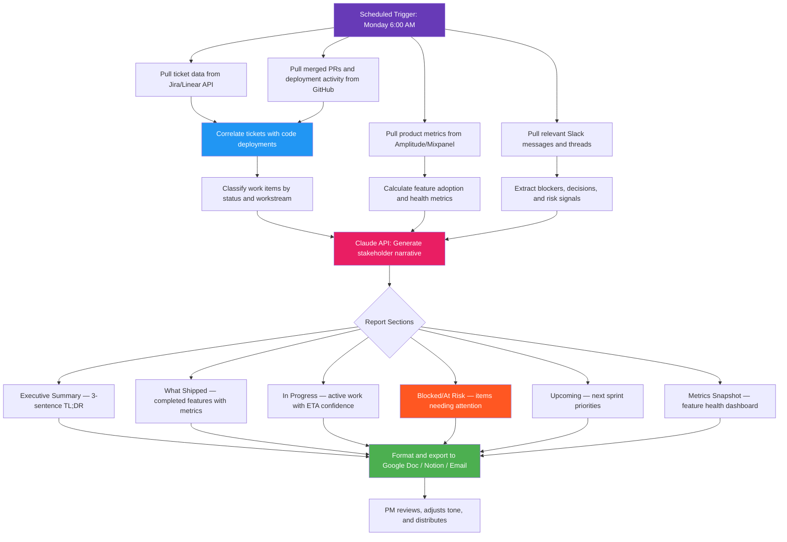

# Blueprint: Product Manager — Automated Weekly Stakeholder Status Report

**Role:** Product Manager / Program Manager / Technical Product Lead
**Pain Point:** 6–10 hours per week spent manually gathering updates from engineering tickets, design tools, analytics dashboards, and Slack threads to compile a single stakeholder status report
**Time Saved:** ~8 hours/week
**Difficulty to Implement:** Low–Medium
**Tools Required:** Project management API (Jira, Linear, or Asana), GitHub/GitLab API, analytics platform API (Amplitude, Mixpanel, or PostHog), Slack API, Claude API, Google Docs/Notion for output

---

## The Problem

Product managers are the connective tissue of a product organization. They sit between engineering, design, marketing, sales, and leadership — and every one of those groups wants to know: *What shipped? What's on track? What's blocked? What's next?*

The weekly stakeholder update is the PM's most time-consuming recurring task, and it follows the same painful pattern every single week:

1. Open Jira or Linear and manually review every ticket that moved in the last sprint — categorizing what was completed, what's in progress, and what slipped
2. Check GitHub for merged PRs to understand what actually shipped versus what was merely "done" in the ticket system
3. Pull product analytics to see how recently launched features are performing — adoption rates, error rates, funnel conversions
4. Scroll through Slack channels to surface blockers, cross-team dependencies, and decisions that were made informally in threads
5. Synthesize all of this into a coherent narrative that leadership can skim in 2 minutes and engineering leads can reference for detail

For a PM managing 2–3 active workstreams across a team of 8–12 engineers, this breaks down to:

- **~2 hours** reviewing and categorizing tickets across sprints and epics
- **~1.5 hours** cross-referencing GitHub activity against ticket status
- **~1.5 hours** pulling and interpreting analytics data for launched features
- **~1 hour** scanning Slack for blockers, decisions, and sentiment signals
- **~2 hours** writing, formatting, and distributing the actual report

That's 8 hours of work that follows a highly structured, repeatable pattern. The data sources are well-defined, the categorization logic is consistent, and the output format is templated. This is a textbook case for AI automation.

This blueprint automates the full pipeline: ticket aggregation, code activity correlation, analytics snapshot, Slack signal extraction, and narrative report generation — delivering a polished stakeholder update every Monday at 8:00 AM, ready for the PM to review and send.

---

## Workflow Overview



---

## How It Works

### Step 1: Data Collection (Automated)

Every Monday at 6:00 AM, the workflow pulls the previous 7 days of activity from four data sources in parallel.

**Data sources and what gets extracted:**

| Source | Data Pulled | Purpose |
|--------|------------|---------|
| Jira / Linear API | Tickets completed, in progress, blocked, newly created; story points burned; sprint progress | What work moved and where it stands |
| GitHub / GitLab API | Merged PRs, deployments, release tags, PR review times | What actually shipped to production |
| Amplitude / Mixpanel / PostHog | Feature flag adoption, funnel conversion rates, error rates, DAU/WAU for new features | How shipped features are performing |
| Slack API | Messages from engineering and product channels mentioning blockers, delays, decisions, or dependencies | Soft signals that don't live in tickets |

**Example raw data — Jira ticket batch:**

```json
{
  "sprint": "Sprint 24 — Checkout Revamp",
  "sprint_dates": "2026-03-23 to 2026-04-03",
  "velocity": {
    "committed": 34,
    "completed": 29,
    "completion_rate": "85.3%"
  },
  "tickets": [
    {
      "key": "PROD-1247",
      "title": "Add Apple Pay support to mobile checkout",
      "type": "Story",
      "status": "Done",
      "story_points": 5,
      "assignee": "Sarah Chen",
      "completed_date": "2026-03-27",
      "linked_prs": ["#1892", "#1895"],
      "deployed": true,
      "labels": ["checkout", "payments", "mobile"]
    },
    {
      "key": "PROD-1253",
      "title": "Fix race condition in cart quantity update",
      "type": "Bug",
      "status": "Done",
      "story_points": 3,
      "assignee": "Marcus Johnson",
      "completed_date": "2026-03-25",
      "linked_prs": ["#1888"],
      "deployed": true,
      "labels": ["checkout", "bug", "P1"]
    },
    {
      "key": "PROD-1260",
      "title": "Implement address autocomplete with Google Places API",
      "type": "Story",
      "status": "In Progress",
      "story_points": 8,
      "assignee": "Priya Patel",
      "linked_prs": ["#1901"],
      "blockers": ["Awaiting Google Places API key approval from security team"],
      "labels": ["checkout", "address", "blocked"]
    }
  ]
}
```

**Example raw data — GitHub activity:**

```json
{
  "period": "2026-03-23 to 2026-03-29",
  "merged_prs": 14,
  "deployments": 6,
  "avg_pr_review_time_hours": 8.3,
  "notable_prs": [
    {
      "number": 1892,
      "title": "feat: Apple Pay integration for mobile checkout",
      "author": "sarah-chen",
      "merged_at": "2026-03-27T11:42:00Z",
      "files_changed": 23,
      "additions": 847,
      "deletions": 112,
      "linked_ticket": "PROD-1247"
    }
  ],
  "deployments_log": [
    {
      "environment": "production",
      "deployed_at": "2026-03-27T14:00:00Z",
      "release_tag": "v2.14.0",
      "included_prs": ["#1888", "#1892", "#1895"],
      "rollback": false
    }
  ]
}
```

**Example raw data — Product analytics snapshot:**

```json
{
  "feature_health": [
    {
      "feature": "Apple Pay Checkout (launched 2026-03-27)",
      "days_live": 2,
      "adoption_rate": "12.4% of mobile checkout sessions",
      "conversion_lift": "+3.2% vs card-only checkout",
      "error_rate": "0.3%",
      "status": "healthy"
    },
    {
      "feature": "One-Click Reorder (launched 2026-03-15)",
      "days_live": 14,
      "adoption_rate": "28.7% of returning users",
      "conversion_lift": "+8.1% repeat purchase rate",
      "error_rate": "0.1%",
      "status": "healthy"
    },
    {
      "feature": "Guest Checkout Redesign (launched 2026-03-10)",
      "days_live": 19,
      "adoption_rate": "N/A (applies to all guest users)",
      "conversion_lift": "-1.4% vs previous design",
      "error_rate": "2.1% (elevated)",
      "status": "needs_attention"
    }
  ],
  "overall_metrics": {
    "dau": 142300,
    "dau_change": "+4.2% WoW",
    "checkout_conversion": "3.8%",
    "checkout_conversion_change": "+0.3% WoW",
    "cart_abandonment": "67.2%",
    "cart_abandonment_change": "-2.1% WoW (improving)"
  }
}
```

**Example raw data — Slack signals:**

```json
{
  "extracted_signals": [
    {
      "type": "blocker",
      "channel": "#eng-checkout",
      "timestamp": "2026-03-26T09:14:00Z",
      "author": "priya.patel",
      "summary": "Google Places API key request stuck in security review since Monday. Address autocomplete work blocked.",
      "severity": "high",
      "linked_ticket": "PROD-1260"
    },
    {
      "type": "decision",
      "channel": "#product-checkout",
      "timestamp": "2026-03-25T15:30:00Z",
      "author": "alex.rivera",
      "summary": "Decision: Ship guest checkout fix as hotfix rather than waiting for next sprint. Approved by eng lead.",
      "participants": ["alex.rivera", "marcus.johnson", "jennifer.wu"]
    },
    {
      "type": "risk",
      "channel": "#eng-checkout",
      "timestamp": "2026-03-28T11:00:00Z",
      "author": "jennifer.wu",
      "summary": "Guest checkout redesign showing elevated error rates (2.1%). Investigating — may need rollback if not resolved by EOD Monday.",
      "severity": "medium"
    },
    {
      "type": "positive",
      "channel": "#wins",
      "timestamp": "2026-03-27T16:45:00Z",
      "author": "sarah.chen",
      "summary": "Apple Pay live on mobile! First 100 transactions processed with zero failures.",
      "sentiment": "celebration"
    }
  ]
}
```

### Step 2: Correlation and Classification (Automated)

The workflow cross-references tickets with GitHub PRs and deployments to determine true status — not just what Jira says, but what actually shipped to production.

**Classification logic:**

| Status | Definition |
|--------|-----------|
| Shipped | Ticket marked Done + PR merged + deployed to production |
| Merged, Not Deployed | Ticket Done + PR merged but not yet in a production release |
| In Progress (On Track) | Ticket In Progress + active PR with recent commits + no blockers |
| In Progress (At Risk) | Ticket In Progress + no PR activity in 3+ days OR blocker detected |
| Blocked | Explicit blocker in ticket or Slack signal flagging dependency |
| Slipped | Ticket was in the sprint commitment but not completed |

This correlation catches a common problem: tickets marked "Done" in Jira that haven't actually been deployed, and tickets that appear "In Progress" but have gone stale with no code activity.

### Step 3: AI-Powered Report Generation (Claude API)

The correlated data is sent to Claude with a structured prompt that generates a stakeholder-ready narrative.

**Report generation prompt:**

```
You are a senior product manager writing a weekly stakeholder status update.
Your audience includes: VP of Product, Engineering Director, Design Lead,
and cross-functional partners (Marketing, Sales, Support).

Write a professional status report that leadership can skim in 2 minutes
while providing enough detail for engineering leads to reference.

DATA:
- Sprint summary: {sprint_data}
- Deployment log: {deployment_data}
- Feature health metrics: {analytics_data}
- Slack signals (blockers, decisions, risks): {slack_signals}
- Previous week's report (for continuity): {last_week_summary}

REPORT STRUCTURE:
1. EXECUTIVE SUMMARY (3 sentences max — what's the headline this week?)
2. WHAT SHIPPED (completed + deployed features with early metrics)
3. IN PROGRESS (active workstreams with confidence level: green/yellow/red)
4. BLOCKED / AT RISK (items that need leadership attention or action)
5. KEY DECISIONS MADE (decisions captured from Slack and meetings)
6. METRICS SNAPSHOT (feature health + overall product health)
7. NEXT WEEK'S PRIORITIES (what's coming in the next sprint)

TONE: Professional, concise, data-driven. Lead with outcomes, not activities.
Flag risks early with recommended actions. Celebrate wins briefly.

Return as structured JSON with each section as a key.
```

**Example AI-generated report output:**

```json
{
  "executive_summary": "Strong week for Checkout Revamp: Apple Pay launched on mobile with 12.4% adoption in first 48 hours and a 3.2% conversion lift. Sprint 24 velocity at 85.3% (29/34 points). One active risk: Guest Checkout Redesign showing elevated error rates that may require a rollback decision by Monday EOD.",

  "what_shipped": [
    {
      "feature": "Apple Pay Mobile Checkout",
      "ticket": "PROD-1247",
      "impact": "12.4% adoption in 48 hours, +3.2% conversion lift vs card-only. Zero transaction failures in first 100 payments.",
      "status": "healthy",
      "owner": "Sarah Chen"
    },
    {
      "feature": "Cart Quantity Race Condition Fix",
      "ticket": "PROD-1253",
      "impact": "P1 bug resolved — cart update errors reduced from 340/day to 2/day. Customer support ticket volume for cart issues down 94%.",
      "status": "resolved",
      "owner": "Marcus Johnson"
    }
  ],

  "in_progress": [
    {
      "workstream": "Address Autocomplete (Google Places)",
      "ticket": "PROD-1260",
      "confidence": "red",
      "notes": "Blocked on security team API key approval since March 23. Priya's implementation work is paused. If unresolved by Wednesday, this will slip from Sprint 24.",
      "action_needed": "Escalation to Security team lead — requesting approval by EOD Tuesday",
      "owner": "Priya Patel"
    },
    {
      "workstream": "Shipping Calculator Redesign",
      "ticket": "PROD-1265",
      "confidence": "green",
      "notes": "PR #1905 in review, 80% through code review. On track for merge by Wednesday and deployment Thursday.",
      "owner": "David Kim"
    }
  ],

  "blocked_at_risk": [
    {
      "item": "Guest Checkout Redesign — Elevated Error Rates",
      "severity": "medium-high",
      "details": "Error rate at 2.1% (target: <0.5%). Engineering investigating root cause. Potential rollback if not resolved by Monday EOD.",
      "recommendation": "Schedule 30-min war room Monday 10 AM with Jennifer Wu and Marcus Johnson. Have rollback plan ready.",
      "owner": "Jennifer Wu"
    },
    {
      "item": "Google Places API Key Approval",
      "severity": "medium",
      "details": "Security review has been pending for 6 business days. Address autocomplete work completely blocked.",
      "recommendation": "PM to escalate directly to Security team lead with business justification.",
      "owner": "Priya Patel (blocked by Security team)"
    }
  ],

  "key_decisions": [
    "Guest checkout fix shipped as hotfix rather than waiting for next sprint (approved by Alex Rivera, Jennifer Wu, Marcus Johnson — March 25)",
    "Apple Pay rollout strategy: 100% of mobile users immediately rather than staged rollout — based on strong QA results"
  ],

  "metrics_snapshot": {
    "product_health": {
      "dau": "142,300 (+4.2% WoW)",
      "checkout_conversion": "3.8% (+0.3% WoW)",
      "cart_abandonment": "67.2% (-2.1% WoW, improving)"
    },
    "feature_health": {
      "apple_pay": "Healthy — 12.4% adoption, 0.3% error rate",
      "one_click_reorder": "Healthy — 28.7% adoption, +8.1% repeat purchase lift",
      "guest_checkout_redesign": "Needs Attention — -1.4% conversion, 2.1% error rate"
    },
    "sprint_health": {
      "velocity": "85.3% (29/34 points completed)",
      "avg_pr_review_time": "8.3 hours (target: <12h)",
      "deployments_this_week": 6
    }
  },

  "next_week_priorities": [
    "Resolve Guest Checkout error rate — rollback or fix by Tuesday",
    "Unblock address autocomplete (security escalation)",
    "Ship Shipping Calculator Redesign (PR in review)",
    "Begin Sprint 25 planning: Saved Payment Methods and Order Tracking Redesign",
    "Apple Pay — monitor adoption through full first week; prepare expansion to tablet"
  ]
}
```

### Step 4: Formatting and Delivery (Automated)

The structured JSON is rendered into a polished document. The workflow supports multiple output formats depending on the team's preference.

**Output options:**

- **Google Doc** — Formatted with headers, tables, and color-coded status indicators. Auto-shared with the stakeholder distribution list.
- **Notion Page** — Created under the team's status update database with proper tags and linked to relevant sprint pages.
- **Email** — HTML-formatted email sent directly to stakeholders with an inline summary and a link to the full report.
- **Slack Message** — A condensed version posted to #product-updates with the executive summary and links to the full report.

---

## Example Output: Formatted Stakeholder Report

```
╔══════════════════════════════════════════════════════════════════════╗
║              WEEKLY PRODUCT STATUS UPDATE                           ║
║              Checkout Revamp — Week of March 23, 2026               ║
║              PM: Alex Rivera                                        ║
╠══════════════════════════════════════════════════════════════════════╣
║                                                                      ║
║  TL;DR                                                               ║
║  Apple Pay launched on mobile — 12.4% adoption in 48 hrs with       ║
║  +3.2% conversion lift. Sprint velocity at 85%. Guest checkout       ║
║  redesign needs attention: elevated errors may require rollback.     ║
║                                                                      ║
╠══════════════════════════════════════════════════════════════════════╣
║  WHAT SHIPPED THIS WEEK                                              ║
║  ────────────────────────────────────────────                        ║
║  [PROD-1247] Apple Pay Mobile Checkout                               ║
║    Owner: Sarah Chen | Deployed: Mar 27                              ║
║    Impact: 12.4% adoption, +3.2% conversion, 0 failures             ║
║                                                                      ║
║  [PROD-1253] Cart Quantity Race Condition Fix                        ║
║    Owner: Marcus Johnson | Deployed: Mar 25                          ║
║    Impact: Cart errors 340/day -> 2/day. Support tickets down 94%.   ║
║                                                                      ║
╠══════════════════════════════════════════════════════════════════════╣
║  IN PROGRESS                                                         ║
║  ────────────────────────────────────────────                        ║
║  [RED]  Address Autocomplete — BLOCKED on security API approval      ║
║         Owner: Priya Patel | Blocked 6 days                         ║
║         Action: Escalate to Security lead by EOD Tuesday             ║
║                                                                      ║
║  [GREEN] Shipping Calculator Redesign — PR in review, on track      ║
║         Owner: David Kim | ETA: Thursday deployment                  ║
║                                                                      ║
╠══════════════════════════════════════════════════════════════════════╣
║  NEEDS ATTENTION                                                     ║
║  ────────────────────────────────────────────                        ║
║  !! Guest Checkout Redesign — Error rate 2.1% (target <0.5%)        ║
║     Risk: Rollback may be needed by Monday EOD                       ║
║     Action: War room Monday 10 AM with Jennifer + Marcus             ║
║                                                                      ║
║  !! Google Places API Key — 6 days in security review                ║
║     Risk: Sprint 24 slip if not resolved by Wednesday                ║
║     Action: PM escalation with business justification                ║
║                                                                      ║
╠══════════════════════════════════════════════════════════════════════╣
║  METRICS SNAPSHOT                                                    ║
║  ────────────────────────────────────────────                        ║
║  DAU             142,300     +4.2% WoW                               ║
║  Checkout Conv.    3.8%      +0.3% WoW                               ║
║  Cart Abandon.    67.2%      -2.1% WoW (improving)                   ║
║  Sprint Velocity   85.3%     29/34 story points                      ║
║  PR Review Time    8.3 hrs   (target <12h)                           ║
║  Deployments         6       (0 rollbacks)                           ║
║                                                                      ║
║  FEATURE HEALTH                                                      ║
║  Apple Pay .................. Healthy (12.4% adoption)               ║
║  One-Click Reorder ......... Healthy (28.7% adoption)               ║
║  Guest Checkout Redesign ... ATTENTION (2.1% error rate)            ║
║                                                                      ║
╠══════════════════════════════════════════════════════════════════════╣
║  NEXT WEEK PRIORITIES                                                ║
║  ────────────────────────────────────────────                        ║
║  1. Resolve Guest Checkout errors — fix or rollback by Tuesday       ║
║  2. Unblock address autocomplete (security escalation)               ║
║  3. Ship Shipping Calculator Redesign                                ║
║  4. Sprint 25 planning: Saved Payments + Order Tracking              ║
║  5. Monitor Apple Pay through first full week                        ║
╚══════════════════════════════════════════════════════════════════════╝
```

---

## Implementation Guide

### Option A: No-Code (Zapier/Make + Google Sheets + Claude API)

**Estimated setup time: 3–4 hours**

1. **Set up Jira/Linear webhook or scheduled trigger** in Zapier/Make to pull sprint data every Monday at 6:00 AM
2. **Add a GitHub integration step** to pull merged PRs and deployment data for the same period
3. **Add an analytics API step** (Amplitude/Mixpanel/PostHog) to pull feature metrics
4. **Add a Slack search step** using the Slack API to pull messages from specified channels containing keywords like "blocker," "blocked," "decision," "risk," "rollback"
5. **Merge all data** using a Zapier/Make data transformer or formatter step
6. **Send to Claude API** with the structured report prompt
7. **Parse the JSON output** and write it to a Google Doc template or Notion page
8. **Auto-share** via Gmail or Slack bot to the stakeholder list

### Option B: Python Script (More Flexible)

**Estimated setup time: 4–5 hours**

```python
import anthropic
import json
import requests
from datetime import datetime, timedelta
from jira import JIRA
from slack_sdk import WebClient

# --- Configuration ---
JIRA_CONFIG = {
    "server": "https://yourcompany.atlassian.net",
    "email": "pm@company.com",
    "api_token": "YOUR_JIRA_TOKEN",
    "project": "PROD",
    "board_id": 42
}

GITHUB_CONFIG = {
    "token": "YOUR_GITHUB_TOKEN",
    "repo": "yourcompany/checkout-service",
}

ANALYTICS_CONFIG = {
    "platform": "amplitude",  # or "mixpanel", "posthog"
    "api_key": "YOUR_AMPLITUDE_KEY",
    "secret": "YOUR_AMPLITUDE_SECRET"
}

SLACK_CONFIG = {
    "token": "YOUR_SLACK_BOT_TOKEN",
    "channels": ["#eng-checkout", "#product-checkout", "#wins"],
    "signal_keywords": ["blocker", "blocked", "decision", "risk",
                        "rollback", "escalate", "delayed", "slipped"]
}

client = anthropic.Anthropic()

# --- Step 1: Data Collection ---
def pull_jira_sprint_data():
    """Pull current sprint tickets with status, points, and metadata."""
    jira = JIRA(
        server=JIRA_CONFIG["server"],
        basic_auth=(JIRA_CONFIG["email"], JIRA_CONFIG["api_token"])
    )
    # Get active sprint
    sprints = jira.sprints(JIRA_CONFIG["board_id"], state="active")
    active_sprint = sprints[0]

    # Pull all issues in sprint
    issues = jira.search_issues(
        f'sprint = {active_sprint.id} AND project = {JIRA_CONFIG["project"]}',
        maxResults=200,
        fields="summary,status,assignee,story_points,created,updated,labels,comment"
    )

    tickets = []
    for issue in issues:
        tickets.append({
            "key": issue.key,
            "title": issue.fields.summary,
            "status": issue.fields.status.name,
            "assignee": str(issue.fields.assignee),
            "story_points": getattr(issue.fields, 'story_points', 0),
            "labels": issue.fields.labels,
            "updated": str(issue.fields.updated)
        })

    return {
        "sprint_name": active_sprint.name,
        "tickets": tickets,
        "total_points": sum(t["story_points"] or 0 for t in tickets),
        "completed_points": sum(
            t["story_points"] or 0 for t in tickets
            if t["status"] in ["Done", "Closed"]
        )
    }

def pull_github_activity(days=7):
    """Pull merged PRs and deployments from the past week."""
    headers = {"Authorization": f"token {GITHUB_CONFIG['token']}"}
    since = (datetime.now() - timedelta(days=days)).isoformat()

    # Get merged PRs
    prs = requests.get(
        f"https://api.github.com/repos/{GITHUB_CONFIG['repo']}/pulls",
        headers=headers,
        params={"state": "closed", "sort": "updated", "direction": "desc", "per_page": 50}
    ).json()

    merged_prs = [
        {
            "number": pr["number"],
            "title": pr["title"],
            "author": pr["user"]["login"],
            "merged_at": pr["merged_at"],
            "additions": pr.get("additions", 0),
            "deletions": pr.get("deletions", 0)
        }
        for pr in prs
        if pr.get("merged_at") and pr["merged_at"] >= since
    ]

    # Get deployments
    deployments = requests.get(
        f"https://api.github.com/repos/{GITHUB_CONFIG['repo']}/deployments",
        headers=headers,
        params={"per_page": 20}
    ).json()

    return {"merged_prs": merged_prs, "deployments": deployments}

def pull_analytics_snapshot():
    """Pull feature adoption and product health metrics."""
    # Implementation varies by analytics platform
    # Returns feature-level and product-level metrics
    pass

def pull_slack_signals(days=7):
    """Extract blockers, decisions, and risk signals from Slack."""
    slack = WebClient(token=SLACK_CONFIG["token"])
    oldest = str((datetime.now() - timedelta(days=days)).timestamp())
    signals = []

    for channel in SLACK_CONFIG["channels"]:
        history = slack.conversations_history(channel=channel, oldest=oldest, limit=500)
        for msg in history["messages"]:
            text = msg.get("text", "").lower()
            if any(kw in text for kw in SLACK_CONFIG["signal_keywords"]):
                signals.append({
                    "channel": channel,
                    "author": msg.get("user"),
                    "text": msg.get("text"),
                    "timestamp": msg.get("ts"),
                    "type": classify_signal(text)
                })

    return signals

def classify_signal(text):
    """Classify a Slack message as blocker, decision, risk, or positive."""
    if any(w in text for w in ["blocker", "blocked", "stuck"]):
        return "blocker"
    elif any(w in text for w in ["decision", "decided", "approved"]):
        return "decision"
    elif any(w in text for w in ["risk", "rollback", "escalate"]):
        return "risk"
    return "info"

# --- Step 2: Correlate and Classify ---
def correlate_tickets_with_code(sprint_data, github_data):
    """Cross-reference Jira tickets with GitHub PRs and deployments."""
    ticket_map = {t["key"]: t for t in sprint_data["tickets"]}

    for pr in github_data["merged_prs"]:
        # Extract ticket key from PR title or branch name (e.g., "PROD-1247")
        for key in ticket_map:
            if key.lower() in pr["title"].lower():
                ticket_map[key]["linked_pr"] = pr["number"]
                ticket_map[key]["deployed"] = True  # simplified check

    classified = {"shipped": [], "in_progress": [], "blocked": [], "slipped": []}
    for ticket in ticket_map.values():
        if ticket["status"] in ["Done", "Closed"] and ticket.get("deployed"):
            classified["shipped"].append(ticket)
        elif ticket["status"] in ["Done", "Closed"]:
            classified["shipped"].append(ticket)  # merged but verify deployment
        elif "blocked" in [l.lower() for l in ticket.get("labels", [])]:
            classified["blocked"].append(ticket)
        elif ticket["status"] in ["In Progress", "In Review"]:
            classified["in_progress"].append(ticket)
        else:
            classified["slipped"].append(ticket)

    return classified

# --- Step 3: Generate Report ---
def generate_status_report(classified, analytics, slack_signals, last_week=None):
    """Send all data to Claude to generate the stakeholder report."""
    prompt = f"""You are a senior product manager writing a weekly stakeholder
    status update. Your audience includes VP of Product, Engineering Director,
    Design Lead, and cross-functional partners.

    SPRINT DATA: {json.dumps(classified, indent=2)}
    ANALYTICS: {json.dumps(analytics, indent=2)}
    SLACK SIGNALS: {json.dumps(slack_signals, indent=2)}
    LAST WEEK CONTEXT: {json.dumps(last_week, indent=2) if last_week else "N/A"}

    Generate a structured status report with sections:
    1. executive_summary (3 sentences max)
    2. what_shipped (features + early metrics)
    3. in_progress (workstreams with green/yellow/red confidence)
    4. blocked_at_risk (items needing attention + recommended actions)
    5. key_decisions (decisions captured this week)
    6. metrics_snapshot (product and sprint health)
    7. next_week_priorities (top 5)

    Tone: Professional, concise, outcome-oriented. Flag risks with actions.
    Return as structured JSON."""

    response = client.messages.create(
        model="claude-sonnet-4-6",
        max_tokens=4096,
        messages=[{"role": "user", "content": prompt}]
    )
    return json.loads(response.content[0].text)

# --- Step 4: Export ---
def export_to_google_doc(report):
    """Format report as a Google Doc and share with stakeholders."""
    pass  # Uses Google Docs API to create formatted document

def post_to_slack(report, channel="#product-updates"):
    """Post executive summary to Slack with link to full report."""
    slack = WebClient(token=SLACK_CONFIG["token"])
    slack.chat_postMessage(
        channel=channel,
        text=f"*Weekly Status Update — {datetime.now().strftime('%B %d, %Y')}*\n\n"
             f"{report['executive_summary']}\n\n"
             f"Full report: [link to Google Doc]"
    )

# --- Main Execution ---
if __name__ == "__main__":
    print("Collecting sprint data from Jira...")
    sprint_data = pull_jira_sprint_data()

    print("Pulling GitHub activity...")
    github_data = pull_github_activity()

    print("Pulling analytics snapshot...")
    analytics = pull_analytics_snapshot()

    print("Scanning Slack for signals...")
    slack_signals = pull_slack_signals()

    print("Correlating tickets with code...")
    classified = correlate_tickets_with_code(sprint_data, github_data)

    print("Generating status report with Claude...")
    report = generate_status_report(classified, analytics, slack_signals)

    print("Exporting report...")
    export_to_google_doc(report)
    post_to_slack(report)

    print("Weekly stakeholder update delivered!")
```

### Option C: GitHub Actions + Linear Sync

For teams already on GitHub and Linear, the workflow can run as a GitHub Action triggered on a cron schedule, pulling data from Linear's GraphQL API and GitHub's own API — requiring zero additional infrastructure.

---

## Why This Should Be Implemented

| Metric | Before Automation | After Automation |
|--------|------------------|-----------------|
| Time to produce weekly update | 6–10 hours | 30 min review and personalization |
| Data staleness | Hours old by the time report is written | Real-time at generation |
| Ticket-to-deployment correlation | Manual, error-prone | Automatic cross-referencing |
| Risk/blocker detection | Depends on PM remembering | Systematically extracted from Slack |
| Report consistency | Varies by PM energy level on Monday | Structured and consistent every week |
| Stakeholder coverage | Often delayed or skipped under time pressure | Delivered on schedule every Monday |
| **Total time recovered** | **~8 hrs/week** | **Reinvested in strategy, user research, and team support** |

The deeper value isn't just the time savings — it's the shift in how a PM spends their week. Instead of spending Monday assembling a backward-looking report, the PM starts the week with a pre-built summary that highlights exactly what needs their attention. This changes the PM's role from "reporting on what happened" to "acting on what matters," which is where product managers create the most value.

The automated correlation between tickets, code, and Slack signals also catches things that manual reporting misses: tickets marked "Done" that were never deployed, stale work items with no code activity, and blocker signals buried in Slack threads that never made it to Jira.

---

## Cost Estimate

| Component | Monthly Cost |
|-----------|-------------|
| Claude API (Sonnet, ~4 calls/week) | ~$5–15 |
| Zapier/Make (if using no-code) | $0–20 (free tier may suffice) |
| Jira/Linear API | Free (included with subscription) |
| GitHub API | Free (within rate limits) |
| Analytics API | Free (included with subscription) |
| Slack API | Free (within rate limits) |
| **Total** | **$5–35/month** |

For a PM earning $150K+/year, 8 hours per week of recovered time represents roughly $3,000/month in productivity value — making the $5–35/month automation cost a 100x return on investment.
