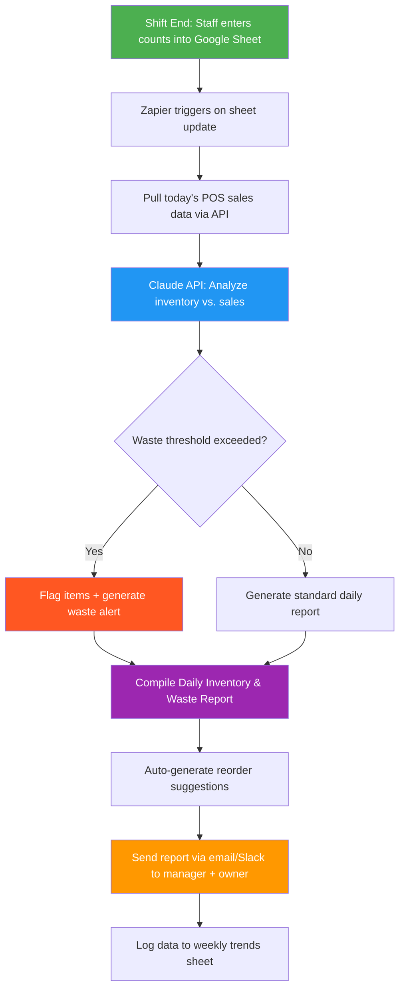

# Blueprint: Restaurant Manager — Daily Inventory & Waste Report

**Role:** Restaurant Manager / Kitchen Manager
**Pain Point:** 2–3 hours daily spent manually counting inventory, tracking waste, cross-referencing deliveries, and compiling reports for ownership
**Time Saved:** ~10–12 hours/week
**Difficulty to Implement:** Low–Medium
**Tools Required:** Google Sheets or Airtable, Claude API (or any LLM API), Zapier/Make, optional POS integration

---

## The Problem

Restaurant managers start and end every shift buried in spreadsheets. They hand-count inventory, compare it against POS sales data, figure out what was wasted versus what was sold, reorder supplies, and then compile a report for the owner or GM. It's tedious, error-prone, and takes time away from what actually matters — running the floor, training staff, and improving the guest experience.

Most independent restaurants and small chains don't have enterprise inventory management systems. They use clipboards, spreadsheets, and gut instinct. This blueprint bridges that gap using AI and simple automation tools they already have access to.

---

## Workflow Overview



---

## Step-by-Step Breakdown

### Step 1: Data Entry (Staff — 5 minutes)

At the end of each shift, a line cook or shift lead enters remaining inventory counts into a shared Google Sheet. The sheet is pre-formatted with item names, units, and par levels.

**Google Sheet Template — "End of Shift Counts":**

| Item | Unit | Par Level | Morning Count | Evening Count | Notes |
|------|------|-----------|---------------|---------------|-------|
| Chicken Breast | lbs | 40 | 42 | 18 | — |
| Romaine Lettuce | heads | 20 | 22 | 5 | Some wilted |
| Salmon Fillet | lbs | 25 | 26 | 11 | — |
| Tomatoes | lbs | 15 | 16 | 3 | — |
| Burger Patties | each | 60 | 65 | 22 | — |
| Heavy Cream | qt | 8 | 8 | 2 | — |
| French Fries (frozen) | lbs | 50 | 52 | 19 | — |

### Step 2: Automation Trigger (Zapier/Make — automatic)

When the evening count column is updated, a Zapier webhook fires. It pulls:
- Today's POS sales summary (from Square, Toast, Clover, etc.)
- The inventory sheet data
- Yesterday's closing counts (for comparison)

### Step 3: AI Analysis (Claude API)

The collected data is sent to Claude with the following prompt:

```
You are a restaurant operations analyst. Given the following data, produce a Daily Inventory & Waste Report.

<inventory_data>
{INVENTORY_SHEET_DATA}
</inventory_data>

<pos_sales>
{POS_SALES_SUMMARY}
</pos_sales>

<yesterday_closing>
{YESTERDAY_COUNTS}
</yesterday_closing>

Perform the following analysis:

1. USAGE CALCULATION: For each item, calculate:
   - Expected usage = (morning count) - (evening count)
   - POS-based usage = units sold per POS data
   - Variance = expected usage - POS-based usage
   - Variance % = variance / expected usage × 100

2. WASTE FLAGS: Flag any item where:
   - Variance exceeds 15% (potential waste, theft, or portioning issue)
   - Evening count is below 25% of par level (reorder urgently)
   - Staff notes mention quality issues

3. REORDER SUGGESTIONS: For items below par level, suggest order quantities
   to return to par + 10% buffer. Factor in day of week (weekends need more).

4. TREND ALERT: Compare today's usage to yesterday. Flag any item with
   >30% swing in either direction.

Format the report as a clean, scannable summary with sections:
- Executive Summary (3 bullet points max)
- Inventory Status Table
- Waste & Variance Alerts
- Reorder List
- Trend Notes

Keep it under 500 words. Use plain language a busy restaurant manager
can scan in 60 seconds.
```

### Step 4: Report Delivery

The generated report is sent via email and/or Slack to the manager and owner.

---

## Example Output

### 📊 Daily Inventory & Waste Report — Thursday, March 26, 2026

**Executive Summary**
- Overall food cost tracking well; 4 of 7 core items within normal variance
- **Romaine lettuce flagged** — 35% variance suggests waste or over-portioning on salads
- Tomatoes and heavy cream need reorder by tomorrow AM

---

**Inventory Status**

| Item | Used | Sold (POS) | Variance | Variance % | Status |
|------|------|-----------|----------|------------|--------|
| Chicken Breast | 24 lbs | 22 lbs | 2 lbs | 8% | ✅ Normal |
| Romaine Lettuce | 17 heads | 11 heads | 6 heads | **35%** | 🔴 Waste Alert |
| Salmon Fillet | 15 lbs | 14 lbs | 1 lb | 7% | ✅ Normal |
| Tomatoes | 13 lbs | 12 lbs | 1 lb | 8% | ⚠️ Low Stock |
| Burger Patties | 43 each | 40 each | 3 each | 7% | ✅ Normal |
| Heavy Cream | 6 qt | 5 qt | 1 qt | 17% | ⚠️ Low Stock |
| French Fries | 33 lbs | 31 lbs | 2 lbs | 6% | ✅ Normal |

---

**Waste & Variance Alerts**

🔴 **Romaine Lettuce — 35% variance (6 heads unaccounted)**
Staff noted "some wilted" — likely prep waste. Recommend: check walk-in temp, reduce prep-ahead quantity for weekday salads, review Caesar salad portioning with line cooks.

⚠️ **Heavy Cream — 17% variance (1 qt unaccounted)**
Slightly above threshold. Could be soup portioning. Monitor tomorrow before escalating.

---

**Reorder List (for tomorrow AM delivery)**

| Item | Current | Par | Order Qty | Priority |
|------|---------|-----|-----------|----------|
| Tomatoes | 3 lbs | 15 lbs | 14 lbs | 🔴 Urgent |
| Heavy Cream | 2 qt | 8 qt | 7 qt | 🔴 Urgent |
| Romaine Lettuce | 5 heads | 20 heads | 17 heads | ⚠️ High |
| Chicken Breast | 18 lbs | 40 lbs | 26 lbs | Normal |

---

**Trend Notes**
Burger patty usage up 18% vs. yesterday (Wednesday) — normal Thursday uptick. Salmon usage consistent. Weekend prep should account for projected 25% volume increase.

---

## Implementation Guide

### Option A: No-Code (Google Sheets + Zapier + Claude API)

1. **Create the Google Sheet** with the template above. Share it with staff via a tablet in the kitchen.
2. **Set up Zapier:**
   - Trigger: Google Sheets → Row Updated (evening count column)
   - Action 1: Pull POS data via API (Square/Toast have Zapier integrations)
   - Action 2: Send data to Claude API via Webhooks
   - Action 3: Send response via Gmail or Slack
3. **Cost:** ~$20/mo Zapier + ~$5/mo Claude API usage

### Option B: Lightweight Script (for tech-comfortable managers)

```python
# daily_inventory_report.py
# Run via cron at 10:30 PM nightly or trigger from a webhook

import gspread
import anthropic
import smtplib
from email.mime.text import MIMEText
from datetime import date

# --- Config ---
SHEET_ID = "your-google-sheet-id"
CLAUDE_API_KEY = "your-api-key"
MANAGER_EMAIL = "manager@restaurant.com"
OWNER_EMAIL = "owner@restaurant.com"

# --- Pull inventory data from Google Sheets ---
gc = gspread.service_account(filename="credentials.json")
sheet = gc.open_by_key(SHEET_ID)
today_ws = sheet.worksheet(date.today().strftime("%Y-%m-%d"))
inventory_data = today_ws.get_all_records()

# --- Pull POS data (example with Square) ---
# pos_data = square_client.get_daily_sales_summary()
pos_data = "Replace with your POS API call"

# --- Send to Claude for analysis ---
client = anthropic.Anthropic(api_key=CLAUDE_API_KEY)
message = client.messages.create(
    model="claude-sonnet-4-6",
    max_tokens=1500,
    messages=[{
        "role": "user",
        "content": f"""You are a restaurant operations analyst.

<inventory_data>
{inventory_data}
</inventory_data>

<pos_sales>
{pos_data}
</pos_sales>

Generate a Daily Inventory & Waste Report with:
- Executive Summary (3 bullets)
- Inventory Status Table with variance analysis
- Waste alerts for items >15% variance
- Reorder suggestions for items below par
- Trend notes vs yesterday

Keep it scannable in 60 seconds."""
    }]
)

report = message.content[0].text

# --- Email the report ---
msg = MIMEText(report)
msg["Subject"] = f"Daily Inventory Report — {date.today().strftime('%A, %B %d')}"
msg["From"] = "reports@restaurant.com"
msg["To"] = f"{MANAGER_EMAIL}, {OWNER_EMAIL}"

with smtplib.SMTP("smtp.gmail.com", 587) as server:
    server.starttls()
    server.login("reports@restaurant.com", "app-password")
    server.send_message(msg)

print("Report sent successfully.")
```

---

## Why This Should Be Implemented

| Before (Manual) | After (Automated) |
|---|---|
| 30 min counting + 20 min cross-referencing POS | 5 min staff data entry, rest is automatic |
| Waste discovered days later (if at all) | Same-day alerts with root cause suggestions |
| Reorders based on gut feeling | Data-driven reorder quantities |
| Weekly report cobbled together on Sunday night | Daily report auto-delivered, weekly trends auto-compiled |
| Manager stays late to do paperwork | Manager spends time on floor and with staff |

**ROI Estimate:** At an average restaurant manager salary of $55K/year, saving 10 hours/week equals roughly $13,750/year in recovered labor — not counting reduced food waste, which typically saves 2–5% of food costs (easily $5K–$15K/year for a mid-volume restaurant).

---

## Variations & Extensions

- **Multi-location rollup:** Aggregate reports across locations for a regional GM dashboard
- **Vendor auto-ordering:** Connect reorder suggestions directly to supplier portals (Sysco, US Foods)
- **Menu engineering tie-in:** Cross-reference waste data with menu item profitability to flag underperforming dishes
- **Prep sheet generator:** Use tomorrow's reservations + day-of-week trends to auto-generate prep quantities

---

*Blueprint by heymarii | March 27, 2026 | Part of the AI Blueprints collection*
