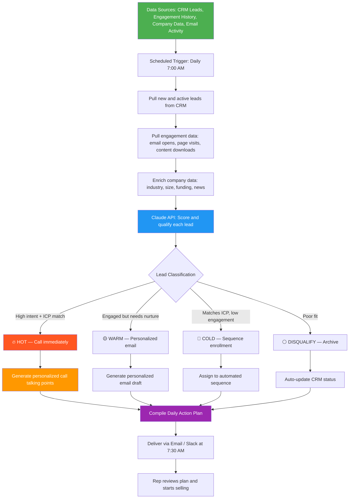

# Blueprint: Sales Rep — Automated Daily Lead Qualification & Follow-Up Prioritization Report

**Role:** Sales Development Rep (SDR) / Account Executive / Business Development Rep
**Pain Point:** 8–12 hours per week spent manually researching leads, scoring prospects, writing personalized outreach emails, and deciding who to follow up with — most of it copy-paste and tab-switching between CRM, LinkedIn, and email
**Time Saved:** ~10–12 hours/week
**Difficulty to Implement:** Low–Medium
**Tools Required:** CRM export (HubSpot, Salesforce, Pipedrive), Claude API or any LLM API, Zapier/Make or a Python script, email or Slack for delivery

---

## The Problem

Sales reps are hired to sell, but most of them spend less than 35% of their time actually selling. The rest is consumed by administrative tasks: logging activities in the CRM, researching prospects on LinkedIn, reading through inbound leads to figure out which ones are worth calling, writing personalized outreach emails from scratch, and manually prioritizing their follow-up list every morning.

Here's what a typical morning looks like for an SDR handling 50–100 active leads:

Open the CRM. Scroll through the lead queue. Click into each lead record one at a time. Check when they last engaged — did they open an email? Visit the pricing page? Download a whitepaper? Hop over to LinkedIn to look at their profile — what's their role, company size, industry? Cross-reference that against the Ideal Customer Profile. Make a mental judgment call: is this lead worth a phone call, an email, or should I skip it? Write a personalized first line for the outreach email by referencing something from their LinkedIn or company news. Copy-paste the rest of the email template. Log the activity in the CRM. Move on to the next lead. Repeat 40 times.

This process takes 2–3 hours every single morning before a single call is made. And the quality of the prioritization degrades as the rep gets deeper into the list — lead #45 gets less research attention than lead #5, even though lead #45 might be the better opportunity.

The data that drives lead qualification already exists in structured formats: CRM records have engagement history, company data is available via enrichment APIs, and outreach templates follow predictable patterns. The synthesis step — combining engagement signals, firmographic data, and behavioral indicators into a prioritized action plan with personalized messaging — is exactly the type of structured analysis that AI handles well.

This blueprint automates the daily lead qualification and follow-up prioritization process, delivering a morning action plan with pre-written, personalized outreach for the top leads.

---

## Workflow Overview



---

## How It Works

### Step 1: Data Collection (Automated)

Every morning at 7:00 AM, the workflow pulls data from the rep's CRM and connected tools. No manual data entry required.

**Data sources and what gets extracted:**

| Source | Data Pulled | Format |
|--------|------------|--------|
| CRM (HubSpot / Salesforce / Pipedrive) | Lead name, company, title, deal stage, last activity date, lead source | API or CSV |
| Email Platform (CRM or Outreach/Salesloft) | Opens, clicks, replies, bounce status for last 7 days | API |
| Website Analytics (HubSpot / GA4 integration) | Page visits, pricing page views, content downloads | API |
| Company Enrichment (Clearbit / Apollo / ZoomInfo) | Industry, employee count, revenue, funding, tech stack | API |
| LinkedIn (manual or enrichment tool) | Title, tenure, recent posts, mutual connections | Enrichment API |

**Example raw data for one lead:**

```json
{
  "lead_id": "LD-4821",
  "name": "Sarah Chen",
  "email": "sarah.chen@meridianlogistics.com",
  "title": "VP of Operations",
  "company": "Meridian Logistics",
  "lead_source": "Webinar: AI in Supply Chain",
  "created_date": "2026-03-22",
  "deal_stage": "New Lead",
  "engagement_history": {
    "emails_sent": 1,
    "emails_opened": 1,
    "email_clicks": 1,
    "last_email_opened": "2026-03-28",
    "website_visits": 3,
    "pages_viewed": ["pricing", "case-studies/logistics", "product/automation"],
    "content_downloads": ["Supply Chain AI Playbook"],
    "last_activity": "2026-03-29"
  },
  "company_data": {
    "industry": "Logistics & Transportation",
    "employee_count": 450,
    "annual_revenue": "$85M",
    "funding": "Series C — $40M (2025)",
    "tech_stack": ["SAP", "Salesforce", "Tableau"],
    "recent_news": "Announced expansion into Southeast Asian markets (March 2026)"
  },
  "icp_match": {
    "target_industry": true,
    "target_company_size": true,
    "target_title_seniority": true,
    "target_tech_stack_fit": true
  }
}
```

### Step 2: AI Lead Scoring & Qualification (Automated)

Each lead's data package is sent to the Claude API for multi-dimensional scoring and classification.

**Prompt template:**

```
You are an expert sales analyst helping a B2B sales development rep prioritize
their daily outreach. Given the following lead data, perform a complete
qualification assessment.

Score the lead across four dimensions (1-10 each):
1. ICP FIT: How well does this person's title, company size, industry, and
   tech stack match our ideal customer profile?
2. ENGAGEMENT SIGNAL: How actively is this person engaging with our content,
   emails, and website? Weight recent activity higher.
3. BUYING INTENT: Based on which pages they visited (pricing = high intent),
   content downloaded, and engagement recency, how likely are they to be
   in an active buying cycle?
4. TIMING: Based on company news, funding, and expansion signals, is this
   a good time to reach out?

Overall classification:
- 🔥 HOT (score 32-40): Call within 2 hours. High intent + strong ICP match.
- 🟡 WARM (score 22-31): Send personalized email today. Engaged but needs nudge.
- 🔵 COLD (score 12-21): Enroll in nurture sequence. Matches ICP but low engagement.
- ⚪ DISQUALIFY (score <12): Poor fit. Archive or deprioritize.

For HOT leads, generate:
- 3 personalized call talking points referencing their specific engagement and company context
- A 2-sentence voicemail script

For WARM leads, generate:
- A personalized email (under 120 words) referencing their specific engagement
  (e.g., "I noticed you downloaded our Supply Chain AI Playbook")
- A suggested subject line (under 8 words)

For COLD leads, suggest which nurture sequence to enroll them in.

Ideal Customer Profile:
{icp_definition}

Lead Data:
{lead_data_json}

Sales rep's name: {rep_name}
Company selling: {company_name}
Product: {product_description}
```

**Example output for Sarah Chen:**

> **Sarah Chen — VP of Operations, Meridian Logistics**
> **Classification:** 🔥 HOT (Score: 36/40)
>
> | Dimension | Score | Rationale |
> |-----------|-------|-----------|
> | ICP Fit | 9/10 | VP-level at a 450-person logistics company. Perfect title + industry + size. |
> | Engagement | 9/10 | Opened email, clicked through, visited pricing page + case studies. Downloaded playbook. |
> | Buying Intent | 9/10 | Pricing page visit + case study for their exact industry = active evaluation. |
> | Timing | 9/10 | Series C funded, expanding into SE Asia — operational complexity increasing. |
>
> **Call Talking Points:**
> 1. "I saw you checked out our logistics case study — the company in that study reduced their route planning time by 40%. Given your SE Asia expansion, I'd love to talk about how that could apply at Meridian."
> 2. "You downloaded our Supply Chain AI Playbook — which section resonated most? A lot of ops leaders at the Series C stage are looking at automation to scale without proportionally scaling headcount."
> 3. "I noticed Meridian is running SAP — we integrate natively and most of our logistics customers are live within 3 weeks."
>
> **Voicemail Script:** "Hi Sarah, this is [Rep Name] from [Company]. I noticed you've been exploring how AI can streamline logistics operations — I work with several companies your size on exactly that. I'd love a quick 15-minute conversation. My number is [number]."

### Step 3: Daily Action Plan Generation (Automated)

The AI compiles all scored leads into a single prioritized daily action plan delivered to the rep's inbox or Slack.

**Example Daily Action Plan:**

```
═══════════════════════════════════════════════════════════════
              DAILY LEAD ACTION PLAN
               Alex Rodriguez, SDR
            Monday, March 30, 2026
═══════════════════════════════════════════════════════════════

📊 PIPELINE SNAPSHOT
─────────────────────
  Active Leads:         67
  New Overnight:         4
  Leads Scored Today:   52

  🔥 HOT — Call Now:      3
  🟡 WARM — Email Today:  8
  🔵 COLD — Auto-Nurture: 31
  ⚪ DISQUALIFY:          10

  Estimated revenue in pipeline: $485,000
  Weighted pipeline (by stage):  $142,500

═══════════════════════════════════════════════════════════════
🔥 PRIORITY 1: CALL THESE LEADS NOW (3 leads)
═══════════════════════════════════════════════════════════════

  1. SARAH CHEN — VP of Operations, Meridian Logistics
     Score: 36/40 | Source: Webinar
     ─────────────────────────────────────────────────
     Why now: Visited pricing page yesterday. Downloaded
     logistics case study. Series C funded, expanding to SE Asia.

     Talking points:
     • Reference the logistics case study — 40% route planning
       time reduction
     • Ask about SE Asia expansion — scaling ops complexity
     • SAP integration angle — native, 3-week go-live

     Voicemail: "Hi Sarah, this is Alex from [Company]. I saw
     you've been exploring how AI can streamline logistics
     operations — I'd love a quick 15-minute conversation.
     My number is 555-0142."

  2. MARCUS WILLIAMS — Director of IT, Beacon Healthcare
     Score: 34/40 | Source: Inbound Demo Request
     ─────────────────────────────────────────────────
     Why now: Submitted demo request form on Saturday.
     Company just posted 3 job openings for "automation engineer."

     Talking points:
     • Acknowledge the demo request — confirm timing
     • Reference their automation hiring — "sounds like you're
       building out the automation function"
     • Healthcare compliance angle — HIPAA-ready out of the box

     Voicemail: "Hi Marcus, this is Alex following up on your
     demo request. I'd love to show you how we work with
     healthcare orgs on automation — let's find 20 minutes."

  3. PRIYA SHARMA — COO, NovaTech Manufacturing
     Score: 33/40 | Source: LinkedIn Ad
     ─────────────────────────────────────────────────
     Why now: Clicked LinkedIn ad → visited pricing + product page.
     Company announced new factory buildout in Q1 earnings.

     Talking points:
     • Reference new factory expansion — "scaling production
       usually means scaling operational complexity"
     • Manufacturing-specific ROI: customers see 25% reduction
       in manual reporting time
     • Ask about current tech stack pain points

═══════════════════════════════════════════════════════════════
🟡 PRIORITY 2: SEND THESE EMAILS TODAY (8 leads)
═══════════════════════════════════════════════════════════════

  4. JAMES OKAFOR — Supply Chain Manager, Atlas Distribution
     Score: 28/40 | Last engaged: March 27

     Subject: quick question about your supply chain workflow
     ──────────────────────────────────────────────────────
     Hi James,

     I noticed you downloaded our Supply Chain AI Playbook last
     week — hope it was useful. A lot of supply chain leaders at
     mid-size distributors like Atlas are using it as a starting
     point for automating their demand forecasting.

     Would a 15-minute call this week make sense to see if
     there's a fit? I can share how a similar company cut their
     forecasting time by 60%.

     Best,
     Alex

  5. ELENA VASQUEZ — Head of Procurement, Summit Building Co.
     Score: 26/40 | Last engaged: March 28

     Subject: saw you checking out our case studies
     ──────────────────────────────────────────────────────
     Hi Elena,

     I saw you spent some time on our construction procurement
     case study — that client reduced their vendor comparison
     process from 4 hours to 20 minutes. Given Summit's growth
     this year, I imagine procurement volume is only increasing.

     Worth a quick chat this week?

     Best,
     Alex

  [... 6 more personalized emails ...]

═══════════════════════════════════════════════════════════════
🔵 AUTO-ENROLLED IN NURTURE SEQUENCES (31 leads)
═══════════════════════════════════════════════════════════════

  Enrolled in "Industry Education" sequence:     12 leads
  Enrolled in "Product Awareness" sequence:       9 leads
  Enrolled in "Re-engagement" sequence:          10 leads

  No action needed — these will receive automated emails
  and be re-scored if engagement increases.

═══════════════════════════════════════════════════════════════
⚪ DISQUALIFIED TODAY (10 leads)
═══════════════════════════════════════════════════════════════

  Reason breakdown:
  • Company too small (<20 employees):            4
  • Wrong industry / no product fit:              3
  • Competitor / vendor (not a buyer):            2
  • Invalid email / bounced:                      1

  CRM status auto-updated to "Disqualified."

═══════════════════════════════════════════════════════════════
📈 WEEKLY PERFORMANCE TRACKER
═══════════════════════════════════════════════════════════════

  Calls Made This Week:        12 / 50 target
  Emails Sent This Week:       34 / 80 target
  Meetings Booked This Week:    3 / 8 target
  Pipeline Added This Week:    $45,000 / $100,000 target

  🟡 Pacing slightly behind on meetings. Consider prioritizing
  phone outreach over email for the next 2 days — the HOT
  leads above are your best shot at quick conversions.

═══════════════════════════════════════════════════════════════
  Report generated at 7:30 AM | Next report: Tomorrow 7:30 AM
  Data sources: HubSpot CRM, Clearbit, Email Platform
═══════════════════════════════════════════════════════════════
```

### Step 4: CRM Auto-Updates (Automated)

As leads are scored and classified, the workflow can optionally push updates back to the CRM: updating lead scores, changing deal stages for disqualified leads, adding notes with the AI-generated qualification rationale, and enrolling cold leads into the appropriate nurture sequences. This eliminates the need for the rep to manually log these activities.

### Step 5: Rep Executes the Plan (Manual — Starts Immediately)

Instead of spending 2 hours researching and prioritizing, the rep walks in at 8 AM, opens the action plan, and starts calling the first HOT lead within 5 minutes. The personalized talking points and email drafts are ready to go — the rep just reviews them for accuracy, adds a personal touch if desired, and executes.

---

## Implementation Guide

### Option A: No-Code (HubSpot + Zapier + Claude API)

**Setup time:** 3–4 hours

1. **Define your Ideal Customer Profile** in a structured document — target industries, company sizes, title seniority levels, and key engagement signals (e.g., pricing page visit = high intent).
2. **Set up HubSpot workflow triggers** for key engagement events (email opens, page visits, form submissions).
3. **Create a Zapier automation:**
   - Trigger: Schedule — Every day at 7:00 AM
   - Action 1: HubSpot — Get all leads with activity in the last 7 days
   - Action 2: Clearbit/Apollo — Enrich company data for new leads
   - Action 3: Loop through each lead
   - Action 4: Claude API — Score and qualify with the prompt template above
   - Action 5: HubSpot — Update lead score and notes
   - Action 6: Gmail/Slack — Compile and send the daily action plan
4. **Cost:** ~$30–60/month (Zapier + Claude API + Clearbit free tier)

### Option B: Python Script (More Control)

**Setup time:** 4–6 hours

```python
import json
from datetime import datetime, timedelta
from anthropic import Anthropic
import requests

client = Anthropic()

# CRM Configuration
CRM_API_KEY = "your_hubspot_api_key"
CRM_BASE_URL = "https://api.hubapi.com"

def pull_active_leads(days_lookback=7):
    """Pull leads with recent activity from HubSpot CRM."""
    cutoff = (datetime.now() - timedelta(days=days_lookback)).isoformat()

    # HubSpot Search API — get leads with recent activity
    url = f"{CRM_BASE_URL}/crm/v3/objects/contacts/search"
    headers = {"Authorization": f"Bearer {CRM_API_KEY}", "Content-Type": "application/json"}
    payload = {
        "filterGroups": [{
            "filters": [{
                "propertyName": "lastmodifieddate",
                "operator": "GTE",
                "value": cutoff
            }]
        }],
        "properties": [
            "firstname", "lastname", "email", "company", "jobtitle",
            "lifecyclestage", "hs_lead_status", "hubspot_owner_id",
            "num_associated_deals", "recent_deal_amount",
            "hs_email_last_open_date", "hs_analytics_num_page_views",
            "hs_analytics_last_visit_timestamp"
        ],
        "limit": 100
    }

    response = requests.post(url, headers=headers, json=payload)
    return response.json().get("results", [])


def enrich_company_data(company_name, domain):
    """Enrich company data via Clearbit or Apollo."""
    # Placeholder — replace with your enrichment API
    # Clearbit: https://clearbit.com/docs
    # Apollo: https://apolloio.github.io/apollo-api-docs/
    return {
        "industry": "Unknown",
        "employee_count": 0,
        "annual_revenue": "Unknown",
        "funding": "Unknown",
        "recent_news": ""
    }


def get_engagement_history(contact_id):
    """Pull email and website engagement for a specific contact."""
    url = f"{CRM_BASE_URL}/crm/v3/objects/contacts/{contact_id}/associations/emails"
    headers = {"Authorization": f"Bearer {CRM_API_KEY}"}

    # Get email engagement
    response = requests.get(url, headers=headers)
    email_data = response.json()

    # Get website activity via HubSpot analytics
    analytics_url = f"{CRM_BASE_URL}/crm/v3/objects/contacts/{contact_id}"
    analytics_response = requests.get(analytics_url, headers=headers, params={
        "properties": "hs_analytics_num_page_views,hs_analytics_last_visit_timestamp,"
                      "hs_email_open,hs_email_click,hs_email_last_open_date"
    })

    return {
        "email_data": email_data,
        "analytics": analytics_response.json().get("properties", {})
    }


def score_lead(lead_data, icp_definition, rep_info):
    """Send lead data to Claude API for scoring and qualification."""
    prompt = f"""You are an expert sales analyst. Score and qualify this lead.

Score across four dimensions (1-10):
1. ICP FIT: Title, company size, industry match
2. ENGAGEMENT SIGNAL: Email opens, page visits, content downloads
3. BUYING INTENT: Pricing page visits, demo requests, recency
4. TIMING: Company news, funding, growth signals

Classify as:
- 🔥 HOT (32-40): Generate 3 call talking points + voicemail script
- 🟡 WARM (22-31): Generate personalized email (under 120 words) + subject line
- 🔵 COLD (12-21): Suggest nurture sequence
- ⚪ DISQUALIFY (<12): Provide reason

Return as JSON with keys: classification, total_score, dimension_scores,
rationale, action_content (talking points OR email OR sequence suggestion)

ICP: {json.dumps(icp_definition)}
Lead: {json.dumps(lead_data)}
Rep: {rep_info['name']} at {rep_info['company']}"""

    response = client.messages.create(
        model="claude-sonnet-4-6",
        max_tokens=1000,
        messages=[{"role": "user", "content": prompt}]
    )
    return json.loads(response.content[0].text)


def compile_action_plan(scored_leads, rep_info):
    """Compile all scored leads into a daily action plan."""
    hot = [l for l in scored_leads if l['classification'] == 'HOT']
    warm = [l for l in scored_leads if l['classification'] == 'WARM']
    cold = [l for l in scored_leads if l['classification'] == 'COLD']
    disqualified = [l for l in scored_leads if l['classification'] == 'DISQUALIFY']

    plan = f"""
{'='*60}
            DAILY LEAD ACTION PLAN
             {rep_info['name']}, SDR
          {datetime.now().strftime('%A, %B %d, %Y')}
{'='*60}

📊 PIPELINE SNAPSHOT
  Active Leads:       {len(scored_leads)}
  🔥 HOT — Call Now:    {len(hot)}
  🟡 WARM — Email:      {len(warm)}
  🔵 COLD — Nurture:    {len(cold)}
  ⚪ Disqualified:      {len(disqualified)}
"""

    if hot:
        plan += f"\n{'='*60}\n🔥 PRIORITY 1: CALL THESE LEADS NOW\n{'='*60}\n"
        for i, lead in enumerate(hot, 1):
            plan += f"\n  {i}. {lead['name']} — {lead['title']}, {lead['company']}\n"
            plan += f"     Score: {lead['total_score']}/40\n"
            plan += f"     {lead['action_content']}\n"

    if warm:
        plan += f"\n{'='*60}\n🟡 PRIORITY 2: SEND THESE EMAILS TODAY\n{'='*60}\n"
        for i, lead in enumerate(warm, len(hot) + 1):
            plan += f"\n  {i}. {lead['name']} — {lead['title']}, {lead['company']}\n"
            plan += f"     Score: {lead['total_score']}/40\n"
            plan += f"     {lead['action_content']}\n"

    return plan


def main():
    icp = {
        "target_industries": ["Logistics", "Manufacturing", "Healthcare", "Construction"],
        "target_company_size": "50-2000 employees",
        "target_titles": ["VP", "Director", "Head of", "COO", "CTO", "Manager"],
        "target_revenue": "$10M-$500M"
    }

    rep_info = {
        "name": "Alex Rodriguez",
        "company": "Your Company",
        "product": "AI-powered operations automation platform"
    }

    # Pull and process leads
    leads = pull_active_leads(days_lookback=7)
    scored_leads = []

    for lead in leads:
        engagement = get_engagement_history(lead['id'])
        company_data = enrich_company_data(
            lead['properties'].get('company', ''),
            lead['properties'].get('email', '').split('@')[-1]
        )

        lead_package = {
            'name': f"{lead['properties'].get('firstname', '')} {lead['properties'].get('lastname', '')}",
            'email': lead['properties'].get('email'),
            'title': lead['properties'].get('jobtitle'),
            'company': lead['properties'].get('company'),
            'engagement': engagement,
            'company_data': company_data
        }

        scored = score_lead(lead_package, icp, rep_info)
        scored['name'] = lead_package['name']
        scored['title'] = lead_package['title']
        scored['company'] = lead_package['company']
        scored_leads.append(scored)

    # Sort by score descending
    scored_leads.sort(key=lambda x: x['total_score'], reverse=True)

    # Generate action plan
    plan = compile_action_plan(scored_leads, rep_info)

    # Save
    filename = f"lead_action_plan_{datetime.now().strftime('%Y%m%d')}.md"
    with open(filename, 'w') as f:
        f.write(plan)

    print(plan)
    print(f"\n✅ Action plan saved to {filename}")


if __name__ == '__main__':
    main()
```

---

## Why This Should Be Implemented

**For the sales rep:** Start selling within 5 minutes of sitting down instead of spending 2 hours on research and admin. The personalized talking points and pre-written emails eliminate the blank-page problem — you're not staring at an empty email trying to think of a clever first line. You're reviewing an AI-drafted message that already references the prospect's specific engagement and company context, then adding your personality and hitting send.

**For the sales manager:** Consistent lead qualification across the team. Instead of relying on each rep's individual judgment about which leads to prioritize (which varies wildly based on experience, mood, and recency bias), every lead is scored against the same ICP criteria with the same rigor. You get visibility into pipeline quality and can coach reps on execution rather than prioritization.

**For the business:** Faster speed-to-lead response. Research shows that contacting a lead within 5 minutes of their engagement (e.g., a pricing page visit) makes you 100x more likely to connect compared to waiting 30 minutes. When the AI catches a hot engagement signal at 11 PM and flags it for the 7 AM report, the rep calls at 8:01 AM instead of discovering it at 10 AM after manually reviewing their CRM.

**For the prospect:** Better buying experience. Instead of generic "just checking in" emails, they receive personalized outreach that references their actual interests and company context. The conversation starts at a higher level because the rep already understands their situation.

---

## Cost Estimate

| Component | Monthly Cost | Notes |
|-----------|-------------|-------|
| Claude API | $15–40 | ~100 leads/day × 22 working days × ~800 tokens each |
| Zapier (if using no-code) | $20 | Starter plan for CRM + enrichment integrations |
| Clearbit / Apollo (enrichment) | $0–99 | Free tiers available; paid for volume |
| CRM (HubSpot / Salesforce) | $0+ | Most teams already have a CRM |
| **Total** | **$15–159/month** | A single additional deal closed per month covers years of cost |

**ROI example:** If the daily action plan helps a rep book just 2 more meetings per week (from faster response time and better personalization), and the team's meeting-to-close rate is 15% with an average deal size of $25,000, that's roughly 1.3 extra deals/month = $32,500/month in additional revenue from a tool costing under $160/month.

---

## Getting Started Checklist

- [ ] Define your Ideal Customer Profile in writing — target industries, company sizes, title levels, and key qualifying criteria
- [ ] Identify your top engagement signals — which CRM events indicate buying intent? (pricing page visits, demo requests, multiple email opens)
- [ ] Export one week of CRM lead data with engagement history
- [ ] Set up a Claude API key at console.anthropic.com
- [ ] Create 3–5 email templates that the AI can personalize (the AI adapts them per lead, but having a base structure improves quality)
- [ ] Define your lead scoring thresholds — what score makes a lead "hot" vs. "warm" for your specific product and market?
- [ ] Choose your implementation path (no-code or Python)
- [ ] Run a pilot for one week with your actual lead queue — compare AI prioritization against your manual prioritization
- [ ] Review AI-generated emails for tone, accuracy, and brand voice
- [ ] Set up CRM write-back for automatic score updates and activity logging
- [ ] Roll out to the full sales team with a 30-minute training session

---

*Blueprint created: March 30, 2026*
*Category: Sales — Business Development*
*Estimated implementation time: 3–6 hours*
