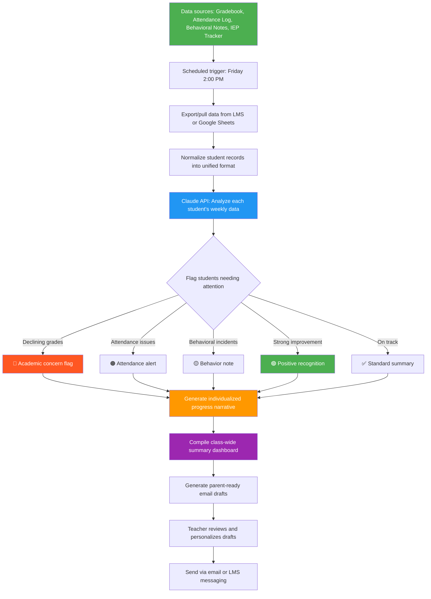

# Blueprint: Teacher — Automated Weekly Student Progress Report

**Role:** K–12 Teacher / Instructor
**Pain Point:** 5–8 hours per week spent manually reviewing grades, attendance, assignment completion, and behavioral notes to write individualized student progress summaries for parents, administrators, and intervention teams
**Time Saved:** ~10–12 hours/week
**Difficulty to Implement:** Low
**Tools Required:** Google Sheets or LMS export (Canvas, Google Classroom, PowerSchool), Claude API or any LLM API, Zapier/Make or a Python script, Google Docs or email for delivery

---

## The Problem

Teachers are some of the most overworked professionals on the planet, and a massive chunk of their non-teaching time goes to one task: writing progress reports. Every week (or every other week), teachers are expected to synthesize data from multiple disconnected sources — gradebooks, attendance logs, assignment completion trackers, behavioral incident notes, IEP/504 accommodation checklists — into individualized narratives for each student.

For a teacher with 120–150 students across multiple class periods, this means opening a gradebook, scrolling through dozens of rows, mentally computing trends ("Is Maria improving or declining in math?"), cross-referencing attendance ("Has Jayden's drop in grades coincided with increased absences?"), checking behavioral notes ("Did Tyler have any incidents this week?"), and then writing a 3–5 sentence summary per student. At 2–3 minutes per student, that's 4–7 hours of writing per cycle — time that could be spent on lesson planning, tutoring, or simply recovering from an exhausting job.

The data already exists in structured formats. A teacher's gradebook, attendance system, and behavioral log are essentially databases. The synthesis step — turning rows of numbers into human-readable insights — is exactly the kind of pattern recognition and natural language generation that AI handles well.

This blueprint automates the entire progress report pipeline so teachers receive a draft set of individualized student progress summaries every Friday afternoon, ready to review, personalize, and send.

---

## Workflow Overview



---

## How It Works

### Step 1: Data Collection (Automated)

Every Friday at 2:00 PM, the workflow pulls data from the teacher's existing tools. No new data entry is required — it works with what the teacher already maintains.

**Data sources and what gets extracted:**

| Source | Data Pulled | Format |
|--------|------------|--------|
| Gradebook (Google Sheets / Canvas / PowerSchool) | Assignment scores, overall grade, grade trend (last 4 weeks) | CSV or API |
| Attendance Log | Days present, absent, tardy for the week and cumulative | CSV or API |
| Behavioral Notes | Incident descriptions, dates, severity | Spreadsheet or form responses |
| IEP/504 Tracker | Accommodation checklist, goal progress | Spreadsheet |
| Assignment Submission Log | On-time, late, or missing assignments | LMS export |

**Example raw data for one student:**

```json
{
  "student_name": "Maria Gonzalez",
  "grade_level": "7th",
  "period": 3,
  "subject": "Math",
  "current_grade": "B (83%)",
  "grade_4_weeks_ago": "C+ (78%)",
  "grade_trend": "improving",
  "assignments_this_week": [
    {"name": "Fraction Operations Quiz", "score": "88%", "status": "on-time"},
    {"name": "Chapter 6 Homework", "score": "75%", "status": "1 day late"},
    {"name": "Word Problems Worksheet", "score": "92%", "status": "on-time"}
  ],
  "attendance_this_week": {"present": 4, "absent": 1, "tardy": 0},
  "attendance_ytd": {"present": 108, "absent": 12, "tardy": 5},
  "behavioral_notes": [],
  "iep_status": "None",
  "missing_assignments_total": 2
}
```

### Step 2: AI Analysis (Automated)

Each student's data package is sent to the Claude API with a carefully structured prompt that acts as a teaching assistant.

**Prompt template:**

```
You are an experienced teaching assistant helping a {grade_level} {subject} teacher
write weekly student progress summaries.

Given the following student data, produce:

1. A 3–5 sentence progress summary written in warm, professional language suitable
   for parents. Focus on trends, not just numbers. Highlight what the student is doing
   well before noting areas for improvement.

2. A priority flag:
   - 🔴 CONCERN (declining grade trend, 3+ absences this week, or behavioral incident)
   - 🟠 WATCH (slight decline, 2 absences, or late assignment pattern)
   - 🟢 POSITIVE (improving trend or strong performance)
   - ✅ ON TRACK (steady, no issues)

3. One specific, actionable suggestion the teacher can mention to the parent
   (e.g., "Consider reviewing fraction operations at home using the Khan Academy
   module linked in Google Classroom").

Student Data:
{student_data_json}

Teacher Preferences:
- Tone: {warm/formal/casual}
- Focus areas this week: {teacher_specified_focus}
- School-wide initiative to reference: {if any}
```

**Example output for Maria Gonzalez:**

> **Maria Gonzalez — Period 3 Math**
> **Flag:** 🟢 POSITIVE
>
> Maria had a strong week in math. Her grade has climbed from a C+ to a solid B over the past four weeks, which reflects real effort and growing confidence with fraction operations. She scored a 92% on the Word Problems Worksheet and an 88% on the Fraction Operations Quiz. Her Chapter 6 Homework came in a day late, so continuing to build the habit of on-time submission will help keep that momentum going. Maria was absent one day this week — checking in to make sure she has the notes from Tuesday would be helpful.
>
> **Suggested parent talking point:** "Maria is making excellent progress — encouraging her to try the bonus challenge problems in Google Classroom could help push her toward an A."

### Step 3: Flagging & Prioritization (Automated)

The workflow groups all students into priority tiers so the teacher can focus review time where it matters most.

**Example class dashboard output:**

```
═══════════════════════════════════════════════════════════
          WEEKLY PROGRESS DASHBOARD — Ms. Johnson
              Week of March 23–27, 2026
═══════════════════════════════════════════════════════════

📊 CLASS OVERVIEW
─────────────────
  Total Students:     28
  On Track:           19 (68%)
  Positive Trend:      4 (14%)
  Watch List:          3 (11%)
  Concern:             2 (7%)

🔴 IMMEDIATE ATTENTION (2 students)
────────────────────────────────────
  1. Tyler Washington — Period 3
     Grade: D (62%) ↓ from C- (71%)
     Absences this week: 3 of 5 days
     Missing assignments: 5 cumulative
     → Recommend parent conference

  2. Aisha Patel — Period 5
     Grade: C (73%) ↓ from B- (80%)
     Behavioral note: Disruptive 3/25
     Late assignments: 3 this week
     → Recommend counselor check-in

🟠 WATCH LIST (3 students)
──────────────────────────
  3. Jayden Brooks — Period 2
     Attendance: 2 absences this week
     Grade holding steady: B (85%)
     → Monitor next week

  4. Sofia Chen — Period 3
     Late submissions: 2 of 3 assignments
     Grade: B+ (88%) slight dip
     → Gentle reminder on deadlines

  5. Marcus Rivera — Period 5
     Grade: C+ (77%) flat for 3 weeks
     → May benefit from tutoring referral

🟢 POSITIVE RECOGNITION (4 students)
─────────────────────────────────────
  6. Maria Gonzalez — Period 3
     Grade: C+ → B (83%) ↑ over 4 weeks

  7. David Kim — Period 2
     Grade: B → A- (91%) ↑ over 2 weeks

  8. Emma Thompson — Period 5
     Perfect attendance + all assignments on time

  9. James Okonkwo — Period 2
     Grade: B- → B+ (87%) ↑ over 3 weeks

✅ ON TRACK (19 students)
─────────────────────────
  [Standard summaries generated — no action needed]
```

### Step 4: Parent Communication Drafts (Automated)

For flagged students, the workflow generates ready-to-send email drafts.

**Example email draft for a concern student:**

```
Subject: Weekly Update — Tyler's Progress in 7th Grade Math

Dear Mr. and Mrs. Washington,

I wanted to reach out with a quick update on Tyler's week in math class.
He missed three days this week, and I want to make sure he's doing okay.
When he's in class, I can see he understands the material — he scored
well on the in-class problems we worked through on Thursday.

The challenge right now is that the missed days are creating gaps. He has
five assignments that need to be made up, and his grade has dropped from
a C- to a D over the past two weeks. I'd love to work with you and Tyler
on a catch-up plan so he doesn't fall further behind.

Could we set up a quick 10-minute phone call or meeting this week? I'm
available [Tuesday/Thursday after 3:30 PM].

Thank you for your partnership,
Ms. Johnson
```

### Step 5: Teacher Review & Send (Manual — 15 minutes)

The teacher receives:
- The class dashboard summary
- Individual student progress narratives
- Pre-drafted parent emails for flagged students

The teacher's job is now editorial, not clerical: review the AI-generated drafts, add personal touches ("I noticed Tyler seemed tired on Thursday — is everything okay at home?"), and hit send. What used to take 5–8 hours now takes 15–30 minutes of review.

---

## Implementation Guide

### Option A: No-Code (Google Sheets + Zapier + Claude API)

**Setup time:** 2–3 hours

1. **Organize your gradebook in Google Sheets** with columns: Student Name, Period, Current Grade, Grade 4 Weeks Ago, Assignments (score + status), Attendance, Behavioral Notes
2. **Create a Zapier automation:**
   - Trigger: Schedule — Every Friday at 2:00 PM
   - Action 1: Google Sheets — Get all rows from gradebook
   - Action 2: Loop through each student row
   - Action 3: Claude API — Send student data with the prompt template above
   - Action 4: Google Docs — Append each student summary to a weekly report document
   - Action 5: Gmail — Send the report to the teacher
3. **Cost:** ~$5–15/month (Zapier Starter + Claude API usage for ~150 students)

### Option B: Python Script (More Control)

**Setup time:** 3–4 hours (or ask Claude to generate the script)

```python
import json
import csv
from datetime import datetime
from anthropic import Anthropic

client = Anthropic()

def load_student_data(gradebook_path, attendance_path, behavior_path):
    """Load and merge data from multiple CSV exports."""
    students = {}

    # Load gradebook
    with open(gradebook_path, 'r') as f:
        reader = csv.DictReader(f)
        for row in reader:
            student_id = row['student_id']
            students[student_id] = {
                'name': row['student_name'],
                'period': row['period'],
                'current_grade': row['current_grade'],
                'grade_4_weeks_ago': row['grade_4_weeks_ago'],
                'assignments': json.loads(row.get('assignments_json', '[]'))
            }

    # Merge attendance
    with open(attendance_path, 'r') as f:
        reader = csv.DictReader(f)
        for row in reader:
            sid = row['student_id']
            if sid in students:
                students[sid]['attendance'] = {
                    'present': int(row['days_present_week']),
                    'absent': int(row['days_absent_week']),
                    'tardy': int(row['days_tardy_week'])
                }

    # Merge behavioral notes
    with open(behavior_path, 'r') as f:
        reader = csv.DictReader(f)
        for row in reader:
            sid = row['student_id']
            if sid in students:
                students[sid].setdefault('behavioral_notes', []).append(row['note'])

    return students


def generate_progress_summary(student_data, teacher_prefs):
    """Send student data to Claude API for analysis and summary generation."""
    prompt = f"""You are an experienced teaching assistant helping a teacher
write weekly student progress summaries.

Given the following student data, produce:
1. A 3-5 sentence progress summary in warm, professional language for parents.
   Highlight positives before areas for improvement.
2. A priority flag: 🔴 CONCERN, 🟠 WATCH, 🟢 POSITIVE, or ✅ ON TRACK
3. One actionable suggestion for the parent.

Student Data:
{json.dumps(student_data, indent=2)}

Teacher Preferences:
- Tone: {teacher_prefs.get('tone', 'warm')}
- Focus this week: {teacher_prefs.get('focus', 'general progress')}
"""

    response = client.messages.create(
        model="claude-sonnet-4-6",
        max_tokens=500,
        messages=[{"role": "user", "content": prompt}]
    )
    return response.content[0].text


def build_dashboard(summaries):
    """Compile individual summaries into a class-wide dashboard."""
    concern = [s for s in summaries if '🔴' in s['flag']]
    watch = [s for s in summaries if '🟠' in s['flag']]
    positive = [s for s in summaries if '🟢' in s['flag']]
    on_track = [s for s in summaries if '✅' in s['flag']]

    dashboard = f"""
{'='*60}
       WEEKLY PROGRESS DASHBOARD
       Week of {datetime.now().strftime('%B %d, %Y')}
{'='*60}

📊 CLASS OVERVIEW
  Total Students:     {len(summaries)}
  On Track:           {len(on_track)} ({len(on_track)*100//len(summaries)}%)
  Positive Trend:     {len(positive)} ({len(positive)*100//len(summaries)}%)
  Watch List:         {len(watch)} ({len(watch)*100//len(summaries)}%)
  Concern:            {len(concern)} ({len(concern)*100//len(summaries)}%)
"""

    if concern:
        dashboard += f"\n🔴 IMMEDIATE ATTENTION ({len(concern)} students)\n"
        for s in concern:
            dashboard += f"  - {s['name']}: {s['summary'][:80]}...\n"

    if watch:
        dashboard += f"\n🟠 WATCH LIST ({len(watch)} students)\n"
        for s in watch:
            dashboard += f"  - {s['name']}: {s['summary'][:80]}...\n"

    if positive:
        dashboard += f"\n🟢 POSITIVE RECOGNITION ({len(positive)} students)\n"
        for s in positive:
            dashboard += f"  - {s['name']}: {s['summary'][:80]}...\n"

    return dashboard


def main():
    teacher_prefs = {
        'tone': 'warm',
        'focus': 'assignment completion and attendance'
    }

    students = load_student_data(
        'gradebook.csv', 'attendance.csv', 'behavior.csv'
    )

    summaries = []
    for student_id, data in students.items():
        result = generate_progress_summary(data, teacher_prefs)
        summaries.append({
            'name': data['name'],
            'flag': result.split('\n')[0],  # First line contains flag
            'summary': result
        })

    dashboard = build_dashboard(summaries)

    # Save outputs
    with open(f"progress_report_{datetime.now().strftime('%Y%m%d')}.md", 'w') as f:
        f.write(dashboard)
        f.write('\n\n---\n\n# Individual Student Summaries\n\n')
        for s in summaries:
            f.write(f"## {s['name']}\n{s['summary']}\n\n")

    print("✅ Weekly progress report generated successfully!")
    print(dashboard)


if __name__ == '__main__':
    main()
```

---

## Why This Should Be Implemented

**For the teacher:** Reclaim 10+ hours per week. Instead of spending Sunday evening writing progress notes, spend that time on lesson planning, professional development, or rest. The quality of the reports actually improves because the AI catches patterns (like a correlation between attendance drops and grade declines) that a tired teacher writing their 80th summary might miss.

**For students:** Faster intervention. When a student starts struggling, the automated flagging system catches it in the first week — not after a month of declining grades. The AI doesn't have "report fatigue" and applies the same rigor to student #150 as student #1.

**For parents:** More consistent, more frequent, more actionable communication. Instead of a generic "Your child is doing fine" or waiting until parent-teacher conferences, parents get specific, data-backed updates every week with concrete suggestions for how to help at home.

**For administrators:** Standardized reporting across classrooms. When every teacher uses the same AI-assisted framework, administrators can identify school-wide trends (e.g., "attendance is dropping across 7th grade") and allocate resources accordingly.

---

## Cost Estimate

| Component | Monthly Cost | Notes |
|-----------|-------------|-------|
| Claude API | $3–10 | ~150 students × 4 weeks × ~500 tokens each |
| Zapier (if using no-code) | $20 | Starter plan |
| Google Workspace | $0 | Most schools already have this |
| **Total** | **$3–30/month** | Less than the cost of one substitute teacher hour |

---

## Getting Started Checklist

- [ ] Audit your current data sources — where do grades, attendance, and notes live?
- [ ] Standardize your gradebook format (consistent column headers)
- [ ] Set up a Claude API key at console.anthropic.com
- [ ] Choose your implementation path (no-code or Python)
- [ ] Run a pilot with one class period for two weeks
- [ ] Review AI-generated summaries for accuracy and tone
- [ ] Gradually expand to all class periods
- [ ] Customize the prompt template to match your communication style

---

*Blueprint created: March 29, 2026*
*Category: Education — K-12 Teaching*
*Estimated implementation time: 2–4 hours*
